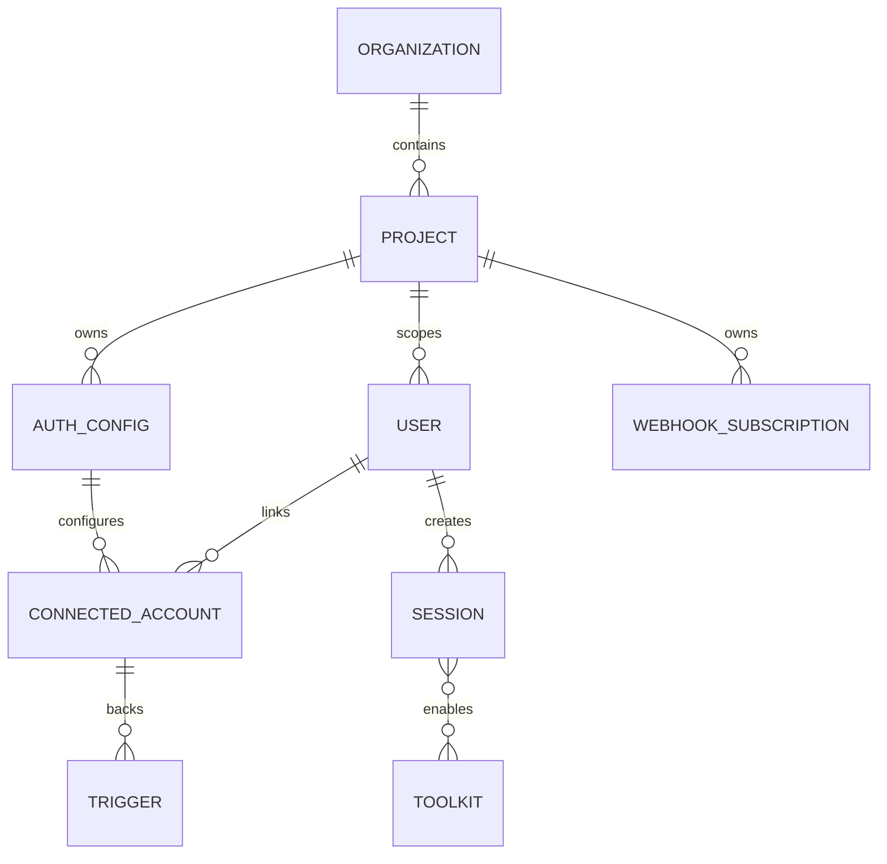
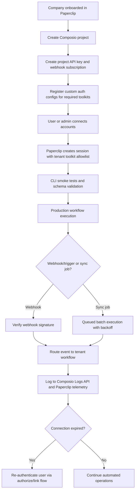

# Composio CLI and Toolkit Plan for Multi-Tenant Paperclip

## Executive summary

For a Paperclip system that will operate across many companies, the most robust default is to treat **Composio projects as the tenant isolation boundary** and create **one Composio project per company per environment** for production workloads. Composio’s own documentation identifies **projects** as its multi-tenancy primitive and states that projects isolate API keys, connected accounts, auth configs, and webhook configurations from one another. Within each project, sessions should be created **per user and per task context**, because sessions are immutable, tied to a user, persist server-side, and should be recreated when the toolkit/auth/account contract changes. citeturn7view0turn25search1turn25search3

The **CLI should be your operator and automation layer**, not the primary long-lived runtime abstraction for agents. Composio’s current docs position the CLI around `search`, `execute`, `link`, `run`, `proxy`, and developer inspection, while the broader platform guidance recommends **sessions** for agentic runtime flows because sessions handle discovery, auth, and execution with lower context cost and better state sharing. In practice, that means: use the **CLI** for tenant bootstrap, smoke tests, schema inspection, one-off operations, and emergency recovery; use **sessions** for application runtime inside Paperclip. citeturn39view0turn8search8turn27search3

For authentication, the best production pattern is to **start with Composio-managed auth in development**, then move high-value, user-facing, or high-throughput toolkits to **customer-owned OAuth apps or custom auth configs** in production. Composio explicitly recommends custom auth when you need white-label consent screens, custom scopes, dedicated provider quota, faster polling triggers, or custom instances. Managed auth is fast to start with, but shared quotas and Composio branding are usually not what a multi-company SaaS wants long term. citeturn3view3turn3view4turn3view2

The connector portfolio should be prioritized around the systems that produce the most cross-company operational value: **GitHub/GitLab, Slack, Gmail/Outlook, Google Drive/OneDrive, Notion/Confluence, HubSpot/Salesforce, Jira/Linear, Datadog/Sentry/PagerDuty, BigQuery/Snowflake/PostHog, Stripe/QuickBooks, and an identity/admin layer such as Google Admin or Auth0**. Because the exact company stack is unspecified, the most scalable Paperclip pattern is to define **connector families** and activate the concrete toolkit that matches each tenant’s stack. Composio’s official toolkit docs show broad coverage for these families, often with very large tool surfaces and, for many toolkits, trigger support as well. citeturn13view1turn13view0turn21search3turn19search0turn10search0turn11view2turn11view3turn19search1turn11view0turn24search3turn14view0turn14view1turn10search1turn15view1turn16view0turn23view2turn19search2turn23view3turn16view1turn24search2turn22view1

Operationally, Paperclip should be built as **webhook-first, polling-second**. Composio triggers support both webhook-driven and polling-driven delivery, but Composio-managed auth imposes a **15-minute minimum polling interval** for polling triggers, and webhook delivery is the recommended production mode. Webhook signatures should always be verified with `COMPOSIO_WEBHOOK_SECRET`, and connection expiry should be treated as a first-class operational event so users can be proactively re-authenticated before workflows degrade. citeturn4search0turn4search3turn4search2turn4search4

## CLI operating model and configuration

The Composio CLI is designed around an operator workflow: **search if you do not know the slug, execute if you do, use `--get-schema` or `--dry-run` before live writes, link accounts only when the execute step indicates that a toolkit is not connected, use `run` for multi-step workflows, and use `proxy` for authenticated raw API access**. That sequencing is worth preserving in Paperclip, because it produces safer automations and gives you a consistent workflow for smoke tests and incident response. citeturn39view0

A minimal local bootstrap looks like this:

```bash
curl -fsSL https://composio.dev/install | bash

composio login
composio whoami

composio search "create a github issue" --toolkits github
composio execute GITHUB_CREATE_ISSUE --get-schema
composio execute GITHUB_CREATE_ISSUE --dry-run -d '{"owner":"acme","repo":"app","title":"Smoke test"}'
composio link github
composio execute GITHUB_CREATE_ISSUE -d '{"owner":"acme","repo":"app","title":"Smoke test"}'
```

Those commands come directly from the CLI docs, including install, login, schema inspection, dry-run validation, link, and execute flows. `composio whoami` is specifically documented as **not including API keys** in the display or JSON output, which makes it safe for operator context checks. citeturn39view0

For non-interactive systems, the most important CLI environment variables are `COMPOSIO_API_KEY`, `COMPOSIO_CACHE_DIR`, `COMPOSIO_SESSION_DIR`, `COMPOSIO_LOG_LEVEL`, `COMPOSIO_DISABLE_TELEMETRY`, `COMPOSIO_WEBHOOK_SECRET`, and the per-toolkit version pinning variables `COMPOSIO_TOOLKIT_VERSION_{TOOLKIT}`. Those are the hooks Paperclip needs for secure CI/CD, deterministic deployments, and controlled rollback. Because the official installation path is a `curl | bash` bootstrap, production CI should not install “latest” at runtime; instead, Paperclip should build the CLI into a pre-vetted image or release artifact and treat the runtime environment variables as the mutable control plane. The version pinning env vars are especially useful for freezing toolkit behavior during staged rollouts. citeturn39view0

A production-oriented environment file can be structured like this:

```dotenv
# Composio runtime
COMPOSIO_API_KEY=ak_prod_company_acme
COMPOSIO_DISABLE_TELEMETRY=true
COMPOSIO_LOG_LEVEL=info
COMPOSIO_CACHE_DIR=/var/cache/paperclip/composio
COMPOSIO_SESSION_DIR=/var/lib/paperclip/composio

# Security / webhooks
COMPOSIO_WEBHOOK_SECRET=whsec_redacted

# Toolkit version freeze for controlled rollout
COMPOSIO_TOOLKIT_VERSION_GITHUB=20260415_00
COMPOSIO_TOOLKIT_VERSION_GMAIL=20260417_00
COMPOSIO_TOOLKIT_VERSION_SLACK=20260417_00
COMPOSIO_TOOLKIT_VERSION_HUBSPOT=20260417_01
```

For multi-tenant isolation, the highest-confidence design is:

| Paperclip concern | Recommended pattern | Why this is the safest default |
|---|---|---|
| Tenant boundary | One Composio project per company per environment | Projects isolate API keys, connected accounts, auth configs, and webhooks. citeturn7view0 |
| User identity | Stable namespaced `user_id`, such as `co_acme:usr_123` | Sessions and connected accounts are scoped to user IDs; connections persist across sessions. citeturn25search1turn7view2 |
| Multiple accounts | Enable multi-account only where needed; require explicit selection for ambiguous toolkits | Composio supports multi-account mode and explicit account selection; otherwise it uses the most recently connected account. citeturn3view1turn25search4turn25search5 |
| Runtime toolkit scope | Restrict sessions to approved toolkits per tenant | By default sessions can access all toolkits; Paperclip should narrow this for security and cost. citeturn7view1 |
| Auth strategy | Managed auth in dev, BYO OAuth/custom auth in prod for user-facing or high-volume toolkits | This is the documented path for branding, custom scopes, rate quotas, and faster polling triggers. citeturn3view2turn3view3 |
| Direct execution vs agent runtime | Sessions for runtime, CLI/direct only for controlled ops and typed integrations | Sessions are the recommended runtime abstraction; direct execution remains supported but is lower-level. citeturn8search8turn27search3 |

A practical per-company Paperclip manifest can look like this:

```yaml
company: acme
environment: production
composio:
  project_id: proj_acme_prod
  api_key_secret_ref: vault://paperclip/composio/acme/prod
  webhook_secret_ref: vault://paperclip/composio/acme/webhook
  allowed_toolkits:
    - github
    - slack
    - gmail
    - googledrive
    - hubspot
    - jira
    - datadog
    - pagerduty
    - posthog
    - stripe
  auth_configs:
    github: ac_github_acme_prod
    slack: ac_slack_acme_prod
    gmail: ac_gmail_acme_prod
  multi_account:
    enabled_toolkits: [gmail, github]
    require_explicit_selection: true
  toolkit_versions:
    github: 20260415_00
    gmail: 20260417_00
    slack: 20260417_00
```

That manifest is a Paperclip recommendation rather than a Composio-native file format, but it maps directly to Composio’s documented concepts: projects, auth configs, connected accounts, toolkit restrictions, and per-toolkit version pinning. citeturn7view0turn7view1turn39view0

## Connector portfolio and prioritization

Because the tenant technology stack is unspecified, the right way to optimize across many companies is to prioritize **connector families** rather than a single universal stack. The table below is the recommended default portfolio for Paperclip, ordered by cross-company value and by the breadth of Composio’s official support.

| Priority | Category | Recommended toolkit family | Why it should be enabled early |
|---|---|---|---|
| Highest | Code repos | GitHub first, GitLab where required | Core engineering workflows, issue creation, PR/repo ops, commit/PR triggers, CI-adjacent automations. GitHub’s Composio toolkit is especially deep and trigger-rich. citeturn13view1turn15view0turn32search0 |
| Highest | Messaging | Slack first | The fastest path to user-visible value: alerts, approvals, summaries, and human-in-the-loop coordination. Slack has a large tool surface and trigger support in Composio. citeturn13view0 |
| Highest | Email | Gmail or Outlook | Universal fallback channel for notifications, summaries, routing, and approvals. Both ecosystems have broad tool support; Gmail and Outlook both have triggers. citeturn21search3turn19search0 |
| Highest | Docs and files | Google Drive or OneDrive; add Notion or Confluence for knowledge bases | Critical for retrieval, export, upload, and workflow artifacts. Drive and OneDrive have trigger/event potential; Notion and Confluence add structured knowledge workflows. citeturn10search0turn11view2turn11view3turn19search1 |
| Highest | CRM and service | HubSpot first for SMB/mid-market; Salesforce or Salesforce Service Cloud for enterprise | Direct business impact via contacts, deals, tickets, cases, and support workflows. HubSpot and Salesforce-family systems are usually worth onboarding in the first wave. citeturn11view0turn24search3turn31search0 |
| High | Work tracking | Jira or Linear | Converts human requests into durable work items, status sync, triage, and engineering orchestration. citeturn14view0turn14view1turn30search0turn30search1 |
| High | Monitoring and incident response | Datadog, Sentry, PagerDuty | These three together cover detection, error triage, and escalation. They are the right backbone for event-driven operations. citeturn10search1turn15view1turn16view0turn33search0turn33search1turn36search1 |
| High | Analytics and data | BigQuery or Snowflake; PostHog for product analytics | Cross-company reporting, warehouse queries, insight generation, cohorting, and product telemetry. citeturn23view2turn19search2turn23view3 |
| High | Billing and finance | Stripe first; QuickBooks for accounting sync | Converts operational actions into revenue and finance workflows. Stripe is better for platform and billing flows; QuickBooks is better for accounting and reporting. citeturn16view1turn24search2turn35search2turn35search3 |
| High | Identity and admin | Google Admin for Workspace tenants; Auth0 when the tenant identity plane lives there | Necessary for provisioning, group membership, admin workflows, and least-privilege control. citeturn22view1turn34search0turn34search8 |
| Medium | Deployment and edge infra | Vercel and Cloudflare | High leverage for DNS, environment variables, deployments, and edge controls, especially in product-led SaaS stacks. citeturn23view1turn23view0turn33search3turn34search1 |
| Medium | Customer support | Zendesk or Intercom | Should move into the first wave for support-heavy companies, but can wait behind CRM if the tenant already runs support in HubSpot or Salesforce. citeturn24search0turn24search1 |

The most scalable activation policy is to make **GitHub/Slack/Email/Files/CRM/Work tracking** the default first-wave bundle for every company, then add **monitoring/analytics/billing/identity/infra** once the initial workflows have proved reliable. That order balances visible business value with integration risk. It also aligns with the breadth of Composio’s official toolkit support across these domains. citeturn13view1turn13view0turn21search3turn10search0turn11view0turn14view0turn16view1turn22view1

## Connector implementation playbooks

The table below is optimized for Paperclip operations. It focuses on **high-confidence command patterns**, **minimum permission profiles**, and **the right execution mode**. Where provider docs expose exact scopes cleanly, they are listed directly. Where provider permissions are endpoint-specific or capability-based, the table names the minimum permission family you should use and notes that endpoint docs should still be the final source of truth before enabling writes.

| Toolkit family | Example CLI pattern | Minimum permission profile | Recommended mode | Security and rate-limit notes |
|---|---|---|---|---|
| **GitHub** | `composio tools list github`  \| `composio execute GITHUB_CREATE_ISSUE -d '{"owner":"acme","repo":"app","title":"Bug"}'`  \| `composio dev listen --toolkits github --table` | `repo` for repository write operations; `read:org` if org/team lookup is needed; request more only when required. | **Webhook-first** for repo events; batch read operations; queue writes serially. | GitHub OAuth scopes are explicit, and GitHub recommends authenticated requests, avoiding polling where webhooks exist, and avoiding concurrent requests to reduce secondary limiting pressure. citeturn13view1turn28search0turn32search0turn32search16 |
| **GitLab** | `composio search "create project issue" --toolkits gitlab`  \| `composio execute GITLAB_CREATE_PROJECT_ISSUE -d @issue.json` | Prefer the narrowest GitLab OAuth scopes that fit the workflow; avoid `sudo` except as a break-glass admin path. | Poll or webhook depending tenant setup; batch repo reads. | GitLab supports OAuth scopes and has configurable/self-managed rate limits; tenant-specific GitLab instances require careful per-company policy review. citeturn15view0turn37search0turn37search1turn37search8 |
| **Slack** | `composio tools list slack`  \| `composio execute SLACK_SEND_MESSAGE -d '{"channel":"C123","text":"Deploy started"}'` | Separate **messaging scopes** from **admin/audit scopes**; use a dedicated admin app if you need enterprise admin tools. | **Event-driven** wherever possible; reserve polling for exceptional cases. | Slack’s Composio toolkit includes admin and audit actions, so Paperclip should split low-risk messaging from high-risk workspace administration into separate auth configs or even separate apps. citeturn13view0 |
| **Gmail** | `composio execute GMAIL_SEND_EMAIL --dry-run -d '{"to":["ops@acme.com"],"subject":"Test","body":"ok"}'`  \| `composio execute GMAIL_FETCH_EMAILS -d '{"max_results":10}'` | `gmail.readonly` for read-only workflows; `gmail.modify` for mailbox actions; `gmail.send` for outbound messages. | Polling triggers only when necessary; otherwise use scheduled reads plus batching. | Gmail documents API-specific scopes and quota-based limits; Composio notes managed-auth polling triggers have a 15-minute minimum interval, so do not build urgent automations around polling-only Gmail triggers. citeturn21search3turn28search2turn32search2turn4search0turn3view2 |
| **Outlook and OneDrive** | `composio search "send an email" --toolkits outlook`  \| `composio execute ONE_DRIVE_ONEDRIVE_UPLOAD_FILE -d @upload.json` | Microsoft Graph least-privilege permissions such as `Mail.Read`, `Mail.Send`, `Files.Read`, `Files.ReadWrite`; use selected scopes such as `Sites.Selected` or file-selected patterns when possible. | Event-driven for mail where feasible; batch file sync and delta APIs for storage. | Microsoft Graph applies throttling that varies by scenario and service, and Microsoft documents selected scopes for finer-grained OneDrive/SharePoint access. citeturn19search0turn11view2turn29search7turn29search10turn29search11turn35search0turn35search4 |
| **Google Drive and Google Sheets** | `composio execute GOOGLEDRIVE_UPLOAD_FILE -d @file.json`  \| `composio execute GOOGLESHEETS_VALUES_UPDATE -d @values.json` | `drive.file` or `drive.readonly` for file-limited access; use Sheets scopes only when spreadsheet mutation is actually needed. | Use change/watch where available; batch sheet reads/updates to reduce quota pressure. | Google documents API-specific scopes for Drive and Sheets; Sheets and Drive quotas are separate operational concerns, and Paperclip should favor file-limited access over broad drive scopes. citeturn10search0turn11view1turn28search3turn28search6 |
| **Notion and Confluence** | `composio execute NOTION_CREATE_NOTION_PAGE -d @page.json`  \| `composio execute CONFLUENCE_CREATE_PAGE -d @page.json` | Notion uses **capabilities** rather than classic OAuth scopes: request only needed capabilities such as read content, update content, insert content, comments, file uploads, or database access. For Confluence, use the narrowest read/write content scopes for the pages and spaces you touch. | Mostly sync/read-through plus targeted writes; event-driven only where the tenant requires it. | Notion explicitly emphasizes capability-based least privilege; Confluence and Jira both rely on Atlassian OAuth with endpoint-specific scopes. citeturn11view3turn29search1turn29search5turn29search12turn19search1turn30search18 |
| **HubSpot and Salesforce-family CRM** | `composio execute HUBSPOT_CREATE_CONTACT -d @contact.json`  \| `composio execute SALESFORCE_SERVICE_CLOUD_CREATE_CASE_RECORD -d @case.json` | HubSpot scopes are endpoint-specific; keep to the specific CRM object families you need, such as contacts, companies, deals, tickets, and associated read/write permissions. For Salesforce, request only the minimal OAuth scopes your connected app needs; avoid `full` unless there is no practical alternative. | Event-driven where webhooks are available; otherwise scheduled sync plus dedupe and idempotent upserts. | HubSpot documents endpoint-specific scopes and platform rate limits; Salesforce scopes are assigned on the connected app and should be minimized carefully. citeturn11view0turn29search2turn29search6turn32search3turn24search3turn31search0 |
| **Jira and Linear** | `composio execute JIRA_CREATE_ISSUE -d @issue.json`  \| `composio execute LINEAR_CREATE_LINEAR_ISSUE -d @issue.json` | Jira: favor classic scopes such as `read:jira-work`, `write:jira-work`, and `read:jira-user` only when needed. Linear: OAuth is preferred for multi-company apps; permissions are bounded by the authorizing user. | Event-driven for issue status changes when required; otherwise batched sync and idempotent updates. | Atlassian documents endpoint-specific OAuth scopes and rate limiting systems; Linear documents OAuth and separate global limits for API key and OAuth usage. citeturn14view0turn14view1turn30search0turn30search1turn35search1turn36search0 |
| **Datadog, Sentry, PagerDuty** | `composio execute DATADOG_CREATE_MONITOR -d @monitor.json`  \| `composio execute SENTRY_GET_PROJECT_LIST -d '{}'`  \| `composio execute PAGERDUTY_CREATE_INCIDENT_RECORD -d @incident.json` | Datadog: request only the OAuth scope families needed, such as metrics, dashboards, monitors, or incidents. Sentry: assign per-endpoint scopes such as project read/write or org read/write. PagerDuty Classic User OAuth is coarse: `read` or `write`. | **Strongly event-driven**; keep write paths queued and audited. | Datadog, Sentry, and PagerDuty all document explicit rate-limiting behavior. PagerDuty OAuth apps are preferred over user API keys for durable applications. citeturn10search1turn15view1turn16view0turn36search3turn38search11turn38search2turn33search0turn33search1turn36search1 |
| **BigQuery, Snowflake, PostHog** | `composio execute GOOGLEBIGQUERY_INSERT_JOB -d @query.json`  \| `composio execute SNOWFLAKE_EXECUTE_SQL -d @query.json`  \| `composio execute POSTHOG_CREATE_CUSTOM_PROJECT_INSIGHTS -d @insight.json` | BigQuery: prefer service-account auth for warehouse jobs and narrow project/dataset roles; Snowflake: use tenant-specific OAuth apps and least-privilege warehouse/database/schema roles; PostHog: use personal or service API keys with endpoint scopes such as `query:read` where required. | Mostly **sync/batch**, with read-heavy patterns and explicit job controls. | Snowflake’s Composio page states that managed auth is not available; BigQuery supports OAuth and Google service account auth; PostHog documents API scopes and explicit rate limits for many endpoints. citeturn23view2turn19search2turn23view3turn33search2turn33search14 |
| **Stripe and QuickBooks** | `composio execute STRIPE_CREATE_CUSTOMER -d @customer.json`  \| `composio execute QUICKBOOKS_CREATE_INVOICE -d @invoice.json` | Stripe Connect OAuth has read-only vs read/write considerations; use the least access required and prefer modern Connect onboarding patterns where possible. QuickBooks scopes should be limited to the accounting domains you actually use. | Mostly synchronous writes with strict idempotency keys and queueing; avoid broad fan-out. | Stripe documents API rate limiting and lock contention guidance; QuickBooks documents production throttles, including per-realm request and concurrency limits. citeturn16view1turn24search2turn38search4turn35search2turn35search3turn31search2 |
| **Google Admin and Auth0** | `composio execute GOOGLE_ADMIN_LIST_USERS -d '{}'`  \| `composio search "assign permissions to a user" --toolkits auth0` | Google Admin requires custom OAuth and should be restricted to admin workflows only. Auth0 Management API permissions should be split by action family and granted only to trusted automation paths. | Scheduled sync for inventories; write paths only through approved admin workflows. | Google Admin has no Composio managed app according to the toolkit page, so custom credentials are required. Auth0 rate limits vary by API, endpoint family, tenant type, and plan. citeturn22view1turn34search2turn34search8turn34search0turn36search2turn36search5 |
| **Vercel and Cloudflare** | `composio execute VERCEL_CREATE_DEPLOYMENT -d @deploy.json`  \| `composio execute CLOUDFLARE_CREATE_DNS_RECORD -d @dns.json` | Use bearer/service tokens with the smallest team, project, zone, or account scope possible. Cloudflare should use token permissions and resources, not a broad global key. | Event-driven for deploy and DNS change notifications; queue configuration writes. | Vercel documents bearer-token auth and rate-limit headers. Cloudflare documents token permissions, one-time token display, and account-owned tokens as durable service-principal-style credentials. citeturn23view1turn23view0turn33search3turn34search1turn34search4turn34search10 |

Two connector-level rules matter more than any individual slug. First, if Paperclip needs functionality that is **not yet exposed as a dedicated Composio tool**, use `composio proxy` against the provider’s relative API path and keep the request on the same scheme and registrable domain as the connected account’s base URL. Second, use `composio run` for controlled multi-step workflows, not ad hoc shell glue, because `run` gives you `execute()`, `search()`, `proxy()`, `Promise.all`, and reusable workflow files inside the CLI. citeturn39view0

## Integration architecture and workflows

The logical model for Paperclip should look like this:



That structure mirrors Composio’s documented model: projects isolate auth and webhook resources; sessions bind a user, toolkits, auth configs, and connected-account choices; connected accounts persist over time and can be selected explicitly when multiple accounts exist for the same toolkit. citeturn7view0turn25search1turn3view1

For Paperclip’s runtime data flow, the right pattern is:



A few architecture decisions are especially important:

Paperclip should keep **one webhook endpoint per environment**, not one per tenant, and route on the Composio event `type`, `project_id`, `auth_config_id`, `toolkit`, and your own tenant mapping. Composio documents that all subscribed events can arrive at the same endpoint, webhooks are the recommended production delivery mechanism, and the payload contains the type metadata necessary to distinguish trigger messages from connection-expiry events. citeturn4search3turn4search5turn4search4

For background ingestion and automation, design workflow classes rather than giant connector-specific DAGs. The most useful Paperclip classes are:

- **Read-through workflows**: search CRM, fetch documents, query warehouse, summarize into Slack or email.
- **Ticketing workflows**: convert alerts or customer messages into Jira/Linear/GitHub issues.
- **Revenue workflows**: use Stripe or QuickBooks to create or reconcile financial records after a business event.
- **Admin workflows**: provision users/groups in Google Admin or Auth0 only through tightly gated approval paths.

Composio’s distinction between toolkits, tools, sessions, and triggers fits this model well, and `run` plus `proxy` give you an operational escape hatch when a workflow needs raw API access or multiple dependent steps. citeturn39view0turn7view2turn4search0

## Operations, migration, and rollout

### Onboarding and tenant bootstrap

A company onboarding runbook should begin by creating a new Composio project using the **organization API key**, because project management endpoints use `x-org-api-key` rather than a project key. The project creation endpoint can also mint a new project API key in the same call. That is the cleanest way to stand up per-company isolation automatically from Paperclip’s control plane. citeturn7view0

```bash
curl -X POST https://backend.composio.dev/api/v3.1/org/owner/project/new \
  -H "x-org-api-key: $COMPOSIO_ORG_API_KEY" \
  -H "Content-Type: application/json" \
  -d '{
    "name": "co-acme-prod",
    "should_create_api_key": true
  }'
```

Once the project exists, set project-level security and logging defaults. Composio documents project settings such as `require_mcp_api_key`, `mask_secret_keys_in_connected_account`, and `log_visibility_setting`. For Paperclip, the safest default is to keep secret masking enabled, require API keys for MCP traffic, and only loosen visibility in a short-lived debugging context. citeturn7view0turn27search8

### Monitoring, alerting, and troubleshooting

Paperclip should use **three operational views**:

- **Composio tool execution logs** for debugging exact requests, responses, timing, and failures.
- **Composio usage APIs** for per-project and org-level metering, internal chargeback, and scaling dashboards.
- **Paperclip application telemetry** for tenant workflow health, user-facing latency, and business KPIs.

Composio’s observability docs explicitly split logs and usage this way, and the logs API supports filters by toolkit, tool, user, connected account, auth config, session, and status. citeturn26view0turn26view1

```bash
curl -X POST https://backend.composio.dev/api/v3.1/logs/tool_execution \
  -H "x-api-key: $COMPOSIO_PROJECT_API_KEY" \
  -H "Content-Type: application/json" \
  -d '{
    "filters": [
      { "field": "toolkit_slug", "operator": "==", "value": "gmail" },
      { "field": "status", "operator": "==", "value": "failed" }
    ]
  }'
```

For local or controlled operator debugging, the CLI developer commands are also useful:

```bash
composio dev listen --toolkits github --table
composio dev logs tools
composio dev logs triggers
```

These are developer-project commands, not the normal production runtime path, but they are valuable in staging and incident response. citeturn39view0

For webhooks, always verify signatures. Composio documents webhook verification helpers, requires the `webhook-id`, `webhook-signature`, and `webhook-timestamp` headers, and uses a tolerance window that defaults to **300 seconds** unless changed. Treat signature failures as permanent 401s, not retryable workflow failures. citeturn4search2turn4search6

The most common operational failure modes and the fastest responses are:

| Symptom | Likely cause | Fastest response |
|---|---|---|
| `execute` says toolkit not connected | No active connected account in that project/user context | `composio link <toolkit>` or app-driven `session.authorize()`; then retry the same command. citeturn39view0turn25search8 |
| Wrong tenant account used | Multi-account ambiguity | Enable explicit account selection and pin connected-account IDs in the session. citeturn3view1turn25search4 |
| Trigger is delayed | Polling trigger on managed auth | Accept delay, move to webhook-capable toolkit, or switch to your own OAuth app where faster polling is supported. citeturn4search0turn3view2turn3view3 |
| Sudden auth failures after long stability | Refresh token revoked/expired | Handle `composio.connected_account.expired` and re-authorize the user proactively. citeturn4search4 |
| Large output floods terminal | CLI stored artifact instead of inline output | Use `composio artifacts cwd` and inspect the artifact directory. citeturn39view0 |
| Unsupported provider endpoint | Tool missing, schema mismatch, or provider feature gap | Use `composio proxy` against the provider endpoint while retaining Composio auth handling. citeturn39view0 |

### Backups, scaling, and cost controls

Composio manages token refresh and connected-account lifecycle automatically, but Paperclip still needs its own backup and control data. The operational minimum is to back up: project IDs, project API keys, auth-config IDs, webhook-subscription IDs, toolkit version pins, tenant allowlists, and the external secret-manager references for BYO OAuth client credentials. Composio’s own docs make clear that auth configs, projects, and webhooks are distinct scoped resources; that is the metadata Paperclip must preserve so tenants can be rebuilt quickly after an incident. citeturn7view0turn3view3turn27search0

Scaling should follow four rules:

Use **webhooks first** and polling only when the provider forces it. Use **batched reads** and **queued writes**. Use `composio execute --parallel` only for **independent** low-risk calls, and prefer `run` when you need logic, retries, or bounded concurrency. Finally, respect provider throttling and use exponential backoff plus per-toolkit concurrency limits in Paperclip’s execution engine. That guidance is consistent with Composio’s CLI workflow and with provider best practices from GitHub, Stripe, Microsoft Graph, Datadog, and others. citeturn39view0turn32search16turn35search2turn35search0turn33search0

Cost control should be enforced at three layers: **tenant allowlists** so sessions do not expose unnecessary toolkits, **usage metering** through Composio’s usage APIs, and **provider token design** so service principals are narrowly scoped and cheap to rotate. On top of that, Paperclip should classify tools into **read-only**, **idempotent write**, and **destructive write** classes and require progressively stronger approval and retry policies. The CLI’s `--dry-run` and `--get-schema` steps are ideal pre-flight gates for anything destructive. citeturn7view1turn26view0turn39view0

### Migration, canary, and rollback

There are two migrations that matter most in practice.

The first is **managed auth to custom auth**. Composio documents that you can start on managed auth and later pass custom auth config IDs into sessions without changing the rest of your session creation pattern. Existing users’ connections continue to work until they re-authenticate, and Composio also supports importing existing tokens or API keys if Paperclip already manages credentials elsewhere. That makes a phased migration realistic instead of disruptive. citeturn3view3turn27search10turn27search0

The second is **direct tools to sessions**. If any part of Paperclip currently uses direct execution patterns heavily, the migration docs are clear that sessions are the preferred runtime abstraction, while direct execution remains a supported low-level interface. One important caveat is that **triggers do not work with sessions yet**, so trigger management should remain on the documented trigger/webhook path while runtime tool usage moves to sessions. citeturn25search11turn3view5turn4search0

A safe canary sequence per tenant is:

1. Create a **staging project** for the company.
2. Pin toolkit versions with `COMPOSIO_TOOLKIT_VERSION_*`.
3. Run `composio search`, `tools list`, `--get-schema`, and `--dry-run` smoke tests.
4. Enable **read-only** connectors first.
5. Turn on a single write workflow behind a feature flag.
6. Subscribe to tool-execution failures and connection-expiry events.
7. Expand to a canary user group.
8. Promote to production only after both the workflow and the re-auth path have been exercised.

Rollback in Paperclip should be immediate and mechanical: route traffic back to the previous project or auth config, restore prior toolkit version pins, disable the affected workflow, and rotate webhook secrets only if there is evidence of compromise. Because Composio exposes version pinning and project-level separation, rollback can be operationally simple if those controls are used from the start. citeturn39view0turn7view0turn4search2

## Prioritized implementation checklist and timeline

The table below is the recommended **per-company** rollout plan for Paperclip when the tenant stack is not yet deeply customized.

| Phase | Target duration | What Paperclip should deliver | Exit criteria | Rollback point |
|---|---|---|---|---|
| Foundation | Day 1 to Day 2 | Create company project, API key, webhook subscription, tenant manifest, toolkit allowlist, secret-manager entries, CLI smoke test job | `whoami`, project routing, webhook verification, and one dry-run tool call all succeed | Delete or disable the new project before account linking |
| Read-only wave | Day 3 to Day 5 | Enable code repo, messaging, email, docs/files, and one analytics source in **read-only** mode | Logs API shows successful reads, no cross-tenant leakage, no ambiguous account selection | Revert allowlist and auth configs; keep project |
| Write canary | Week 2 | Enable one controlled write workflow for GitHub/Jira/Slack/CRM with explicit approvals | Idempotent writes succeed, failures are visible in logs, re-auth path tested | Disable workflow flag; keep accounts and project intact |
| Trigger wave | Week 2 to Week 3 | Turn on webhook-first triggers for repo/chat/incident systems; enable connection-expiry handling | Verified signatures, alert routing works, connection expiry re-auth tested | Disable trigger subscriptions or event handlers |
| Revenue and admin | Week 3 | Add billing and identity/admin tooling only if needed by tenant use cases | Finance/admin writes pass least-privilege review and tenant approval | Remove admin/billing allowlist and auth config bindings |
| Production hardening | Week 4 | Composio usage dashboard, cost caps, retry policies, version pins, documented runbook | Stable 7-day window with no critical auth or routing failures | Revert to previous toolkit pins and feature flags |

The practical definition of “done” for a tenant is not “all connectors enabled.” It is: **the first useful workflows are stable, auditable, least-privilege, and reversible**. Because multi-company operations amplify small mistakes, a slow rollout with aggressive dry-runs and scoped writes is materially better than a fast rollout that exposes all toolkits by default. That recommendation is directly supported by Composio’s emphasis on explicit toolkit restriction, dry-run/schema inspection, projects as isolation boundaries, and event verification. citeturn7view1turn39view0turn7view0turn4search2

## Open questions and limitations

This plan is intentionally optimized for the case where **each tenant’s exact stack is not known in advance**. That is why it emphasizes connector families and tenant manifests rather than a single universal toolkit set. The most important unresolved inputs that would change the final connector mix are: whether tenants are primarily **Google Workspace or Microsoft 365**, whether CRM is primarily **HubSpot or Salesforce**, whether engineering is **GitHub or GitLab**, and whether identity is handled by **Google Admin, Auth0, or another IdP**. Those choices do not change the Paperclip control-plane design, but they do change the exact auth-config portfolio and the concrete scope review you should run per family. citeturn22view1turn19search0turn11view0turn24search3turn13view1turn15view0

A second limitation is that some providers expose **endpoint-specific or capability-based permissions** rather than a short, universal scope bundle. HubSpot, Atlassian, Sentry, Datadog, and some admin platforms fall into that category. In those cases, this report gives the correct **minimum permission profile** and rollout approach, but Paperclip should still perform a tenant-specific permission review before enabling destructive writes. That is consistent with the provider docs and with Composio’s recommendation to move to custom auth configs when you need custom scopes. citeturn29search2turn30search18turn38search11turn38search3turn3view2

The high-confidence conclusion is unchanged: **use one Composio project per company per environment, sessions for runtime, CLI for ops, custom auth for serious production connectors, webhook-first workflows, strict allowlists, explicit multi-account selection, and version-pinned staged rollouts**. That is the configuration that best matches both Composio’s architecture and the realities of running Paperclip across many companies. citeturn7view0turn25search1turn39view0turn3view3turn4search0