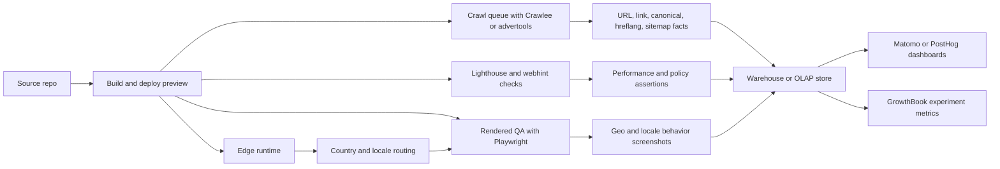
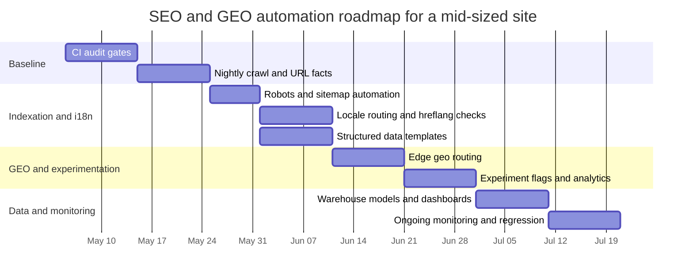

# GitHub Repositories and Automation Stack for SEO and GEO Workflows

## Executive Summary

The strongest open-source foundation for automating SEO and GEO workflows today is not a single “SEO platform,” but a composable stack. The best technical core is a browser/runtime layer for rendered-page checks and geo testing, a crawler plus parsing layer for large-scale URL extraction and QA, an audit layer for page quality and performance, an i18n/schema layer for localization correctness, an experimentation and analytics layer, and an edge/runtime layer for geo-aware delivery. In practice, the highest-confidence building blocks are Playwright, Crawlee, Lighthouse, advertools, schema-dts, next-intl or i18next/FormatJS, Cloudflare Workers or Vercel/OpenNext patterns, and a measurement layer such as GrowthBook, PostHog, Matomo, or GoAccess. These projects are active, well-documented, and used well beyond narrow SEO use cases. citeturn17view0turn19view0turn16search2turn16search0turn8view1turn12view0turn10view0turn11view0turn22view0turn23view0turn26search2turn37view0turn28search2turn29search0

The biggest strategic gap is keyword research, rank tracking, and backlink analysis. Code on GitHub helps a lot with orchestration, parsing, and API integration, but the actual data layer is still dominated by APIs and large proprietary indexes. For search-volume and keyword planning, the Google Ads API client is the cleanest official route. For SERP and backlink/rank datasets, official vendor clients such as DataForSEO’s and SerpApi’s wrappers are more practical than trying to maintain brittle scrapers. That is partly a data-economics issue and partly a legal-risk issue: search-results scraping is an actively contested area, and there is ongoing litigation around it. citeturn35search5turn35search2turn31search4turn31search1turn31news49turn31news48

For a mid-sized website, the most sensible roadmap is to implement this in phases. Start with crawl/audit baselines and CI gating, then add structured data, sitemap/robots, and hreflang/i18n validation, then add geo-aware testing and edge localization, and only then invest in experimentation and warehouse-backed analytics. A realistic first production version is an eight-to-twelve-week program for one platform engineer plus part-time SEO and application engineering support. That staging avoids the common failure mode of shipping feature-flagging and localization logic before the organization has reliable crawl intelligence, rendering QA, and deployment checks. citeturn8view1turn9view0turn10view0turn34search1turn33search0turn22view0turn40search6turn40search2

## Research Method

This report prioritizes repositories and official docs that are active, well-documented, and practical to automate in CI, cron jobs, or serverless/edge environments. I treated GitHub repository pages, commit-history pages, organization repository listings, and official product documentation as primary sources. Where GitHub crawl pages exposed an exact commit-history date, I report that. Where GitHub did not expose the commit-history timestamp reliably in the available crawl, I use the most recent observable release date or organization-level “updated” date as the activity signal. That is why some rows say “last commit observed,” while others say “latest release” or “last observed update.”

A note on category coverage: open-source coverage is excellent for crawling, audits, rendering QA, schema, i18n, logs, analytics, CI/CD, edge runtimes, and experimentation. It is materially weaker for search-volume, rank, and backlink data itself. For those domains, the best GitHub-hosted resources are usually official client libraries and orchestration tools rather than complete open-data replacements. citeturn35search5turn35search2turn31search4turn31search1turn39search9turn39search10

## Prioritized Catalog

**Top 10 overall repositories for a production SEO/GEO automation program**

| Priority | Repository | Canonical GitHub URL | Why it matters | Primary language or ecosystem | Activity signal | License | Skills and setup | Sources |
|---|---|---|---|---|---|---|---|---|
| High | `GoogleChrome/lighthouse` | `https://github.com/GoogleChrome/lighthouse` | Baseline technical SEO and web-quality audits: performance, best practices, rendered-page diagnostics, custom audits | Node/Chrome CLI, JS/TS ecosystem | ~30k stars, ~9.7k forks, last commit observed Apr 8, 2026 | Apache-2.0 | Node.js, Chrome, CLI or CI runners | citeturn7view1turn8view1turn9view1turn12view0 |
| High | `microsoft/playwright` | `https://github.com/microsoft/playwright` | Best browser automation layer for geo/regional testing, rendering QA, screenshot diffs, cookie/locale flows, and headless SEO checks | TypeScript | ~88k stars, ~5.6k forks, last commit observed Apr 25, 2026 | Apache-2.0 | Node.js, browser binaries, CI runners; also agent/CLI workflows | citeturn15search3turn17view0turn19view0 |
| High | `apify/crawlee` | `https://github.com/apify/crawlee` | Large-scale crawling and scraping orchestration with Playwright/Puppeteer/Cheerio/JSDOM, proxy rotation, retries, and queueing | TypeScript | ~22.8k stars, ~1.3k forks, last observed update Apr 17, 2026 | Apache-2.0 | Node.js, optional proxies, queues/storage, serverless or container runners | citeturn16search2turn16search0 |
| High | `eliasdabbas/advertools` | `https://github.com/eliasdabbas/advertools` | SEO-focused Python toolkit for crawls, logs, sitemaps, robots, SERP dataframes, and crawl analytics | Python | ~1.4k stars, ~240 forks, last commit observed Apr 2, 2026 | MIT | Python, pandas-oriented workflows, notebooks or batch jobs | citeturn10view0turn10view2turn11view0 |
| High | `amannn/next-intl` | `https://github.com/amannn/next-intl` | Best-in-class Next.js i18n layer for locale paths, message formatting, and SEO-friendly internationalized routing | TypeScript | ~4.2k stars, ~357 forks, release observed Apr 28, 2026; commit history observed Apr 1, 2026 | MIT | Next.js, ICU messages, routing design, build-time locale pipelines | citeturn22view0turn24view0 |
| High | `google/schema-dts` | `https://github.com/google/schema-dts` | Strong typed JSON-LD layer for Schema.org; ideal for structured-data correctness in TS codebases | TypeScript | ~1.2k stars, ~49 forks, last commit observed Mar 28, 2026 | Apache-2.0 | TypeScript, JSON-LD generation, front-end or SSR code | citeturn23view0turn25view0 |
| High | `cloudflare/workers-sdk` | `https://github.com/cloudflare/workers-sdk` | Edge/runtime tooling for geo-aware redirects, locale routing, header-based policy, and globally distributed functions | TypeScript | ~4k stars, ~1.2k forks, latest release Apr 15, 2026 | Apache-2.0 and MIT | TypeScript, Wrangler CLI, Workers runtime, edge deployment | citeturn26search2 |
| High | `growthbook/growthbook` | `https://github.com/growthbook/growthbook` | Warehouse-native feature flags, experiments, and product analytics; ideal for localized SEO tests and landing-page experiments | TypeScript | ~7.7k stars, ~738 forks, latest release Feb 4, 2026 | Open core: mostly MIT, some enterprise-licensed directories | Docker Compose or Kubernetes, warehouse integrations, SDKs | citeturn37view0turn28search4 |
| High | `PostHog/posthog` | `https://github.com/PostHog/posthog` | Broadest open-source measurement platform here: web analytics, feature flags, experimentation, pipelines, replay, error tracking | Python-led monorepo with JS/TS | ~32.6k stars, ~2.5k forks, last observed update Apr 19, 2026 | MIT expat for repo core, with proprietary code in `ee` | Docker/K8s, event instrumentation, warehousing optional | citeturn28search2turn28search3turn28search0 |
| High | `matomo-org/matomo` | `https://github.com/matomo-org/matomo` | Privacy-first, self-hosted analytics alternative with strong fit for SEO traffic analysis and first-party control | PHP | ~21.4k stars, ~2.8k forks, last observed update Apr 19, 2026 | GPL-3.0 | PHP/MySQL or MariaDB, web deployment, privacy/compliance review | citeturn29search1turn29search2 |

**Top 10 for crawling, site auditing, rendering QA, and monitoring**

| Repository | Best use | Primary language or ecosystem | Activity signal | License | Setup burden | Sources |
|---|---|---|---|---|---|---|
| `GoogleChrome/lighthouse` | Performance and technical audit baselines | Node/Chrome | Last commit observed Apr 8, 2026 | Apache-2.0 | Low to medium | citeturn8view1turn12view0 |
| `apify/crawlee` | Scalable crawling with browser and HTTP handlers | TypeScript | Updated Apr 17, 2026 | Apache-2.0 | Medium | citeturn16search2turn16search0 |
| `microsoft/playwright` | Rendered-page QA, locale/cookie/geo flows, screenshots | TypeScript | Last commit observed Apr 25, 2026 | Apache-2.0 | Medium | citeturn17view0turn19view0 |
| `puppeteer/puppeteer` | Browser automation if your team prefers DevTools Protocol-heavy workflows | TypeScript | Last commit observed Apr 20, 2026 | Apache-2.0 | Medium | citeturn18view0turn20view0 |
| `gocolly/colly` | Fast Go crawler for simple-to-moderate structured scraping | Go | Last commit observed Apr 14, 2026 | Apache-2.0 | Medium | citeturn18view1turn20view1 |
| `eliasdabbas/advertools` | Crawl comparison, log parsing, sitemap/robots ingestion | Python | Last commit observed Apr 2, 2026 | MIT | Low | citeturn10view0turn11view0 |
| `webhintio/hint` | Linting for accessibility, speed, compatibility, and best practices | Node/monorepo | Commit date not exposed in retrieved crawl; active monorepo with 6,372 commits | Apache-2.0 | Low | citeturn7view0turn8view0turn9view0 |
| `sitespeedio/sitespeed.io` | Continuous monitoring and performance regressions in real browsers | JavaScript | Latest release observed Mar 25, 2026 | MIT | Medium | citeturn7view2turn8view2turn9view2 |
| `treosh/lighthouse-ci-action` | Turn Lighthouse checks into an off-the-shelf GitHub Action | TypeScript | Workflow activity observed in GitHub Actions | MIT | Low | citeturn31search0turn31search5 |
| `allinurl/goaccess` | Real-time log analytics and HTML dashboards from webserver logs | C | Mature project; exact last commit not exposed in retrieved crawl | MIT | Low | citeturn29search0 |

**Top 10 for localization, hreflang/i18n, schema, robots, sitemaps, geo-IP, and edge delivery**

| Repository | Best use | Primary language or ecosystem | Activity signal | License | Setup burden | Sources |
|---|---|---|---|---|---|---|
| `amannn/next-intl` | Internationalized routing and locale-aware page generation in Next.js | TypeScript | Release observed Apr 28, 2026 | MIT | Medium | citeturn22view0turn24view0 |
| `i18next/i18next` | General i18n core across browser/Node environments | JavaScript | Updated Nov 26, 2025 | MIT | Low | citeturn21search0turn21search2 |
| `formatjs/formatjs` | ICU formatting, React Intl, locale-safe messages and formatting | TypeScript/Rust-led monorepo | Last commit observed Jan 29, 2026 | License not exposed in retrieved crawl; verify before embedding in product policy | Medium | citeturn21search1turn23view1turn25view1 |
| `google/schema-dts` | Typed JSON-LD generation and validation in TS apps | TypeScript | Last commit observed Mar 28, 2026 | Apache-2.0 | Low | citeturn23view0turn25view0 |
| `schemaorg/schemaorg` | Canonical Schema.org definitions and release history | HTML/data repo | Schema.org 30.0 released Mar 19, 2026; repo updated Nov 21, 2025 | Apache-2.0 | Low | citeturn33search1turn34search0turn34search4 |
| `google/robotstxt` | Googlebot-compatible robots parsing and URL allow/deny testing | C++ | Stable release observed Feb 20, 2026 | Apache-2.0 | Medium | citeturn34search1turn34search3 |
| `ekalinin/sitemap.js` | Programmatic sitemap generation and CLI creation/parsing | Node.js | Activity metadata incomplete in retrieved crawl; tooling and CLI are clear | See repo LICENSE | Low | citeturn33search0turn34search2 |
| `ipinfo/cli` | Fast operator tooling for IP/location validation and batch checks | Go | Active project; exact commit date not exposed in retrieved crawl | Apache-2.0 | Low | citeturn26search0turn26search5 |
| `cloudflare/workers-sdk` | Edge redirects, country-based locale defaults, per-country content policy | TypeScript | Latest release Apr 15, 2026 | Apache-2.0 and MIT | Medium | citeturn26search2 |
| `opennextjs/opennextjs-aws` | Deploy Next.js SEO/i18n stacks on AWS with SSR/ISR/middleware support | TypeScript | Updated Nov 13, 2025 | MIT | Medium to high | citeturn27search1turn27search4 |

**Top 10 for experimentation, analytics, keyword/rank APIs, and data pipelines**

| Repository | Best use | Primary language or ecosystem | Activity signal | License | Setup burden | Sources |
|---|---|---|---|---|---|---|
| `growthbook/growthbook` | Experimentation and feature flags for SEO landing pages, redirects, copy tests | TypeScript | Latest release Feb 4, 2026 | Open core, mostly MIT plus enterprise license | Medium | citeturn37view0turn28search4 |
| `PostHog/posthog` | Product and web analytics, flags, experiments, pipelines | Python-led monorepo | Updated Apr 19, 2026 | MIT expat plus proprietary `ee` directory | High | citeturn28search0turn28search2turn28search3 |
| `Flagsmith/flagsmith` | Self-hostable feature flags and remote config | Python | Updated Dec 2, 2025 | BSD-3-Clause | Medium | citeturn29search4turn38view0 |
| `Unleash/unleash` | Mature open-source feature management for rollouts and targeting | Node/TS ecosystem | Activity strong; exact license not exposed in retrieved crawl | Verify repo license before internal standardization | Medium | citeturn29search3turn38view1 |
| `matomo-org/matomo` | Self-hosted analytics with privacy controls | PHP | Updated Apr 19, 2026 | GPL-3.0 | Medium | citeturn29search1turn29search2 |
| `airbytehq/airbyte` | Move SEO/GEO data into warehouses; connector-rich ELT | Python/Kotlin/Java | Updated Apr 19, 2026 | License not exposed in retrieved crawl; verify policy fit | High | citeturn30search0turn30search2 |
| `dbt-labs/dbt-core` | Transform crawl/log/rank/event data into trusted marts | Python | Latest release Apr 8, 2026 | Apache-2.0 | Medium | citeturn32search1turn32search4 |
| `googleads/google-ads-python` | Official keyword-planning and search-volume workflows via Google Ads API | Python | Activity visible; exact last commit not exposed in retrieved crawl | Apache-2.0 | Medium | citeturn35search5turn30search4 |
| `dataforseo/PythonClient` | Official client for SERP, keywords, backlinks, domain analytics APIs | Python | Updated Nov 13, 2025 | MIT | Low to medium | citeturn35search0turn35search2 |
| `serpapi/serpapi-python` | Official Python wrapper for search engine results APIs | Python | Updated Oct 11, 2025 | MIT | Low | citeturn35search6turn31search4 |

A few strong alternates deserve mention even though I did not rank them in the three top-10 tables above: `rudderlabs/rudder-server` for CDP/event routing with Elastic License 2.0; `meltano/meltano` for code-first ELT; `matomo-org/matomo-log-analytics` for importing raw server logs into Matomo; and `spatie/schema-org` for PHP teams that want fluent Schema.org builders. citeturn36search5turn32search3turn30search1turn33search2

## Stack Architecture and Workflows

The most practical way to combine these repositories is to build a layered stack rather than a monolith. Use browser automation for rendered-page truth, crawler libraries for breadth, static/quality audits for gating, typed schema/i18n layers for implementation correctness, an edge layer for country-aware routing, and analytics/experimentation tools for measurement. That pattern aligns with how the referenced projects are designed: Playwright and Crawlee handle execution and orchestration, Lighthouse and webhint handle quality checks, next-intl/i18next/FormatJS manage locale behavior, schema-dts and Schema.org handle structured data, and GrowthBook/PostHog/Matomo handle decision-making and measurement. citeturn17view0turn16search2turn8view1turn9view0turn22view0turn21search2turn21search1turn23view0turn33search1turn37view0turn28search2turn29search2



A useful task-to-tool matrix for the categories you asked for looks like this:

| Task category | Primary repositories and tools | Practical note | Sources |
|---|---|---|---|
| Crawling and scraping | Crawlee, Playwright, Puppeteer, Colly, advertools | Use browser crawlers only where rendering matters; use HTTP/DOM crawlers for scale | citeturn16search2turn17view0turn18view0turn18view1turn10view0 |
| Site auditing | Lighthouse, webhint, sitespeed.io | Combine page-level gates with periodic trend monitoring | citeturn8view1turn9view0turn9view2 |
| On-page optimization | Lighthouse, webhint, next-intl, schema-dts | Treat metadata, rendered titles, and locale routes as testable contracts | citeturn8view1turn9view0turn22view0turn23view0 |
| Keyword research | Google Ads API client, DataForSEO client | Use official API-backed volumes instead of homemade scraping | citeturn35search5turn35search2 |
| Rank tracking | DataForSEO client, SerpApi client, Playwright for spot checks | API-first is more stable than scraping raw SERPs yourself | citeturn35search2turn31search4turn31news49turn31news48 |
| Backlink analysis | DataForSEO Domain Analytics, Common Crawl for custom link studies | Open-source orchestration is good; high-quality link data is still API-heavy | citeturn35search2turn39search9turn39search10 |
| Log analysis | GoAccess, advertools, Matomo Log Analytics | Keep both raw-log and event-based views; they answer different SEO questions | citeturn29search0turn10view0turn30search1 |
| Structured data and schema | schema-dts, schema.org, spatie/schema-org | Prefer code-generated or typed JSON-LD over ad hoc blobs | citeturn23view0turn33search1turn33search2 |
| Sitemap and robots | sitemap.js, google/robotstxt, advertools | Generate sitemaps in build/deploy; lint robots against Google’s parser | citeturn33search0turn34search1turn10view0 |
| Hreflang and localization | next-intl, i18next, FormatJS, CLDR data | Treat locale-path and message-format correctness as build-time and crawl-time checks | citeturn22view0turn21search2turn21search1turn39search1turn39search0 |
| Geotargeting and IP-based testing | Playwright, GeoIP2, IPinfo CLI, Vercel geo headers | GeoIP is approximate; test behavior and fallbacks, not just lookup accuracy | citeturn17view0turn26search1turn26search0turn40search6 |
| CDN and edge localization | Cloudflare Workers SDK, OpenNext AWS, Vercel Functions/Edge Config | Use edge only for cheap routing and policy, not heavy origin-dependent logic | citeturn26search2turn27search4turn40search0turn40search1turn40search2 |
| A/B testing | GrowthBook, PostHog, Flagsmith, Unleash | GrowthBook is strongest if you already have or want a warehouse-native path | citeturn37view0turn28search2turn29search5turn29search3 |
| Analytics integration | Matomo, PostHog, RudderStack, Airbyte, dbt | Separate collection from modeling; do not bury SEO KPIs in raw event tables | citeturn29search2turn28search2turn36search5turn30search2turn32search1 |
| Automation and CI | Lighthouse CI Action, Playwright, webhint, GitHub Actions | Make SEO checks block merges on regressions, not just generate reports | citeturn31search0turn17view0turn9view0 |
| Deployment | Workers SDK, OpenNext AWS, Vercel templates | Deployment choice matters because geo headers, middleware, and cache behavior differ | citeturn26search2turn27search4turn40search6 |
| Monitoring | sitespeed.io, GoAccess, Matomo, PostHog | Use both synthetic and observational monitoring | citeturn9view2turn29search0turn29search2turn28search2 |

An opinionated default stack for a mid-sized multilingual website is: Playwright + Crawlee + Lighthouse + webhint + advertools + schema-dts + next-intl/i18next + google/robotstxt + sitemap.js + Cloudflare Workers or Vercel/OpenNext + GrowthBook + either Matomo or PostHog + dbt. That combination covers nearly every category in your request without forcing a single cloud or framework. It also gives you a clean separation between page correctness, geo behavior, and business measurement. citeturn17view0turn16search2turn8view1turn9view0turn10view0turn23view0turn22view0turn21search2turn34search1turn33search0turn26search2turn27search4turn37view0turn29search2turn28search2turn32search1

A practical CI pattern looks like this:

```yaml
name: seo-qa

on:
  pull_request:
  workflow_dispatch:

jobs:
  qa:
    runs-on: ubuntu-latest
    steps:
      - uses: actions/checkout@v4

      - uses: actions/setup-node@v4
        with:
          node-version: 20

      - run: npm ci
      - run: npx playwright install --with-deps chromium

      - run: npm run build
      - run: npm run start &

      - run: npx hint http://127.0.0.1:3000

      - uses: treosh/lighthouse-ci-action@v12
        with:
          urls: |
            http://127.0.0.1:3000/
            http://127.0.0.1:3000/de/
            http://127.0.0.1:3000/fr/
          uploadArtifacts: true
          temporaryPublicStorage: false

      - run: npx playwright test
```

This pattern is a strong default because `webhint` can run from `npx`, Playwright has a straightforward install path for CI, and `treosh/lighthouse-ci-action` wraps Lighthouse CI in a purpose-built GitHub Action. citeturn9view0turn17view0turn31search0

For edge localization, a minimal routing layer can look like this:

```ts
import { geolocation } from '@vercel/functions'

export function middleware(req: Request) {
  const { country = 'US' } = geolocation(req)
  const locale = country === 'DE' ? 'de' : country === 'FR' ? 'fr' : 'en'
  return Response.redirect(new URL(`/${locale}`, req.url), 302)
}
```

Vercel’s official geo example and geo-header guide show that the helper is built on top of deployment-time geolocation headers, while the Edge Config product is explicitly positioned for feature flags, A/B testing, redirects, and IP blocking close to the user. citeturn40search4turn40search6turn40search2

If you want developer- or agent-oriented “skill resources,” Playwright is the most concrete example in this set. The repository includes a `.claude/skills` directory, and the Playwright CLI explicitly documents `playwright-cli install --skills`, which makes it unusually well suited for AI-assisted QA agents or internal automation assistants that need browser skills out of the box. citeturn17view0

## Data Resources, Licensing, and Risk

The best geo and locale reference datasets to combine with these repositories are MaxMind GeoLite/GeoIP2, IPinfo, GeoNames, Unicode CLDR, Schema.org releases, and Common Crawl. They solve different problems. MaxMind and IPinfo are for IP-to-location enrichment and operational testing. GeoNames is for normalized place data and multilingual location lookups. CLDR is for locale conventions, date/number/currency rules, and display names. Schema.org provides the canonical vocabulary releases for structured data. Common Crawl is the open-web corpus you can query when you need large-scale link, page, or language studies. citeturn26search1turn26search0turn39search2turn39search4turn39search1turn39search3turn34search4turn39search9turn39search10

| Resource | Best use in SEO/GEO workflows | Practical usage note | License or policy note | Sources |
|---|---|---|---|---|
| MaxMind GeoLite2 / GeoIP2 | Country/region defaults, coarse geo QA, bot and market segmentation | Use database readers or web service clients; do not assume household-level accuracy | GeoIP is “inherently imprecise”; GeoLite downloads are covered by MaxMind’s EULA | citeturn26search1turn39search8 |
| IPinfo | Operator-friendly IP lookup and quick geo verification in testing/support | CLI is good for one-off or batch validation | Commercial API usage terms apply; repo itself is Apache-2.0 | citeturn26search0turn26search5 |
| GeoNames | Geo normalization, multilingual place joins, canonical IDs | Useful to enrich locale records with `geoname_id` and alternate names | CC BY 4.0; large, free download set | citeturn39search2turn39search4 |
| Unicode CLDR / `cldr-json` | Locale display names, date/number/currency rules, pluralization support | Use CLDR-backed libraries to avoid homemade locale tables | CLDR’s canonical format is XML; JSON is generated and distributed via `cldr-json` | citeturn39search1turn39search3turn39search0 |
| Schema.org releases | Structured-data source of truth | Pin schema generation/validation to a known release where reproducibility matters | Stable release cadence; 30.0 published Mar 19, 2026 | citeturn34search4turn33search1 |
| Common Crawl | Large-scale backlink, language, indexability, and competitive studies | Use CDX/index access for filtering rather than downloading everything blindly | Open corpus on AWS/Open Data; bulk-friendly but operationally heavy | citeturn39search9turn39search10 |

The main licensing and legal point is that “open source repo available on GitHub” does not mean “safe to use without policy review.” GrowthBook is open core. PostHog has an MIT-licensed core repo but also proprietary code in `ee`. RudderStack server uses Elastic License 2.0. Airbyte and Unleash require a separate verification pass if your procurement standards insist on a specific OSI-approved license class, because the retrieved crawl pages did not expose the exact license text cleanly enough to rely on them here. citeturn28search4turn28search2turn36search5turn30search2turn29search3

On scraping risk, the most sensitive zone is search-results collection. Google’s `robotstxt` library is valuable because it reflects Googlebot’s parsing and matching behavior, helping you align your own tooling with how Google interprets robots rules. But compliance with robots handling does not eliminate other contractual or copyright risks. As of late 2025 and early 2026, Google and SerpApi were in active litigation over search-results scraping and alleged anti-scraping bypasses, with SerpApi moving to dismiss on copyrightability grounds. That does not make rank tracking impossible, but it is a strong reason to bias toward official APIs, licensed providers, and careful counsel review for any large-scale SERP collection. This is not legal advice. citeturn34search1turn34search3turn31news49turn31news48

Operationally, geo testing also has caveats. Vercel’s geo headers are only present in deployed environments, not in local dev, and the guide explicitly warns that the feature does not work behind a proxy in front of the deployment unless trusted-proxy features are enabled. That means your GEO QA plan should include both local fallback mocks and deployed staging tests from multiple regions. citeturn40search6

## Implementation Roadmap

For a mid-sized site, I would implement this as a staged program. The goal is to make each phase independently valuable, testable, and deployable.

| Phase | What you build | Deliverables | Estimated effort | Sample commands and starting points |
|---|---|---|---|---|
| Foundation | Rendered QA, crawl sampling, technical baselines in CI | Lighthouse/webhint/Playwright checks on PRs; nightly crawl job; baseline scorecards | 2–3 weeks | `npm init playwright@latest`; `npx hint https://example.com`; use `treosh/lighthouse-ci-action` in GitHub Actions | citeturn17view0turn9view0turn31search0 |
| Indexation controls | Sitemaps, robots, canonical and redirect rules | Automated sitemap generation, robots testing, canonical regression checks | 1–2 weeks | `npx sitemap < listofurls.txt`; `bazel run robots_main -- ~/local/path/to/robots.txt YourBot https://example.com/url` | citeturn33search0turn34search1 |
| Localization correctness | Locale routing, message formatting, hreflang validation logic | Locale contracts, path standards, content-fallback policy, test fixtures | 2 weeks | `composer require spatie/schema-org` for PHP teams; `npm install` with next-intl/i18next/FormatJS stacks as appropriate | citeturn22view0turn21search2turn21search1turn33search2 |
| Structured data | Typed JSON-LD and schema linting | Shared schema builder module, page-type templates, CI validations | 1–2 weeks | Use `schema-dts` or Schema.org-derived builders in app code | citeturn23view0turn33search1 |
| GEO and edge delivery | Country-aware routing and experiment-safe edge policy | Geo header wrappers, fallback rules, region-stage tests, edge redirects | 2 weeks | `npm create cloudflare@latest`; `pnpm create next-app --example https://github.com/vercel/examples/tree/main/edge-middleware/geolocation geolocation` | citeturn26search2turn40search4 |
| Logs and analytics | Log intelligence plus event analytics | Bot/crawl segments, organic landing-page marts, experiment dashboards | 2–3 weeks | GrowthBook self-host quickstart: `docker compose up -d`; Google Ads client: `pip install google-ads`; DataForSEO client: `pip install dataforseo-client`; SerpApi client: `pip install serpapi` | citeturn37view0turn35search5turn35search2turn31search4 |
| Data model and reporting | Warehouse marts and decision-ready views | dbt models for URLs, locales, pages, search KPIs, and experiment slices | 1–2 weeks | Start dbt Core and warehouse models after collection and crawl facts are stable | citeturn32search1 |

A sensible command-line starter stack for the first two weeks is:

```bash
npm init playwright@latest
npm install --save-dev hint
npx hint https://example.com
npx sitemap < listofurls.txt
pip install google-ads
pip install dataforseo-client
pip install serpapi
pip install geoip2
npm create cloudflare@latest
```

Each of those commands or installation paths is directly documented by the referenced projects or their official docs, and together they are enough to stand up a first pass at rendered QA, linting, sitemap generation, keyword data API access, and geo-IP enrichment. citeturn17view0turn9view0turn33search0turn35search5turn35search2turn31search4turn26search1turn26search2

The timeline below is the implementation sequence I would recommend:



## Open Questions and Limitations

Some repository pages exposed exact commit-history dates, while others only exposed an organization-level “updated” date or latest release in the available public crawl pages. I called that out where it mattered instead of pretending every row had identical evidence quality.

A few licenses should be verified directly before standardization in an enterprise setting. In particular, I would re-check Airbyte, Unleash, and any repo whose retrieved crawl showed “View license” without exposing the exact text in the page content I captured. The same caution applies to open-core projects like GrowthBook and PostHog, where the repo clearly includes mixed licensing boundaries. citeturn30search2turn29search3turn28search2turn28search4

Finally, if your program depends heavily on rank tracking or backlink intelligence, this catalog should be read as an automation-and-integration catalog, not as proof that pure open-source repositories replace commercial search datasets. For those functions, the winning pattern is usually open-source orchestration wrapped around official APIs, licensed providers, or large public corpora like Common Crawl. citeturn35search5turn35search2turn31search4turn39search9turn39search10