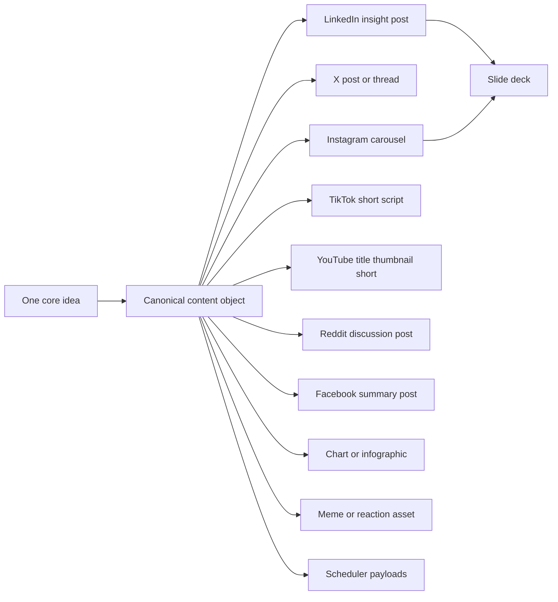
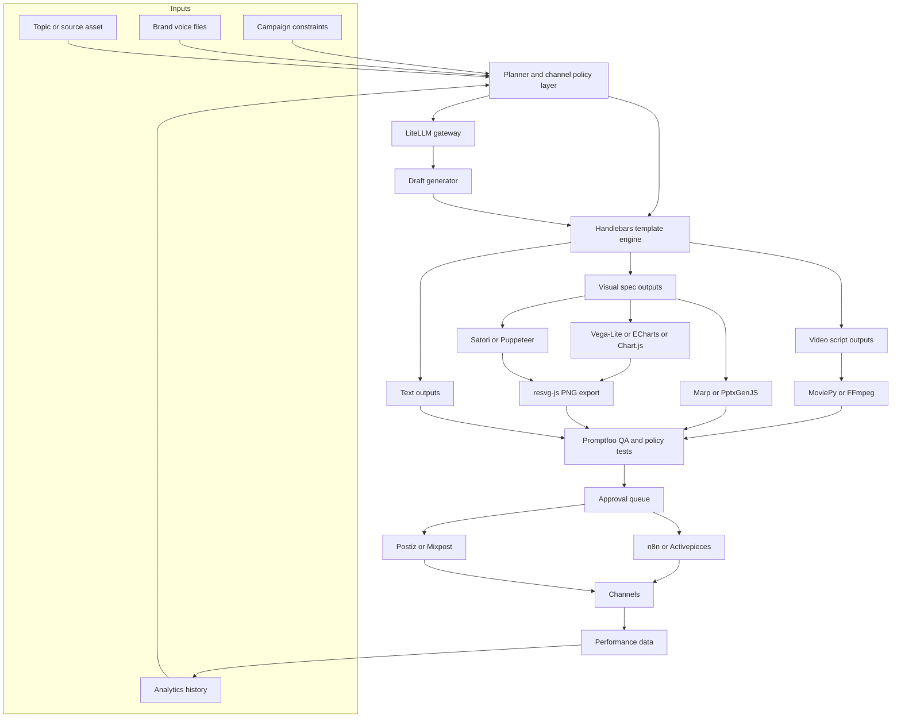
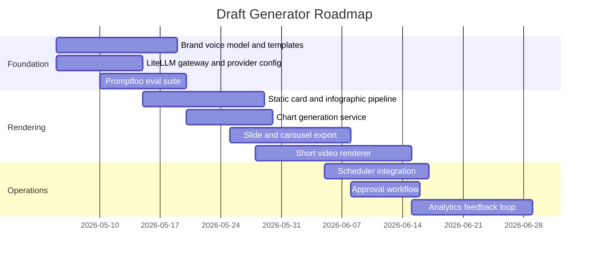

# GitHub Research for an Automated Multi Format Social Media Draft Generator

## Executive summary

The strongest open-source path is **not** one monolithic “social media AI” repo. The best stack is a **composable pipeline**: a model gateway for text and multimodal generation, a prompt-and-template layer for voice consistency, deterministic visual renderers for charts/cards/slides, programmatic video tooling for shorts, and a scheduling layer that publishes through official APIs and OAuth. The highest-confidence combination from the repositories reviewed is: **LiteLLM** for model routing, **Promptfoo** for prompt evaluation, **Handlebars** plus social-media prompt/skill repos for templated drafts, **Satori + resvg-js + Puppeteer** for social cards/infographics/image export, **Vega-Lite / Apache ECharts / Chart.js** for graphs, **Marp + PptxGenJS** for slide/carousel output, **MoviePy + FFmpeg** for shorts, and **Postiz or Mixpost** for multi-platform scheduling. For orchestration, **n8n** or **Activepieces** are the most practical glue layers. citeturn15view0turn14view2turn13view2turn20view0turn19view2turn20view1turn10view1turn11view2turn5view2turn5view1turn23view0turn25view0

The most useful GitHub repository that is directly social-content-focused is **charlie947/social-media-skills**. It is not an end-to-end product, but it is unusually valuable as a **prompt/policy/voice layer** because it already encodes cross-channel workflows for voice-building, post-writing, carousels, infographics, reels scripting, thumbnails, pinned comments, and scoring content against prior history. It is best treated as a knowledge pack to adapt into your own system rather than as the runtime itself. citeturn5view0

For publishing, there is a meaningful license fork in the road. **Postiz** is the most mature open-source social scheduler reviewed here, with strong momentum, official OAuth positioning, API friendliness, and broad scheduling emphasis, but it is **AGPL-3.0**, which may be unacceptable if you want to embed it deeply into a closed commercial backend. **Mixpost** is much more permissive at the open-source layer, but its open repository is the **Lite** edition and some advanced capability is commercialized. **n8n** and **Activepieces** are excellent orchestration layers, but each has its own non-standard licensing nuance: n8n uses fair-code licensing and Activepieces combines MIT community code with commercial features. citeturn5view2turn5view1turn23view0turn25view0

On the channel side, the shared “red thread” should be: **one source idea, one proof point, one thumbnail/hero visual, one CTA, then channel-specific adaptation**. Official platform materials consistently emphasize optimization around native formats, attention capture, clear thumbnails/visual packaging, and platform-fit creative. Meta has a creator best-practices hub and placement guidance, YouTube emphasizes thumbnail-and-title packaging and video optimization, TikTok provides Creative Center and creative best-practice guidance, Reddit stresses community norms and Reddit-native storytelling, and X provides official technical post constraints and Ads API support. LinkedIn is the relative outlier in this research set: public official creator-style guidance was less concentrated in the retrieved sources, so I treat LinkedIn recommendations below as more conservative and partly secondary-source-based. citeturn26search0turn26search1turn26search13turn26search2turn26search8turn34search1turn34search13turn35search0turn35search9turn32view1turn32view0turn37search7

## Repository landscape

### Priority stack for a production ready system

The table below is ordered by how much practical leverage each project adds to a real automated draft generator.

| Project | Best use | License | Maturity | Stack | Inputs and outputs | Example usage | Strengths | Limitations | Integration notes |
|---|---|---|---|---|---|---|---|---|---|
| `BerriAI/litellm` citeturn15view0 | Model gateway for text, image, audio, batches, MCP tools | View license on repo | 45.5k stars; latest stable release May 2, 2026 | Python + TypeScript | In: OpenAI-style requests, MCP tools, multi-provider creds. Out: unified `/chat/completions`, `/responses`, `/images`, `/audio`, etc. | `completion(model="openai/gpt-4o", messages=[...])` and proxy on `:4000` | Best control point for multi-model routing, fallback, spend tracking, guardrails, MCP bridging | Adds infra complexity; not a content strategy layer by itself | Use as the single “brains” endpoint for all generators; excellent for swapping providers without rewriting application code |
| `promptfoo/promptfoo` citeturn14view2turn13view1 | Prompt regression testing and quality gates | MIT | 20.8k stars; latest release Apr 27, 2026 | TypeScript | In: prompt configs, eval cases, models. Out: eval matrices, reports, CI checks | `promptfoo eval`, `promptfoo view` | Critical for keeping caption hooks, CTAs, and tone stable over time | Does not generate assets directly | Put between prompt-template changes and production release; score outputs per channel |
| `charlie947/social-media-skills` citeturn5view0 | Voice rules, channel workflows, social prompting patterns | MIT | 730 stars; no releases published | Shell/Markdown skill pack | In: newsletter / topic / voice context. Out: prompts, frameworks, briefed workflows | `/plugin install social-media-skills` or clone skill folders | Unusually social-specific; includes voice-builder, post-writer, scorer, carousel/infographic and reels workflows | Not a standalone service or scheduler; more knowledge pack than product | Great seed material for your “channel policy + voice policy” layer |
| `handlebars-lang/handlebars.js` citeturn13view2 | Copy templates and structured render specs | MIT | 18.6k stars; latest release Mar 26, 2026 | JavaScript/TypeScript | In: JSON content object. Out: text/HTML templates | `Handlebars.compile(source)(context)` | Ideal for deterministic caption, CTA, and thumbnail-text templates | Not opinionated about content quality | Use for all draft scaffolds before LLM refinement |
| `vercel/satori` citeturn20view0 | JSX/HTML-to-SVG social cards and infographic layouts | MPL-2.0 | 13.4k stars; latest release Apr 30, 2026 | TypeScript | In: JSX + fonts + dimensions. Out: SVG strings | `const svg = await satori(<div>...</div>, {width, height, fonts})` | Excellent for branded quote cards, preview cards, carousels, static infographic panels | Limited HTML/CSS subset; static only | Pair with resvg-js or Puppeteer for PNG export |
| `thx/resvg-js` citeturn19view2 | Fast SVG-to-PNG conversion | MPL-2.0 | 1.9k stars; latest release Mar 26, 2024 | Rust + TypeScript + WASM | In: SVG string/file. Out: PNG buffer, dimensions | `new Resvg(svg, opts).render().asPng()` | Fast, safe, lightweight conversion for image pipelines | Release cadence slower in reviewed lines than some peers | Best companion to Satori for deterministic image export |
| `puppeteer/puppeteer` citeturn20view1 | Render HTML/CSS carousels, dashboards, and thumbnails as screenshots/PDFs | Apache-2.0 | 94.2k stars; latest release Apr 20, 2026 | TypeScript | In: URLs/HTML/templates. Out: screenshots, PDFs, DOM automation | `page.goto()`, `page.setViewport()`, screenshot/export | Best when you want “real browser output” from HTML/CSS templates | Heavier than SVG-only paths | Use for high-fidelity templates, chart pages, HTML carousels, or approval previews |
| `vega/vega-lite` citeturn16view1 | Declarative chart specs that an LLM can emit safely | BSD-3-Clause | 5.3k stars; latest release Apr 24, 2026 | TypeScript | In: JSON chart spec + data. Out: Vega representations, browser charts | Emit JSON specs from model, render via Vega toolchain/editor | Excellent for structured chart generation from data summaries | Requires render step for PNG/SVG export | Best choice when you want LLMs to output normalized graph specs instead of code |
| `apache/echarts` citeturn11view0 | Rich, customizable data viz for dashboards and infographics | Apache-2.0 | 66.3k stars; latest release Jul 30, 2025 | TypeScript/JavaScript | In: option JSON + data. Out: browser charts; dist builds | `npm install echarts --save` | Very powerful and highly customizable; strong ecosystem | More room for inconsistency if model writes raw options badly | Good for analytics dashboards and polished branded charts |
| `chartjs/Chart.js` citeturn21view0 | Simple graphing for static export and slide embeds | MIT | 67.4k stars; latest release Oct 13, 2025 | JavaScript/TypeScript | In: datasets/config. Out: canvas charts | Standard Chart.js config | Very easy for line/bar/radar basics | Less expressive than Vega-Lite/ECharts for advanced infographic work | Great “default graph engine” for MVPs |
| `marp-team/marp-cli` citeturn17view0turn16view0 | Markdown-to-slides, PDF, PPTX, and images | MIT | 3.5k stars; latest release Mar 16, 2026 | TypeScript | In: Markdown + themes + config. Out: HTML, PDF, PPTX, PNG/JPEG slides | `npx @marp-team/marp-cli slide-deck.md --pptx` | Excellent for content-driven carousels and speaker-deck-style repurposing | Browser dependency for some export modes; design system must be themed well | Great for turning newsletter/article drafts into LinkedIn or Instagram carousels |
| `gitbrent/PptxGenJS` citeturn22view2turn22view1turn22view0 | Programmatic PowerPoint and slide export | MIT | Mature docs/demos; exact stars not surfaced in captured lines | JavaScript | In: text, images, shapes, tables, media, HTML tables. Out: `.pptx`, base64, Blob, Buffer, stream | `let pres = new PptxGenJS(); ... pres.writeFile()` | Very practical if PowerPoint export matters for clients or internal reviews | More presentation-centric than social-native by default | Use when PPTX is a hard requirement; especially useful for report-to-slide workflows |
| `Zulko/moviepy` citeturn9view0 | Python video editing for shorts/reels pipelines | MIT | 14.6k stars; latest release May 21, 2025 | Python | In: video, images, text, audio. Out: MP4/WebM/GIF | `CompositeVideoClip([clip, txt_clip]).write_videofile("result.mp4")` | Accessible Python API for subtitles, overlays, clip assembly | Slower than direct FFmpeg for bulk rendering | Good for teams that prefer Python-first content backends |
| `FFmpeg/FFmpeg` citeturn11view2 | Core media engine for transcoding, resizing, subtitles, muxing | Mainly LGPL with optional GPL components | 59.5k stars; 124k+ commits | C | In: nearly any media. Out: nearly any media | Use `ffmpeg`, `ffprobe`, `libav*` | Foundation layer for every serious short-video pipeline | License can become GPL depending on compiled components | Treat as the lower-level runtime under MoviePy, Remotion-like systems, or custom workers |
| `jacebrowning/memegen` citeturn16view2 | Meme rendering API | MIT | 1.7k stars | Python + Sanic + Pillow | In: meme template + text + optional background URL. Out: meme image URLs/assets | URL-driven meme generation through API | Very efficient for lightweight meme drafts and reaction images | Constrained to meme template paradigm | Useful as a “meme mode” service rather than your main image engine |
| `gitroomhq/postiz-app` citeturn5view2 | Open-source social scheduling/publishing hub | AGPL-3.0 | 29.9k stars; latest release Apr 27, 2026 | TypeScript, Next.js, NestJS, Prisma, Temporal | In: schedules, media, API calls. Out: scheduled posts, analytics, collaboration | Docs + API support; automation with n8n/Make/Zapier mentioned in repo | Most capable pure social-publishing OSS option reviewed | AGPL may be a blocker for some commercial backends | Best if you want a self-hosted scheduling UI and publish API now |
| `inovector/mixpost` citeturn5view1 | Self-hosted social management and scheduling | MIT for Lite repo | 3.2k stars; latest release Mar 16, 2026 | PHP, Laravel, Vue | In: post templates, hashtag groups, media, calendars. Out: scheduled posts, analytics | Docs-driven install | Strong for templates, hashtag groups, queues, calendar workflow | Open repo is Lite while higher tiers are commercial | Best if permissive licensing matters more than maximum built-in AI/agent features |
| `n8n-io/n8n` citeturn23view0 | Orchestration and integration hub | Sustainable Use / Enterprise | 187k stars; latest release Apr 29, 2026 | TypeScript + Vue | In: triggers, API calls, code, AI nodes. Out: workflows, automations | `npx n8n` or Docker run | Best general-purpose workflow engine for content ops | Not OSI-open-source in the strictest sense | Use to connect prompts, renderers, approvals, analytics, and publishers |
| `activepieces/activepieces` citeturn25view0 | Alternative orchestration and MCP-friendly automation | MIT CE + commercial license | 22k stars; latest release Apr 24, 2026 | TypeScript | In: pieces, flows, AI components. Out: automations, MCP-available pieces | Piece framework + deployment docs | Very strong if you want AI-agent/MCP orientation and extensible connectors | Mixed license model for enterprise portions | Good alternative to n8n, especially if MCP exposure matters |
| `lazymac2x/social-media-toolkit` citeturn14view0 | Niche example for rule-based hashtags/captions/engagement scoring | Not surfaced in captured lines | 0 stars; 9 commits | Node.js | In: topic/niche/platform data. Out: hashtag sets, caption templates, engagement metrics | REST endpoints like `/api/v1/hashtags/:topic` and MCP config | Useful example of deterministic social helper services | Immature; not a production backbone | Treat as inspiration or a small internal microservice pattern |

### What this means in practice

A robust implementation should separate **“thinking” from “rendering.”** Let the LLM decide message angle, hook, proof, and channel adaptation; let deterministic libraries render charts, cards, slide decks, and videos. That architecture is much more repeatable than asking a single model to generate everything as raw prose or ad hoc code. The combination of LiteLLM, Promptfoo, Handlebars, Satori/resvg/Puppeteer, chart libraries, video tooling, and a scheduler/orchestrator gives you that separation cleanly. citeturn15view0turn14view2turn13view2turn20view0turn19view2turn20view1turn16view1turn11view0turn21view0turn9view0turn11view2turn5view2turn23view0

## Platform guidance and the unified red thread

### Channel rules that matter most for automated drafts

| Channel | High-confidence guidance from reviewed sources | Operating recommendation for your generator |
|---|---|---|
| Facebook | Meta provides placement aspect-ratio guidance and mobile video best practices; Facebook creators also have testing/performance features around Reels. citeturn26search1turn26search13turn26search15 | Favor **community-forward, slightly broader** copy than LinkedIn; use 1:1 or 4:5 stills for feeds and 9:16 for vertical video. Generate both a “feed summary” version and a “link-driving” version. |
| Instagram | Meta launched an official Instagram Best Practices hub for creators; new creation/insight features include tools for Reels, carousels, stories, and retention understanding. citeturn26search0turn26search3 | Treat Instagram as **visual-first**. Prioritize Reels and carousels, short first lines, save/share CTAs, and a stronger thumbnail/cover workflow than Facebook. |
| X | X posts can contain up to 280 characters with weighted counting; URLs count as 23 characters, hashtags count normally, and attached media counts as 0 characters in official clients. X also exposes an Ads API and official SDK/docs for developers. citeturn32view1turn32view0turn33view0 | Keep drafts **concise, punchy, reply-friendly, and conversation-seeking**. Generate thread-capable outputs when the idea needs proof or nuance. Character counting should be enforced in code, not by prompt alone. |
| YouTube | YouTube explicitly emphasizes thumbnail/title packaging, higher-resolution custom thumbnails, and optimization of titles, descriptions, cards, end screens, and playlists; it also supports A/B testing titles and thumbnails. citeturn26search2turn26search8turn26search11turn26search14turn26search20 | Build a dedicated **title-thumbnail pair generator**. Your system should always generate at least three thumbnail concepts and two title variants for every long or short video. |
| TikTok | TikTok’s help center covers format/resolution and creation length options; TikTok for Business publishes creative best practices and Creative Center as a public resource for trends, top-performing ads, and hashtags. TikTok’s own “5 tips for creators” is explicit about For You feed discovery and content travel. citeturn34search2turn34search10turn34search14turn34search1turn34search5turn34search13turn34search9turn34search3 | Optimize for **native-feeling vertical video, fast hook, on-screen text, and creator-style framing**. Generate looser, more conversational scripts than Instagram or YouTube. |
| Reddit | Reddit’s own Reddiquette emphasizes human, respectful, community-sensitive behavior. Reddit’s training materials emphasize mobile-responsive creative, authentic Reddit-native copy, and community-centric messaging. Promoted posts reuse title/body/media from posts. citeturn35search0turn35search12turn35search1turn35search7turn35search9turn35search10 | For Reddit, draft **community-specific variants**, not generic brand copy. Provide a transparency line, a discussion prompt, and a “no-post” flag when a topic feels too promotional for a target subreddit. |
| LinkedIn | In the reviewed secondary sources, LinkedIn posts are described as allowing up to 3,000 characters, with strong hooks and digestible formatting especially important before truncation; company pages are framed as trust-building assets for customers, followers, and employees. citeturn37search7turn37search13 | Make LinkedIn the **most insight-dense and professionally framed** channel: one clear takeaway, one proof point, one practical CTA, restrained hashtags, and cleaner carousels/doc-style visuals. |

### The red thread

The best cross-channel system uses a **single canonical content object** and then derives every format from it. I would make that object contain: `audience`, `angle`, `claim`, `proof`, `objection`, `CTA`, `brand voice notes`, `visual metaphor`, `source links`, and `repurposing priority`. This mirrors what the best repos do individually: Charlie Hills’ skill pack starts from voice context and newsletter-derived source material; chart libraries want structured data/specs; slide and image tools want structured layout content; and schedulers want clean per-platform payloads. citeturn5view0turn16view1turn17view0turn20view0turn5view2

From that canonical object, the **consistent design system** should stay fixed even as formats change. In practice, that means a small token set: one display font, one body font, one neutral base, one accent, one alert color, one charts palette, one treatment for logos/watermarks, and one thumbnail hierarchy. Satori, resvg-js, Puppeteer, Marp, and PptxGenJS all support this kind of “same tokens, different output” approach well. citeturn20view0turn19view2turn20view1turn17view0turn22view2

The **tone/voice rule** I would encode is: *clear, specific, evidence-aware, not corporate-bloated*. LinkedIn should sound like a useful operator. X should sound like a smart human worth replying to. TikTok and Instagram should sound visual and native. Reddit should sound transparent and community-aware. YouTube should sound promise-led in packaging and value-led in the actual script. That tone split is consistent with the platform materials reviewed: YouTube foregrounds packaging and retention-supporting optimization, TikTok foregrounds native creative and discovery, Reddit foregrounds authenticity and community fit, and Meta foregrounds creator best practices and format fit. citeturn26search0turn26search3turn26search8turn34search1turn34search3turn35search0turn35search9

For **hashtags**, make them configurable rather than hard-coded. Official materials in this research set point more toward **relevance and discoverability** than toward universal fixed counts, and X’s actual counting rules are platform-specific enough that you want computation, not prompt folklore. TikTok Creative Center’s trend and hashtag resources are especially useful as a live signal source, while X should be kept comparatively sparse and Reddit typically should avoid hashtag-driven thinking altogether. citeturn32view1turn34search9turn34search13turn35search0

For **CTAs**, the best unifying pattern is to vary the verb by platform while keeping the business goal constant. A single idea might map to: “Comment with your take” on LinkedIn, “Reply with the edge case” on X, “Save this for later” on Instagram, “Watch to the end” on TikTok, “Tell me where this breaks” on Reddit, “Open the full video” on YouTube, and “Share if your team needs this” on Facebook. That keeps channel-native behavior but preserves the same campaign objective. This is a synthesis, but it is directionally aligned with the platform emphasis on engagement, discovery, packaging, and community participation shown in the reviewed sources. citeturn26search0turn26search8turn34search1turn34search3turn35search9turn37search7

### Repurposing workflow



The highest-return automation is **idea-first repurposing**, not channel-first drafting. In other words: generate the thesis once; generate proof once; generate a visual metaphor once; then render platform variants. That is exactly where deterministic renderers and schedulers outperform all-in-one “just prompt the model again” workflows. citeturn20view0turn19view2turn17view0turn5view2turn5view1

## Recommended architecture and prioritized implementation plan

### Recommended architecture



This architecture has three important properties. First, it keeps **channel policy** separate from model choice, so you can improve prompts without redesigning the whole app. Second, it keeps **rendering deterministic**, so charts, decks, cards, and short videos are versionable assets rather than one-off generations. Third, it gives you a clean **feedback loop** through evaluation and scheduling metrics. Those patterns are directly supported by the repositories reviewed. citeturn15view0turn14view2turn13view2turn20view0turn19view2turn16view1turn9view0turn11view2turn17view0turn22view2turn5view2turn23view0

### Prioritized build list

| Priority | Component | Recommendation | Why it belongs early |
|---|---|---|---|
| Highest | Model access layer | LiteLLM | Lets you switch providers and add image/audio endpoints without rewrite. citeturn15view0 |
| Highest | Voice and channel policy | Handlebars + `social-media-skills` + your own brand docs | Gives consistency across accounts and avoids random prompt drift. citeturn5view0turn13view2 |
| Highest | QA and evaluation | Promptfoo | Prevents “good yesterday, off-brand today” regressions. citeturn14view2turn13view1 |
| High | Static image pipeline | Satori + resvg-js + Puppeteer | Covers infographics, quote cards, social cards, branded images, and screenshot exports. citeturn20view0turn19view2turn20view1 |
| High | Chart layer | Vega-Lite first, ECharts second | Vega-Lite is safer for LLM-generated specs; ECharts is richer for final polish. citeturn16view1turn11view0 |
| High | Video layer | MoviePy + FFmpeg | Enough to build shorts, captioned cutdowns, square/vertical conversions, and GIFs. citeturn9view0turn11view2 |
| High | Publishing layer | Postiz if AGPL is acceptable; Mixpost if permissive licensing is required | This is the fastest route to actual multi-platform scheduling/export. citeturn5view2turn5view1 |
| Medium | Workflow automation | n8n or Activepieces | Useful when approvals, trend ingestion, analytics, and scheduling become multi-step operations. citeturn23view0turn25view0 |
| Medium | Slide export | Marp first, PptxGenJS when PPTX fidelity matters | Marp is excellent for markdown-driven carousels; PptxGenJS is stronger when PPTX is a hard deliverable. citeturn17view0turn22view2 |
| Optional | Meme microservice | Memegen | Great for fast meme drafts without building a full image-gen subsystem. citeturn16view2 |
| Optional | Rule-based social utilities | `social-media-toolkit` | Good ideas for hashtags, timing, and scoring; not mature enough to be a core dependency. citeturn14view0 |

## Implementation roadmap and integration examples

### Roadmap



### Milestones and effort

| Milestone | Scope | Effort | Notes |
|---|---|---|---|
| MVP drafting | Channel-aware text posts, hooks, CTAs, hashtags, JSON payloads | Low | Build first with LiteLLM + Handlebars + Promptfoo. citeturn15view0turn13view2turn14view2 |
| Static visual drafts | Infographics, quote cards, charts, image exports | Medium | Satori/resvg gives the cleanest deterministic path; add Puppeteer for complex CSS layouts. citeturn20view0turn19view2turn20view1 |
| Carousel/slides | LinkedIn documents, IG carousels, PPTX/PDF exports | Medium | Marp is faster to stand up; PptxGenJS matters for PPTX-heavy teams. citeturn17view0turn22view2 |
| Shorts | Vertical video assembly, captions, cutdowns, thumbnail frames | Medium to high | MoviePy is friendly; FFmpeg remains the lower-level backbone. citeturn9view0turn11view2 |
| Publish and approve | Scheduling, queueing, API publication, human approval | Medium | Postiz is the most direct OSS scheduler reviewed. citeturn5view2 |
| Closed-loop optimization | Analytics ingestion, scoring, prompt updates | High | This is where draft quality becomes compounding rather than merely automated. citeturn5view0turn14view2turn23view0 |

### Integration snippets

A practical caption template layer can stay simple and deterministic:

```ts
import Handlebars from "handlebars";

const source = `
{{hook}}

{{body}}

{{#if proof}}Proof: {{proof}}{{/if}}

{{cta}}
{{#if hashtags}}
{{#each hashtags}}#{{this}} {{/each}}
{{/if}}
`;

const tpl = Handlebars.compile(source);

const draft = tpl({
  hook: "Most social teams are automating the wrong thing.",
  body: "Start with one source idea, then adapt it by channel instead of rewriting from scratch.",
  proof: "This cuts strategy drift and makes visual production deterministic.",
  cta: "Comment 'stack' and I’ll share the architecture.",
  hashtags: ["socialmedia", "contentops", "automation"]
});
```

That pattern matches Handlebars’ compile-and-render model and is a good foundation for channel-specific prompt scaffolds. citeturn13view2

A model gateway wrapper should be equally thin:

```python
from litellm import completion

messages = [
    {"role": "system", "content": "You are a social media draft generator. Return JSON."},
    {"role": "user", "content": "Create LinkedIn, X, and Instagram variants for this thesis..."}
]

resp = completion(
    model="openai/gpt-4o",
    messages=messages,
    response_format={"type": "json_object"}
)

print(resp.choices[0].message.content)
```

LiteLLM’s value is that you can keep this wrapper stable while swapping providers, adding image generations, or exposing tools through MCP. citeturn14view1turn15view0

For branded static graphics, the Satori → resvg-js path is especially clean:

```ts
import satori from "satori";
import { Resvg } from "@resvg/resvg-js";
import fs from "node:fs/promises";

const svg = await satori(
  <div style={{
    width: "1080px",
    height: "1350px",
    display: "flex",
    flexDirection: "column",
    justifyContent: "space-between",
    padding: "64px",
    background: "#0B1020",
    color: "white"
  }}>
    <div style={{ fontSize: 72, fontWeight: 700 }}>
      One idea. Seven channel variants.
    </div>
    <div style={{ fontSize: 36, opacity: 0.8 }}>
      Repurpose intelligently instead of rewriting from scratch.
    </div>
  </div>,
  { width: 1080, height: 1350, fonts: [{ name: "Inter", data: interBuffer, weight: 400, style: "normal" }] }
);

const png = new Resvg(svg).render().asPng();
await fs.writeFile("instagram-card.png", png);
```

This is the most reliable path I found for deterministic social cards, quote posts, and infographic panels. citeturn20view0turn19view2

For short-video assembly, the first useful milestone is not “AI video generation”; it is **programmatic text overlays, subtitles, aspect-ratio conversion, and clip packaging**:

```python
from moviepy import VideoFileClip, TextClip, CompositeVideoClip

base = VideoFileClip("source.mp4").subclipped(0, 20)
caption = TextClip(
    font="Arial.ttf",
    text="3 ways to repurpose one idea across channels",
    font_size=58,
    color="white"
).with_duration(20).with_position(("center", "bottom"))

final = CompositeVideoClip([base, caption])
final.write_videofile("short-vertical.mp4")
```

MoviePy gives you a friendlier Python layer while FFmpeg remains the low-level engine to optimize codec, resize, subtitle burn-in, and bulk transcode jobs. citeturn9view0turn11view2

## Sample channel templates, licensing, and deployment

### Sample per-channel templates

| Channel | Draft template | Visual spec baseline | Hashtag stance | CTA pattern |
|---|---|---|---|---|
| Facebook | **Hook** → short context → payoff → optional link line | Static image 1:1 or 4:5; vertical video if repurposed from Reels. Use Meta placement ratios as source of truth. citeturn26search1turn26search13 | Optional and light | “Share with a teammate” / “Tell me how you’d do it” |
| Instagram | **Visual hook** → short caption → save/share payoff → optional micro-story | Carousel or Reel first; design around 4:5 stills and 9:16 video. citeturn26search0turn26search3 | Relevant, configurable | “Save this” / “DM me ‘template’” |
| X | **One sharp thesis** → one proof point → optional reply bait | One strong visual or no visual; always enforce 280 weighted characters. citeturn32view1 | Very sparse | “Reply with your edge case” |
| YouTube | **Title promise** + description opener + pinned comment CTA | Thumbnail-first. Custom thumbnails should be high resolution, up to 3840×2160 with minimum width 640. citeturn26search2turn26search11 | Mostly description-level, not title-level | “Watch to the end” / “Comment your question” |
| TikTok | **On-screen hook** → fast beat script → payoff in first segment → conversational ending | Native vertical 9:16; sound/text-first; creator-style framing. TikTok supports multiple post types and longer uploads, but short-form pacing should still dominate. citeturn34search2turn34search10turn34search14turn34search1 | Trend/relevance-led, configurable | “Comment ‘part 2’” / “Stitch this” |
| Reddit | **Transparency line** → actual value → invite discussion | Minimal polish is fine if substance is strong; respect subreddit rules and Reddit-native tone. citeturn35search0turn35search12turn35search9 | Usually none | “Here’s the tradeoff I’m unsure about — what’s your take?” |
| LinkedIn | **Professional hook** → operator insight → proof/example → practical takeaway | Clean static or doc-style carousel; opening has to work before truncation. citeturn37search7 | Light | “What would you add?” / “Want the template?” |

Here is a concrete, reusable **content object to post-template mapping**:

```json
{
  "idea_id": "content-ops-001",
  "thesis": "One source idea should drive all channels.",
  "proof": "It reduces strategy drift and production waste.",
  "audience": "B2B founders and creators",
  "cta_goal": "comment",
  "visual_metaphor": "spoke-and-hub system",
  "assets": {
    "hero_chart": "vega-lite spec",
    "hero_card": "satori jsx",
    "short_script": "15s vertical version",
    "carousel": "marp markdown"
  }
}
```

That kind of typed object is the cleanest way to keep copy, visuals, and publishing synchronized. It also works naturally with Handlebars, Vega-Lite, Satori, Marp, and scheduler payload generation. citeturn13view2turn16view1turn20view0turn17view0turn5view2

### Recommended licenses for your own codebase

| Scenario | Best license choice | Why |
|---|---|---|
| Internal tool or commercial SaaS with minimal copyleft obligations | MIT or Apache-2.0 | Easiest collaboration path and lowest legal friction |
| You want patent language and clearer contribution posture | Apache-2.0 | Better explicit patent grant than MIT |
| You want improvements to a networked application to remain open | AGPL-3.0 | Strongest reciprocity, but it narrows adoption |
| You are embedding Postiz deeply | Plan for AGPL compliance or isolate through service boundaries | Postiz is AGPL-3.0. citeturn5view2 |
| You are distributing FFmpeg builds | Audit codecs and build flags carefully | FFmpeg is mainly LGPL with optional GPL parts. citeturn11view2 |
| You are using Satori or resvg-js in a proprietary app | Review MPL obligations on modified files | Both are MPL-2.0. citeturn20view0turn19view2 |
| You are standardizing on n8n or Activepieces | Review non-standard distribution/commercial terms early | n8n is fair-code; Activepieces mixes MIT community code with commercial licensing. citeturn23view0turn25view0 |

My practical recommendation is: use **Apache-2.0** for your own glue code and internal draft-generator services, keep scheduler/orchestrator components isolated behind internal APIs, and make license-sensitive dependencies explicit in architecture docs. That gives you the fewest surprises later. citeturn5view2turn11view2turn20view0turn23view0turn25view0

### Deployment options

For most teams, the cleanest deployment path is a **hybrid container architecture**: LiteLLM, Promptfoo runner, web renderer workers, video worker, and scheduler in separate services; object storage for generated assets; and n8n or Activepieces as the event bus around approvals and publishing. Tools like Postiz, Mixpost, n8n, Activepieces, LiteLLM, and Marp all document Docker-friendly or self-hosted patterns, which makes this approach realistic without inventing your own ops model. citeturn15view0turn5view2turn5view1turn23view0turn25view0turn16view0

If you want the simplest near-term rollout, build this in three layers: **core API**, **asset workers**, and **publishing UI**. The core API owns prompts, brand voice, and content objects. Asset workers own cards/charts/slides/videos. The publishing UI can be Postiz or Mixpost at first, then replaced later if you outgrow them. That keeps your highest-value IP in the middle layer while letting you move faster at the edges. citeturn15view0turn20view0turn16view1turn17view0turn9view0turn5view2turn5view1

## Open questions and limitations

A few areas are less crisp than the rest of the stack. Public **official creator-style guidance for LinkedIn** was less concentrated in the retrieved sources than for Meta, YouTube, TikTok, or Reddit, so the LinkedIn operational advice above is more conservative and partly secondary-source-based. **Official public creative guidance for X** was also less discoverable in the retrieved sources than its technical/developer materials, so I anchored X recommendations more strongly on official character-counting and platform mechanics than on a rich public creator playbook. citeturn32view1turn32view0turn37search7

A few GitHub projects are clearly useful but were not fully profiled on every requested field in the lines captured during review. **PptxGenJS** is one of them: its capabilities, docs, and integration patterns are strong in the retrieved materials, but I did not capture numeric GitHub star/recent-commit metadata in the reviewed lines, so I treated it as a capability-first recommendation rather than a maturity-ranked core dependency. citeturn22view2turn22view1turn22view0

The final architectural point is strategic: if your goal is “automate drafts for multiple types of accounts,” the real moat is **your brand-policy layer, repurposing logic, and evaluation set**, not your renderer choice. The repos above can get you 70–80% of the way quickly. The last 20% comes from encoding your own voice, account archetypes, proof standards, CTAs, approval thresholds, and feedback loops. That is where a system built on LiteLLM, Promptfoo, template rendering, deterministic asset generation, and channel-aware scheduling becomes much more than a prompt wrapper. citeturn15view0turn14view2turn5view0turn13view2turn5view2