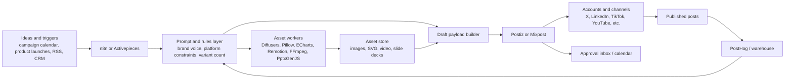
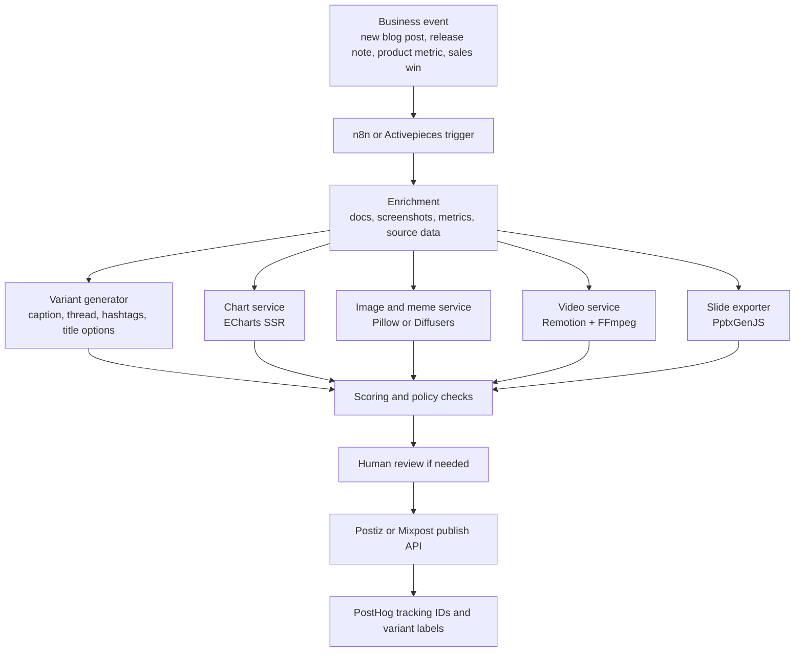
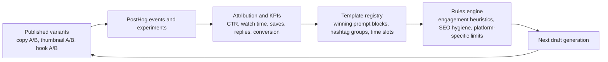

# Open Source Stack for Automated Social Media Content Factories

## Executive summary

After reviewing official GitHub repositories and project documentation, the clearest conclusion is that there is **no single mature open-source repository** that natively covers copy generation, charts/infographics, slide export, short-video rendering, image and meme creation, multi-account scheduling, approvals, experimentation, and analytics in one product. The most reliable approach is a **composable stack**: use **Postiz** or **Mixpost** as the publishing hub, **n8n** or **Activepieces** as the automation backbone, **Remotion** and **FFmpeg** for shorts/video rendering, **Diffusers** and **Pillow** for visuals, **Apache ECharts** for charts and infographic blocks, **PptxGenJS** for slide export, and **PostHog** for A/B testing and analytics feedback. citeturn20view2turn9search1turn4search0turn14search0turn0search1turn10search3turn21search3turn23view1turn19view1turn28search0turn25search0turn17view0turn12view0turn12view1

If you need the **closest thing to a self-hosted Buffer/Hootsuite-style center**, start with **Postiz**; if you need the **best orchestration layer**, start with **n8n**; if you are **video-first**, **Remotion** is the strongest code-first choice, usually paired with **FFmpeg**; if your workload is **chart-heavy**, **ECharts SSR** is unusually strong because it can render server-side SVG and Canvas output; and if you care about **repeatable optimization**, **PostHog** gives you experiments, feature flags, payloads, SDKs, and hooks to close the feedback loop. citeturn20view2turn9search1turn0search1turn13search3turn21search3turn23view1turn25search0turn12view0turn12view1turn24search0

License review matters here. **Postiz** is **AGPL-3.0**; **n8n** is distributed under the **Sustainable Use License** and enterprise terms rather than a conventional permissive OSS license; **Activepieces Community Edition** is **MIT** but enterprise features are commercial; **Remotion** uses a **special company/commercial license model**; **FFmpeg** is **mainly LGPL with optional GPL components**; **Diffusers** is **Apache-2.0** as a library, while specific model checkpoints can carry their own access or usage terms; and the main **PostHog** repo is **MIT expat except for the `ee` directory**, with a separate FOSS mirror available. citeturn20view2turn0search1turn20view5turn21search3turn23view1turn23view2turn20view3turn15search1turn1search3turn1search0

## Ranked repository shortlist

The ranking below favors **direct fit for an end-to-end social-content pipeline**, not raw GitHub popularity alone.

| Rank | Repository | One-line summary | Stack and dependencies | License and maturity | Strengths | Weaknesses | Suggested use-case |
|---|---|---|---|---|---|---|---|
| 1 | **Postiz** | The best direct-fit OSS publishing hub for multi-account social scheduling and draft/publish workflows. | TypeScript monorepo; **NextJS**, **NestJS**, **Prisma**, **Temporal**; default **PostgreSQL**. | **AGPL-3.0**; about **29.9k stars** and **5.4k forks**; latest release shown as **v2.21.7** on **April 27, 2026**. | Native social-media focus, team collaboration, analytics, public API, Node SDK, n8n node, and per-platform settings for channels such as X, LinkedIn, TikTok, YouTube, Pinterest, Medium, and more. | AGPL obligations, depends on external platform APIs and approvals, and the public API is rate-limited. | Use as the **last-mile publishing layer** for agencies, creator teams, or internal growth teams managing many accounts. citeturn20view2turn20view0turn9search0turn9search1 |
| 2 | **n8n** | The strongest general-purpose automation backbone for content factories. | TypeScript/Node; visual workflow builder with **JavaScript/Python** code steps; **400+ integrations**; **900+ templates**; LangChain integration in docs. | **Sustainable Use License** plus enterprise terms; about **185k stars** and **56.9k forks**; latest stable release shown on **April 15, 2026**. | Huge integration ecosystem, custom nodes, self-hosting, AI workflows, support for air-gapped deployments, and proven template ecosystem. | Not social-native, not a scheduling UI by itself, and the license is fair-code rather than standard permissive OSS. | Use as the **control plane** connecting LLMs, CRMs, product events, asset workers, and schedulers. citeturn0search1turn13search0turn13search3turn13search6 |
| 3 | **Remotion** | The most compelling code-first framework for short videos, reels, personalized motion graphics, and Shorts-style outputs. | TypeScript/React/Node; local, server, or serverless rendering; templates and editor starter available. | Special company/commercial licensing; about **43.8k stars** and **2.9k forks**; latest release shown as **v4.0.448** on **April 11, 2026**. | Excellent developer ergonomics, reusable React components, server-side or serverless rendering, and strong suitability for repeatable motion templates. | License review is mandatory for companies; React-centric; not a scheduler. | Use for **video-heavy campaigns**, product explainers, quote-card-to-video, and personalized clips. citeturn0search3turn21search3turn21search2 |
| 4 | **Activepieces** | The easiest OSS automation alternative to Zapier/Make for teams that want self-hosting plus AI-ready flows. | TypeScript; extensible “pieces” published on npm; deploy via **Docker**, **Docker Compose**, or **Kubernetes**. | **MIT** for Community Edition, commercial enterprise features; about **22k stars** and **3.6k forks**; repo updated **April 18, 2026**. | Friendly UX, self-hosting, human-in-the-loop, AI pieces and agents, and piece code that can become MCP servers. | Smaller ecosystem depth than n8n; commercial split above CE. | Use for **workflow-first teams** that want approvals, forms, chat-style human inputs, and easier administration. citeturn18view0turn20view5turn20view7turn10search1turn10search3 |
| 5 | **Diffusers** | The strongest self-hostable media-generation library in the set for images, video, and audio diffusion workflows. | Python/**PyTorch**; examples and benchmarks in-repo; GPU-oriented inference and optimization docs. | **Apache-2.0** for the library; about **33.5k stars** and **7k forks**; latest release shown on **March 25, 2026**. | Wide model ecosystem, text-to-image, image-to-image, text-to-video, LoRA/adapters, and strong docs. | GPU-heavy, operationally complex, and model access/usage terms vary by checkpoint. | Use for **brand visuals, concept images, style variants, thumbnails, and creative ideation** under your own control. citeturn19view1turn20view3turn20view4turn15search1 |
| 6 | **Mixpost** | A pragmatic self-hosted Buffer alternative with account management, analytics, templates, and an API. | PHP/**Laravel**/**Vue**; docs list **PHP 8.3+**, **MySQL**, **Redis**, **FFmpeg**, **libvips**, supervisor, cron, and related extensions. | **MIT** for the Lite repo; about **3.1k stars** and **463 forks**; latest release shown as **2.6.0** on **March 16, 2026**. | Strong privacy posture, templates, post versions, hashtag groups, connected accounts, analytics, and API access. | Smaller ecosystem than Postiz/n8n; advanced features are split across Lite/Pro/Enterprise packages. | Use when you want a **Laravel-native scheduling hub** with full infrastructure control. citeturn4search0turn14search0turn14search1turn14search2 |
| 7 | **FFmpeg** | The indispensable multimedia substrate for rendering, resizing, encoding, transcoding, subtitling, and packaging social video. | C libraries plus CLI; online docs and in-repo coding examples in `doc/examples`. | Mainly **LGPL**, with optional **GPL** components; about **59.1k stars** and **13.7k forks**; repo updated **April 19, 2026**. | Extremely mature, language-agnostic integration surface, widely deployed, and compatible with almost any media workflow. | CLI complexity, codec/licensing nuance, and no editorial UI. | Use as the **render/transcode engine** beneath Remotion, schedulers, or custom media workers. citeturn5search6turn23view1turn23view2 |
| 8 | **PptxGenJS** | The best programmatic slide-export option for social campaign decks, weekly creative reviews, and infographic exports. | JavaScript/TypeScript; works in **Node**, **React**, browsers, Electron, and serverless/edge contexts; zero runtime deps called out in docs. | **MIT**; about **5.2k stars** and **870 forks**; GitHub releases page shows **v4.0.1** as latest. | Strong demos, charts/images/tables/SVG support, HTML-to-PPTX, and easy `.pptx` output without PowerPoint installed. | Manual layout can get coordinate-heavy; JS-centric. | Use for **slide export**, reporting decks, and turning content batches into presentation-ready assets. citeturn17view0turn15search4turn22search1 |
| 9 | **Apache ECharts** | A powerful charting and infographic engine with unusually good server-side rendering support. | JavaScript/TypeScript; browser plus Node SSR; SVG and Canvas server-side rendering supported. | **Apache-2.0**; about **66.2k stars** and **19.8k forks**; latest release shown as **6.0.0** on **July 30, 2025**. | Rich chart vocabulary, strong customization, and SSR that can return SVG strings or images for posts, Markdown, PDFs, or slides. | Overkill for trivial charts; visual polish still requires design work. | Use for **social-ready charts, stat cards, infographic tiles, and embeddable campaign graphics**. citeturn5search2turn25search0turn25search1 |
| 10 | **LangGraph** | The best stateful agent-orchestration choice when content pipelines become multi-step, approval-aware, and long-running. | Python; examples folder in repo; designed for durable, stateful agents and long-running workflows. | **MIT**; about **29.3k stars** and **5k forks**; latest release shown on **April 14, 2026**. | Durable execution, state management, long-running workflows, and strong fit for human-in-the-loop content operations. | More engineering-heavy than no-code tools; not a scheduler or media tool itself. | Use for **agentic content planners**, variant evaluators, and approval-aware draft pipelines. citeturn7search1 |
| 11 | **PostHog** | The best experimentation and analytics layer here for creative testing and optimization loops. | Python/TypeScript; cloud or self-host hobby deploy; SDKs plus API/webhooks on the broader platform. | Main repo is **MIT expat except `ee`**, with a separate purged FOSS mirror; about **32.6k stars** and **2.5k forks**; repo updated **April 19, 2026**. | Feature flags, experiments, remote config payloads, product/web analytics, warehouse, and broad integration surface. | Not social-specific; main repo licensing split may matter for strict-purity policies. | Use to **A/B test prompts, thumbnails, CTAs, posting windows, and creative variants**, then feed winners back into templates. citeturn1search3turn1search0turn12view0turn12view1turn24search0 |
| 12 | **Pillow** | The most practical Python image-processing foundation for memes, thumbnails, collages, crops, and caption overlays. | Python with C extensions; broad format support and well-developed handbook/docs. | **MIT-CMU** license; about **13.5k stars** and **2.4k forks**; latest release **12.2.0** on **April 1, 2026**. | Simple scripting model, wide ecosystem adoption, solid image transforms/compositing, and very easy batch automation. | Less opinionated for layout/design systems; advanced typography/layout is manual. | Use for **templated memes, quote cards, thumbnail batches, watermarking, and aspect-ratio variants**. citeturn27view3turn28search0turn28search1 |

Two strong **near-misses** are worth bookmarking. **Marp CLI** is excellent if your decks are **Markdown-first**, because it converts Markdown to **HTML, PDF, PPTX, and images** and is MIT-licensed. **Vega-Lite** is a strong alternative to ECharts when you want **declarative chart specs** that are easy for models or rule engines to generate as JSON; that is an inference from its grammar-first design. citeturn16search1turn19view2turn8search0

## Integration patterns and reference architectures

The most robust architectures separate the stack into four layers: **generation**, **composition**, **publishing**, and **measurement**. In practice, that means keeping schedulers such as Postiz or Mixpost focused on accounts/channels and publishing windows, using n8n or Activepieces as the automation layer, offloading heavy render work to Remotion/FFmpeg/Diffusers/ECharts/Pillow workers, and measuring outcomes with PostHog. citeturn9search1turn14search0turn0search1turn10search3turn21search3turn23view1turn19view1turn25search0turn28search0turn12view0turn12view1

**Scheduler-first pattern**



This is the fastest path when a marketing team already thinks in terms of **calendars, workspaces, approvals, and connected accounts**. Postiz’s public API already models per-platform settings, and Mixpost exposes account and post APIs with bearer tokens, so upstream automation can stay focused on generating clean payloads rather than re-implementing account abstractions. citeturn9search1turn14search0turn14search5

**Workflow-first pattern**



This pattern is best when **every post is event-driven** and you want automation to own branching, retries, approvals, and routing. n8n’s built-in integrations and LangChain-related nodes, plus Activepieces’ deployable CE and human-in-the-loop model, make them strong orchestration choices; if you need more custom stateful behavior, add LangGraph downstream of the trigger layer. citeturn13search3turn13search0turn13search4turn10search1turn10search3turn7search1

**Optimization loop**



Most open schedulers do **not** provide rigorous creative experimentation on their own. The better pattern is to attach deterministic metadata to every variant, capture results in PostHog, and promote winning prompt blocks, hashtag groups, titles, or thumbnail styles back into your templates. PostHog explicitly supports feature flags, multivariate rollouts, payloads, and experiments, while Mixpost and Postiz give you the publishing surface where those variants actually go live. citeturn12view0turn12view1turn24search0turn4search0turn9search1

## Minimal implementation examples

The examples below deliberately combine the tools that are most useful in practice: **ECharts SSR** for server-rendered chart graphics, **PptxGenJS** for slide export, **Pillow** for image/meme composition, **FFmpeg** for short-video packaging, and **Postiz** as a multi-account publish target. citeturn25search0turn17view0turn28search0turn23view1turn9search1

**Node.js example: text generation, chart rendering, and slide export**

This example assumes any **OpenAI-compatible endpoint** for text generation, uses **ECharts** to render a chart as SVG on the server, and writes a `.pptx` deck using **PptxGenJS**. ECharts SSR and PptxGenJS both document the relevant server-side/export paths. citeturn25search0turn17view0turn15search4

```js
// package.json -> { "type": "module" }
// npm i echarts pptxgenjs

import fs from "node:fs/promises";
import * as echarts from "echarts";
import pptxgen from "pptxgenjs";

const LLM_BASE_URL = process.env.LLM_BASE_URL || "http://localhost:11434/v1";
const LLM_MODEL = process.env.LLM_MODEL || "local-social-model";

async function generateCopy(topic) {
  const prompt = `
Return strict JSON with keys:
caption: string
hashtags: string[]
thread: string[]
for topic: ${topic}
Tone: concise, high-signal, social-media-friendly.
`;

  const res = await fetch(`${LLM_BASE_URL}/chat/completions`, {
    method: "POST",
    headers: { "Content-Type": "application/json" },
    body: JSON.stringify({
      model: LLM_MODEL,
      temperature: 0.4,
      messages: [{ role: "user", content: prompt }],
      response_format: { type: "json_object" }
    })
  });

  if (!res.ok) {
    throw new Error(`LLM request failed: ${res.status} ${await res.text()}`);
  }

  const body = await res.json();
  const content = body.choices?.[0]?.message?.content;
  if (!content) throw new Error("No LLM content returned.");
  return JSON.parse(content);
}

function renderChartSvg(series) {
  const chart = echarts.init(null, null, {
    renderer: "svg",
    ssr: true,
    width: 1200,
    height: 675
  });

  chart.setOption({
    title: { text: "Weekly engagement trend" },
    tooltip: { show: false },
    xAxis: { type: "category", data: ["Mon", "Tue", "Wed", "Thu", "Fri", "Sat", "Sun"] },
    yAxis: { type: "value" },
    series: [
      {
        type: "line",
        smooth: true,
        data: series,
        areaStyle: {}
      }
    ]
  });

  const svg = chart.renderToSVGString();
  chart.dispose();
  return svg;
}

async function main() {
  const copy = await generateCopy("launching an AI-assisted social content workflow");
  const svg = renderChartSvg([120, 180, 240, 210, 310, 420, 390]);
  await fs.writeFile("engagement.svg", svg, "utf8");

  const pptx = new pptxgen();
  pptx.layout = "LAYOUT_WIDE";
  pptx.author = "Open-source social content pipeline";
  pptx.subject = "Campaign draft kit";
  pptx.title = "Campaign draft kit";

  const slide1 = pptx.addSlide();
  slide1.addText("Campaign draft kit", { x: 0.6, y: 0.3, w: 12, h: 0.5, fontSize: 24, bold: true });
  slide1.addText(copy.caption, { x: 0.6, y: 1.0, w: 12, h: 1.2, fontSize: 18 });
  slide1.addText(copy.hashtags.join(" "), { x: 0.6, y: 2.2, w: 12, h: 0.6, fontSize: 13, italic: true });

  const slide2 = pptx.addSlide();
  slide2.addText("Performance visual", { x: 0.6, y: 0.3, w: 12, h: 0.4, fontSize: 22, bold: true });
  slide2.addImage({ path: "engagement.svg", x: 0.6, y: 0.9, w: 12.0, h: 5.8 });

  await pptx.writeFile({ fileName: "campaign-kit.pptx" });
  console.log("Wrote campaign-kit.pptx");
}

main().catch((err) => {
  console.error(err);
  process.exit(1);
});
```

**Python example: meme/image composition and a vertical short**

This example uses **Pillow** for image composition and **FFmpeg** to turn the result into a short vertical clip. That is a pragmatic pattern when you want repeatable templates rather than generative video for every asset. citeturn28search0turn23view1

```python
# pip install pillow

from PIL import Image, ImageDraw, ImageFont, ImageOps
import subprocess
import textwrap

W, H = 1080, 1350

def load_font(name: str, size: int):
    try:
        return ImageFont.truetype(name, size)
    except OSError:
        return ImageFont.load_default()

base = Image.open("source.jpg").convert("RGB")
canvas = ImageOps.fit(base, (W, H))
draw = ImageDraw.Draw(canvas)

headline = "WHEN THE CONTENT CALENDAR WRITES ITSELF"
subline = "but legal still wants approval"

headline_font = load_font("Impact.ttf", 72)
sub_font = load_font("Arial.ttf", 34)

def centered_multiline(text, font, top, max_chars):
    lines = textwrap.wrap(text, width=max_chars)
    y = top
    for line in lines:
        bbox = draw.textbbox((0, 0), line, font=font)
        text_w = bbox[2] - bbox[0]
        x = (W - text_w) / 2
        # simple stroke effect
        for dx, dy in [(-2,0), (2,0), (0,-2), (0,2)]:
            draw.text((x+dx, y+dy), line, font=font, fill="black")
        draw.text((x, y), line, font=font, fill="white")
        y += bbox[3] - bbox[1] + 12

centered_multiline(headline, headline_font, 60, 18)
centered_multiline(subline, sub_font, H - 180, 28)

canvas.save("meme.png", quality=95)

subprocess.run([
    "ffmpeg", "-y",
    "-loop", "1",
    "-i", "meme.png",
    "-vf",
    "scale=1080:1920:force_original_aspect_ratio=increase,"
    "crop=1080:1920,"
    "zoompan=z='min(zoom+0.0007,1.06)':d=180:s=1080x1920,"
    "format=yuv420p",
    "-r", "30",
    "-t", "6",
    "short.mp4"
], check=True)

print("Created meme.png and short.mp4")
```

**Shell example: multi-account scheduling via Postiz**

This is a minimal pattern for taking generated assets and copy, then scheduling them to several accounts with platform-specific options. Postiz’s API schema is particularly useful because it exposes channel-specific settings in a structured way, and its docs explicitly recommend batching multiple posts inside one request. citeturn9search1

```bash
POSTIZ_BASE="https://api.postiz.com"
POSTIZ_API_KEY="YOUR_KEY"

curl -X POST "${POSTIZ_BASE}/public/v1/posts" \
  -H "Authorization: ${POSTIZ_API_KEY}" \
  -H "Content-Type: application/json" \
  -d @- <<'JSON'
{
  "type": "schedule",
  "date": "2026-05-05T13:00:00.000Z",
  "shortLink": false,
  "tags": ["campaign:q2-launch", "variant:a"],
  "posts": [
    {
      "integration": { "id": "x-account-id" },
      "value": [
        {
          "content": "We automated the draft pipeline, not the judgment. Human review still matters.",
          "image": [{ "id": "img-001", "path": "https://cdn.example.com/meme.png" }]
        }
      ],
      "settings": {
        "__type": "x",
        "who_can_reply_post": "everyone"
      }
    },
    {
      "integration": { "id": "linkedin-page-id" },
      "value": [
        {
          "content": "A look at our new social content automation stack and the guardrails we kept in place.",
          "image": [{ "id": "img-002", "path": "https://cdn.example.com/engagement.svg" }]
        }
      ],
      "settings": {
        "__type": "linkedin-page",
        "post_as_images_carousel": true
      }
    }
  ]
}
JSON
```

If you want non-developers to safely author payloads, a good operational trick is to let them use the **Postiz output/payload wizard** in the UI, then store the resulting JSON as a versioned template that n8n, Activepieces, or LangGraph can fill in automatically. citeturn9search1

## Recommended stacks and deployment options

The best stack depends less on programming language and more on **how much control you need over publishing, rendering, privacy, and experimentation**.

| Stack | Recommended components | When to choose it | Deployment notes | Privacy and licensing notes |
|---|---|---|---|---|
| **Fastest all-TypeScript stack** | Postiz + n8n + Remotion + ECharts + PptxGenJS + PostHog | Choose this when you want one mostly JS/TS toolchain and the team is comfortable with code plus automation. | Start with Docker Compose for Postiz/n8n/PostHog, then split Remotion and chart workers into separate services as volume grows. n8n self-hosting is recommended for customized production use. | Strong end-to-end fit, but Postiz is AGPL, n8n is fair-code, and Remotion needs company-license review. citeturn20view2turn0search1turn21search3turn25search0turn17view0turn12view1turn13search6 |
| **Privacy-first self-hosted stack** | Mixpost or Postiz + Activepieces CE + Diffusers + Pillow + FFmpeg + self-hosted PostHog | Choose this when prompts, tokens, media, or analytics data must stay on your infrastructure. | Run orchestrator and scheduler on VMs or Kubernetes; place Diffusers on separate GPU workers; keep FFmpeg and Pillow on CPU media workers. Activepieces CE explicitly supports Docker, Compose, and Kubernetes. | Best for data control. Diffusers library is permissive, but each model still needs separate checkpoint-term review. citeturn14search1turn14search2turn10search3turn19view1turn28search0turn23view1turn1search3turn15search1 |
| **Video-heavy campaign stack** | Postiz + n8n + Remotion + FFmpeg + PostHog | Choose this when reels, explainers, and personalized clips are the revenue-driving format. | Queue render jobs separately from publishing jobs. Remotion supports local, server, and serverless rendering, while FFmpeg handles packaging and transcodes. | Excellent for repeatable video templates, but Remotion licensing must be checked early. citeturn21search3turn23view1turn0search1turn20view2turn12view0turn12view1 |
| **Lean single-server team stack** | Mixpost or Postiz + Activepieces + ECharts + Pillow + PptxGenJS | Choose this for small teams that mostly need cards, charts, thumbnails, decks, and scheduled distribution, without GPUs. | A single VM can often handle early-stage usage; add PostHog later if experimentation becomes a priority. | Lower operational complexity, full self-host path, and cleaner licensing than stacks centered on n8n + Remotion. citeturn14search1turn10search3turn25search0turn28search0turn17view0 |

Across all of these stacks, the most important scaling decision is to **separate publishing/orchestration from media rendering**. Remotion, FFmpeg, and Diffusers should sit behind queues or worker pools; schedulers should own accounts, drafts, and timing; and analytic feedback should be captured with stable variant IDs so PostHog experiments and reporting can attribute outcome differences to concrete creative choices. Postiz’s API rate limit is another reason to batch requests rather than spraying publishes one by one. citeturn21search3turn23view1turn19view1turn12view0turn12view1turn9search1

## Licensing, privacy, and compliance checklist

This is the part most teams underestimate. In the shortlist above, some projects are permissive, some are strong copyleft, and several are source-available or mixed-license rather than plain permissive OSS. citeturn20view2turn0search1turn20view5turn21search3turn23view1turn1search3

- **Classify every dependency before adoption.** Put each tool in a tracked register: permissive, copyleft, source-available/fair-code, or mixed-license. At minimum, Postiz, n8n, Remotion, FFmpeg, Activepieces CE, Diffusers, and PostHog should be tagged correctly before procurement or launch. citeturn20view2turn0search1turn21search3turn23view1turn20view5turn20view3turn1search3
- **Treat AGPL and network-facing deployments as a legal-review trigger.** Postiz is AGPL-3.0, so if you modify it and expose it as a service, involve counsel early. citeturn20view2
- **Treat fair-code and special commercial licenses as review triggers too.** n8n’s Sustainable Use License and Remotion’s company licensing model are not “just MIT/Apache.” citeturn0search1turn21search3
- **Separate library license from model/checkpoint terms.** Diffusers is Apache-2.0, but the docs explicitly note gated models, and in practice checkpoint terms can differ from the library’s license. That is an inference supported by the Apache-licensed library and gated-model workflow in the docs. citeturn20view3turn15search1
- **Watch codec and media-feature toggles.** FFmpeg is mainly LGPL, but optional GPL components can change compliance obligations depending on build choices. citeturn23view1turn23view2
- **Use official API/auth flows, not scraping.** Postiz explicitly states that its hosted service uses official OAuth flows and does not automate or scrape content; its docs also expose structured per-platform settings. citeturn2search1turn9search1
- **Check platform app-review requirements early.** Mixpost’s LinkedIn docs note that Community Management API approval may take days and is only available for legal registered entities, not individual developers. citeturn14search9
- **Plan for rate limits and batching.** Postiz documents a 30-requests-per-hour limit for its public API and recommends scheduling multiple posts per request. citeturn9search1
- **Prefer self-hosting when tokens, prompts, or analytics are sensitive.** Mixpost emphasizes self-host ownership/privacy; n8n recommends self-hosting for customized production use; Activepieces CE supports self-host deployment paths; PostHog supports self-hosted hobby deployments. citeturn14search1turn13search6turn10search3turn1search3
- **Instrument every creative variant.** Put stable campaign, template, and variant labels on drafts so experiments in PostHog can compare copy, thumbnail, hashtag, or timing variants cleanly. citeturn12view0turn12view1
- **Get rights for fonts, stock media, music, templates, logos, and training inputs before automation.** This is especially important for meme templates, slides, and short-video pipelines.
- **Keep human review in the loop for high-risk domains** such as regulated products, sensitive claims, or politically adjacent content.
- **Define retention, deletion, and region policies** for prompts, uploaded assets, OAuth tokens, and analytics exports before you scale the pipeline.

## Primary sources

The table below points to the **official repositories and documentation** used in this report. The citations are the links.

| Project | Primary repo and docs |
|---|---|
| Postiz | Official GitHub repo and official API/docs. citeturn20view2turn9search1 |
| n8n | Official GitHub repo and official docs for templates, integrations, AI/LangChain, and self-hosting. citeturn0search1turn13search3turn13search0turn13search6 |
| Activepieces | Official GitHub repo and official docs/deployment guides. citeturn18view0turn10search1turn10search3turn10search0 |
| Mixpost | Official GitHub repo and official docs for API, hosting, and server requirements. citeturn4search0turn14search0turn14search1turn14search2 |
| Remotion | Official GitHub repo and official site/docs. citeturn0search3turn21search3turn9search3 |
| Diffusers | Official GitHub repo and Hugging Face docs. citeturn19view1turn20view3turn15search1 |
| FFmpeg | Official GitHub mirror/README and project docs references. citeturn5search6turn23view1 |
| PptxGenJS | Official GitHub repo and official docs site. citeturn17view0turn15search4 |
| Apache ECharts | Official GitHub repo and official handbook/SSR docs. citeturn5search2turn25search0turn25search1 |
| LangGraph | Official GitHub repo and linked official docs site. citeturn7search1 |
| PostHog | Official GitHub repo, FOSS mirror reference, and official docs/pages for experiments and feature flags. citeturn1search3turn1search0turn12view0turn12view1turn24search0 |
| Pillow | Official GitHub repo and official docs/license pages. citeturn27view3turn28search0turn28search1 |
| Marp CLI | Official GitHub repo for Markdown-first slides. citeturn19view2 |
| Vega-Lite | Official GitHub repo for declarative chart specs. citeturn8search0 |