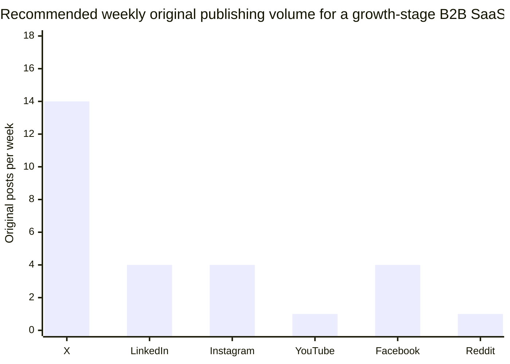
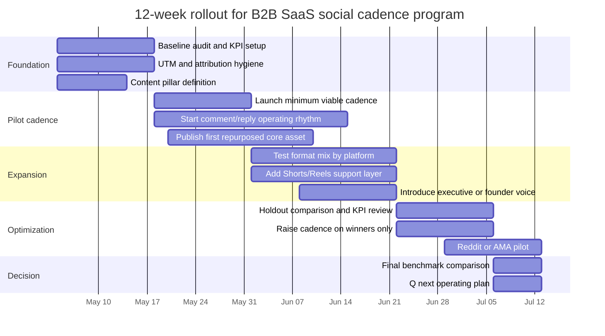
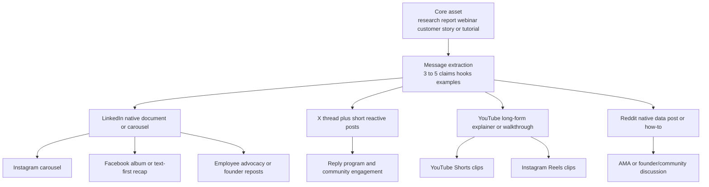

# Optimal Posting Frequency and Content Mix for a B2B SaaS Brand

## Executive summary

The highest-confidence conclusion from current platform guidance and 2024–2026 benchmark data is that B2B SaaS brands should **not** optimize for maximum volume on every channel. They should optimize for **cadence matched to shelf life, buyer intent, and production cost**. Official guidance from Instagram and YouTube emphasizes **consistency, sustainability, and format-aware planning**, while X and Reddit policy language is primarily about **avoiding spammy or inauthentic behavior**, not hitting a target number of posts. Public, numerical “official” cadence guidance is still sparse on LinkedIn and Facebook, so the most practical scheduling decisions come from major benchmark providers such as Hootsuite, Sprout Social, Buffer, SocialPilot, Socialinsider, Rival IQ, and vidIQ. citeturn23view8turn23view5turn23view7turn23view4turn23view1turn23view2turn15view0turn15view1turn15view2turn15view9turn15view6turn15view7turn15view8turn15view4turn15view3

For a general B2B SaaS company with no unusual vertical constraints, the best operating model is to make **LinkedIn and YouTube the authority engines**, **X the conversation and distribution engine**, **Instagram the visual education and brand-humanization channel**, **Facebook a lower-priority amplification/community channel**, and **Reddit a highly selective trust-and-demand-capture channel**. In practice, that means a default cadence of roughly **X: 10–18 original posts per week plus daily replies; LinkedIn: 3–5 company posts per week plus daily comments; Instagram: 3–5 feed posts per week plus Stories on most active days and 1–2 Reels per week; YouTube: 1 long-form video per week and 2–5 Shorts per week; Facebook: 3–5 posts per week unless the audience clearly supports more; Reddit: 5–20 helpful comments per week and 0–2 native posts per week across approved subreddits**. These are not “maximums”; they are the most defensible **recommended operating ranges** after reconciling official guidance with benchmark disagreement and the content economics of B2B SaaS. citeturn17view0turn16view1turn16view2turn24search9turn16view12turn17view6turn17view7turn39view4turn39view0turn29view4turn29view2turn23view0turn23view2turn23view3

The most important content-mix finding is that **format specialization matters more than raw post count**. On Instagram, carousels continue to show the strongest overall engagement, while Reels pull more comments and software brands keep seeing strong response to **product updates and tutorials**. On LinkedIn, the evidence is slightly mixed by dataset, but the pattern is clear enough: **native documents/multi-image posts are strong engagement workhorses, while video is increasingly important and performs especially well in technology slices**. On Facebook, **albums and simple text/status content** still outperform overproduced feed video in many benchmark cuts. On X, **status-style updates and replies** remain the most natural content forms, especially for technology brands. On YouTube, the strongest B2B SaaS pattern is still **evergreen tutorials, explainers, and product education**, with Shorts functioning as the discovery and recap layer rather than the whole strategy. On Reddit, native **data posts, how-to writeups, and AMAs** are the safest high-upside formats, provided community rules allow them. citeturn38view4turn35view1turn30view0turn34view0turn31view3turn38view3turn38view5turn35view5turn38view0turn38view1turn23view0turn33view5turn23view3

The tradeoff is straightforward. Higher posting frequency generally increases the number of feedback loops and the chance of being seen, but it also increases creative fatigue, lowers edit quality, and can push teams into shallow repurposing that harms brand perception or violates platform/community norms. This is especially risky on Reddit and X, where repetitive and low-context posting can trigger moderation or algorithmic restriction, and on YouTube, where unsustainable schedules can undermine consistency and creator well-being. Buffer’s cross-platform consistency research is directionally important here: accounts that post consistently outperform inconsistent posters by a large margin, which suggests most B2B SaaS teams are better served by a **reliable middle cadence** than by short-lived spikes. citeturn21view0turn23view2turn23view7turn40search0turn40search10

## What the evidence says

### How to interpret the source hierarchy

This report prioritizes sources in the following order: **official platform guidance**, then **large benchmark datasets from major social tools**, then **industry slices for technology/software**, and only then **operator playbooks or illustrative SaaS case studies**. That ordering matters because public official guidance usually tells you **what the platform wants**, while benchmark datasets tell you **what brands are actually doing and what tends to correlate with engagement**, and SaaS/operator examples tell you **how that logic gets implemented in practice**. citeturn23view8turn23view5turn23view7turn23view4turn23view1turn23view2turn15view0turn15view1turn15view2turn15view9turn15view6turn15view7turn15view8turn28view0

The clearest official signals are qualitative rather than numeric. Instagram’s October 2024 launch of the in-app **Best Practices** hub explicitly said it would advise creators on **how often to post, how long Reels should be, engagement, reach, monetization, and guidelines**, but Meta made that guidance personalized and in-product rather than publishing a universal public cadence. YouTube’s help documentation is much more explicit on process: it says a **consistent, sustainable release schedule is critical**, recommends batching and scheduling uploads, and specifically says creators should maintain interaction between core uploads with **Shorts, live streams, and posts/polls**. Reddit’s official materials emphasize authentic organic engagement, AMA planning, subreddit-specific norms, and anti-spam behavior. X’s public help center is policy-oriented: it prohibits bulk, duplicative, irrelevant, or unsolicited posting, repeated identical/copypasta posts, unrelated hashtag stuffing, and inauthentic engagement or account inflation. citeturn23view8turn23view5turn23view6turn23view7turn23view0turn23view1turn23view2turn23view3turn21view0

### Where benchmarks agree and where they do not

The major benchmark providers agree on three things. First, **consistency beats sporadic bursts**. Second, **visual/interactive formats usually outperform plain links**. Third, **the “best” frequency is highly platform-dependent and often non-linear**, meaning more posting helps until the content mix or audience fit breaks down. Buffer’s current benchmark products are built from very large datasets and show average posting frequencies of roughly **18 Instagram posts per month** and **36 Facebook posts per month**, while its 2026 state-of-engagement report covers **52M+ posts from 200K+ accounts** collected in 2024–2025. Hootsuite’s 2025 frequency guide recommends **3–5 Instagram posts per week, 1–2 Facebook posts per day, and 2–3 X posts per day**. Sprout’s 2025 guide reports much higher average brand publishing levels on some networks, including **1 LinkedIn post per day, 2 X posts per day, 1–2 Instagram posts per day, and 5 Facebook posts per day**. SocialPilot’s 2025 synthesis leans toward **2–5 LinkedIn posts per week, 4–5 X posts per day, 3–5 Instagram feed posts plus 2 Reels per week, and 2–3 YouTube videos plus 3–5 Shorts per week**. vidIQ’s 2025 YouTube analysis of **5.08M channels** found faster growth above **once per week**, with stronger gains around **3+ uploads per week** and daily or multiweekly Shorts. citeturn36search2turn36search1turn15view9turn16view2turn16view3turn17view0turn15view1turn16view5turn16view6turn16view7turn15view2turn16view9turn16view10turn16view11turn16view12turn17view6turn17view7

The disagreement is most obvious on **Facebook and X**, and that disagreement is actually useful. Hootsuite’s industry benchmarking framework shows that overall engagement peaks can happen at surprisingly low weekly counts, such as **2 posts per week overall on Facebook and LinkedIn**, while the technology slice shows very different optima such as **19 X posts per week for highest engagement in the technology industry**, **18 Instagram posts per week in technology**, and **2 LinkedIn posts per week in technology**. For B2B SaaS, that means benchmark “averages” should be treated as **outer reference points**, not as direct marching orders. In other words, a software brand should not jump to 25 Facebook posts per week just because a tech benchmark found a high-engagement pocket there; it should use the tech slice to understand how far the ceiling could extend **if the audience and resourcing justify it**. citeturn39view3turn39view1turn39view0turn29view4turn31view2

### The SaaS-specific signal

Public, high-quality **SaaS-only** cadence research is much rarer than general benchmark research. The best proxy is the **technology/software** segmentation from Hootsuite, Rival IQ, and Socialinsider, plus recent B2B operator analyses that are clearly labeled as such. The most useful SaaS-specific findings are these: in Hootsuite’s 2026 technology slice, **carousels lead on Instagram**, **videos lead on LinkedIn**, **albums lead on Facebook**, and **replies lead on X**; engagement-optimal weekly frequencies in technology cluster around **18 posts on Instagram, 2 on LinkedIn, 19 on X, and 25 on Facebook**, though those are best read as observed peaks rather than default guidance. Rival IQ’s live Tech & Software landscape shows software brands averaging roughly **11.8 posts per company per week** over the prior 30 days, emphasizing that software brands are active but not producing consumer-brand volumes across every network. Socialinsider’s 2026 content-trends work for software shows that **product updates and tutorials** are the standout content pillars on Instagram for technology/software brands, while **launches** are the strongest Facebook content pattern in that sector. citeturn31view3turn38view1turn29view4turn29view2turn28view0turn30view0

These SaaS/tech slices support a simple operating thesis: B2B SaaS brands should post **less like consumer publishers and more like recurring educators**. The winning content is usually **instructional, evidence-based, or product-contextualized**, not pure brand banter. Gong’s frequently cited LinkedIn example is directionally illustrative rather than definitive: the company’s high volume is built on strong message discipline, reusable design systems, and a heavy bias toward data-backed insights, not on volume alone. Hootsuite’s own content-distribution case example also points in the same direction: repurposing evergreen core assets into platform-native formats helps maintain cadence without building everything from scratch. citeturn33view0turn33view1

| Platform | Official public signal | Major benchmark range | Tech/software signal | Recommended operating range for B2B SaaS |
|---|---|---|---|---|
| X | Policy-first, not cadence-first; avoid duplicative, bulk, irrelevant, or inauthentic posting. citeturn21view0 | Hootsuite 2–3/day; Sprout 2/day; SocialPilot 4–5/day. citeturn17view0turn16view5turn16view10 | Hootsuite tech: replies best format; highest engagement at 19/week. citeturn38view1turn31view2 | **10–18 original posts/week + 25–50 targeted replies/week** |
| LinkedIn | Public guidance is format-leaning rather than cadence-leaning. Recent public signals emphasize growing video usage. citeturn17view3turn26search2 | Sprout 1/day; SocialPilot 2–5/week; Hootsuite overall highest engagement at 2/week. citeturn16view6turn16view9turn39view0 | Hootsuite tech: videos best, 2/week highest engagement; Socialinsider: native docs 7.0% avg engagement, multi-image 6.45%, video 6.0%. citeturn31view3turn29view4turn34view0 | **3–5 company posts/week + daily comment participation** |
| Instagram | Meta’s Best Practices hub explicitly covers how often to post; Hootsuite cites Adam Mosseri recommending 2 Stories/day. citeturn23view8turn24search9 | Hootsuite 3–5/week; Sprout 1–2/day; SocialPilot 3–5 feed posts/week; Buffer avg 18/month. citeturn16view2turn15view1turn15view2turn36search2 | Hootsuite tech: carousels best; Hootsuite tech peak engagement at 18/week; Socialinsider software: product updates and tutorials win. citeturn29view2turn29view4turn30view0 | **3–5 feed posts/week + 1–2 Reels/week + Stories on 3–7 days/week** |
| YouTube | Officially: consistent, sustainable schedule; support uploads with Shorts, live, and posts. citeturn23view5turn23view6turn23view7 | SocialPilot 2–3 videos/week; vidIQ says >1/week helps, 3+/week grows faster. citeturn16view12turn17view6 | No strong SaaS-only cadence benchmark; use B2B content economics and search shelf life. | **1 long-form/week + 2–5 Shorts/week + 1–2 community posts/week** |
| Facebook | Public Meta guidance emphasizes page engagement and visibility best practices, but public numeric cadence guidance is limited. citeturn5search0turn5search1turn5search2 | Hootsuite 1–2/day; Sprout 5/day; SocialPilot 2–4/day; Buffer avg 36/month. citeturn16view3turn16view7turn16view11turn36search1 | Hootsuite tech: albums best; overall Hootsuite peak engagement at 2/week; some Socialinsider cuts still favor text/status participation. citeturn29view2turn39view3turn35view5 | **3–5 posts/week unless Facebook is a strategic owned audience channel** |
| Reddit | Officially: authentic engagement, AMA best practices, community-first norms, strict anti-spam rules. citeturn23view0turn23view1turn23view2turn23view3 | No reputable universal cadence benchmark. | Operator guidance for B2B SaaS favors data posts, how-tos, and long trust-building periods before promotion. citeturn33view5 | **5–20 helpful comments/week + 0–2 native posts/week + quarterly AMA** |

The chart above is a **recommended baseline for original publications only**. It does **not** count replies, comments, Stories frames, or community moderation, which are material parts of performance on X, LinkedIn, Instagram, and Reddit. The publishing counts are synthesized from official guidance, cross-platform benchmarks, and technology/software benchmark slices rather than copied from any single source. citeturn17view0turn16view6turn16view2turn23view7turn39view3turn31view2turn23view2

## Platform recommendations

### X

For B2B SaaS, X works best when treated as a high-frequency **conversation layer**, not as a polished campaign layer. The safest high-performing mix is usually **short point-of-view posts, launch notes, chart or screenshot posts, and replies to relevant industry conversations**, with **1–3 threads per week** for depth. Hootsuite recommends **2–3 posts per day**, Sprout reports an industry average of **2 posts per day**, and SocialPilot recommends **4–5 tweets per day**. At the same time, Hootsuite’s 2026 technology slice shows the strongest engagement at **19 posts per week** and identifies **replies** as the best-performing X content type for technology brands. The right synthesis for B2B SaaS is therefore **2–3 original posts per day plus active commenting/reply behavior**, not a blind race toward 30–40 posts per week. citeturn17view0turn16view5turn16view10turn31view2turn38view1

The crucial tradeoff is quality control. X’s own policy language explicitly prohibits repetitive or nearly identical posts, cross-posting substantially similar content across multiple accounts, unrelated hashtags, and inauthentic engagement behavior. That means SaaS teams should publish **high-context but lightweight** posts, vary framing across similar topics, and avoid spraying identical promo copy from multiple executives or regional handles. The best working mix is approximately **60% short insights/news reactions, 20% replies and quote posts, 10–15% threads, and 10% media snippets or charts**, with daily reply windows around launches, webinars, and reports. citeturn21view0

### LinkedIn

LinkedIn is the highest-priority network for most B2B SaaS brands because it combines professional context, executive visibility, employee advocacy, and lead-gen adjacency. The benchmark conflict here is informative rather than problematic. Sprout reports a brand average of **1 post per day**; SocialPilot recommends **2–5 posts per week**; Hootsuite’s overall benchmark says engagement peaks at **2 posts per week**; Hootsuite’s technology slice also shows **2 posts per week** as the strongest engagement point. But Socialinsider’s 2026 LinkedIn study shows that **native documents** lead average engagement at **7.0%**, followed by **multi-image posts at 6.45%** and **video at 6.0%**, while brands have also increased their posting frequency for visual-first formats over 2025. citeturn16view6turn16view9turn39view0turn29view4turn34view0turn34view2

For B2B SaaS, the best practical cadence is **3–5 company posts per week**, not because that is the one true optimum, but because it creates enough posting density to build memory without forcing low-value filler. The strongest mix is **1–2 native document or carousel-style educational posts per week**, **1 short native video per week**, and **1–2 text/image posts built around insights, customer evidence, or founder perspective**. Comments matter materially too: Sprout notes that thoughtful comments can earn substantial visibility, and Socialinsider shows multi-image posts and native documents often outperform on interaction. That makes **daily comment participation** an essential part of the LinkedIn operating model, especially for executives and subject-matter leaders. citeturn17view3turn34view0turn34view3

If the company already has strong executive voices, the brand page does not need to carry the full burden. In that case, the company page can stay near **3–4 posts/week**, while leaders and advocates publish additional personal content. If the company page is the main public voice, move closer to **5 posts/week**. The practical content mix should be **35–40% documents/carousels, 20–25% short video, 20–25% text/image thought leadership, 10–15% customer proof or culture, and occasional polls**. Because public official cadence guidance from LinkedIn itself remains limited, this is one of the clearest areas where teams should let **their own A/B tests** decide after an initial 8–12 week run. citeturn26search2turn34view0turn39view0

### Instagram

Instagram is not usually the primary pipeline engine for B2B SaaS, but it is often the best channel for **visual education, product storytelling, employer brand, event/showfloor coverage, and audience familiarity**. Meta’s 2024 Best Practices announcement confirms that Instagram is actively surfacing guidance on posting frequency and format decisions inside the professional dashboard, and Hootsuite cites Adam Mosseri’s recommendation of **2 Stories per day** as a useful operating reference. Current benchmark data points in a fairly coherent direction: Hootsuite recommends **3–5 posts/week**, SocialPilot recommends **3–5 feed posts/week plus 2 Reels/week**, Buffer’s current benchmark product shows an average of **18 posts/month**, and Socialinsider shows Reels rising but **carousels still leading on overall engagement**. citeturn23view8turn24search9turn16view2turn15view2turn36search2turn35view0turn35view2turn35view3

The B2B SaaS-specific content signal is even clearer. Socialinsider’s technology/software industry analysis says **product updates and tutorials** were the strongest Instagram content pillars for software brands in 2025, and Hootsuite’s technology benchmark says **carousels** are the top-performing Instagram format in technology at **4.2%**. That strongly supports an Instagram program centered on **swipeable product education, teardown-style feature explainers, checklists, framework carousels, and launch recaps**, with Reels used more selectively for motion, behind-the-scenes footage, speaking highlights, and humanizing clips. citeturn30view0turn29view2

The recommended cadence is therefore **3–5 feed posts/week**, of which **2–3 should be carousels**, **1–2 should be Reels**, and the remainder can be static proof points or event/news posts. Add **Stories on 3–7 days per week**, usually in short bursts rather than all-day saturation. Reels should not dominate the whole plan just because the platform favors video; Socialinsider’s 2026 benchmarks show that Reels win on comments, while carousels continue to hold the strongest engagement baseline. The best mix for B2B SaaS is usually **50% carousels, 25–30% Reels, and the rest Stories and occasional images**. citeturn35view1turn35view2turn35view3

### YouTube

YouTube should be treated as the B2B SaaS brand’s **evergreen demand capture and product education system**, not as a daily social-feed obligation. The official YouTube guidance is unusually useful here: a **consistent, sustainable release schedule is critical**, creators should plan not only videos but also **Shorts, live streams, and posts/polls** around the upload rhythm, and batch production is encouraged. For Shorts specifically, YouTube tells creators to evaluate **frequency, consistency, content volume, production time, and sustainability**. citeturn23view5turn23view6turn23view7

The strongest recent benchmark evidence comes from vidIQ’s large-scale June 2024–June 2025 analysis of **5.08M channels**, which found faster growth for channels posting **more than once a week**, with notably stronger gains around **3+ uploads/week**, and a coaching-based recommendation that channels publishing Shorts **daily or multiple times per week** tend to see faster subscriber growth, better visibility, and stronger long-form discovery. SocialPilot’s guidance lands in the same neighborhood with **2–3 videos/week and 3–5 Shorts/week**, although that is often too production-heavy for a B2B SaaS team unless video is already a major growth engine. citeturn15view3turn17view6turn17view7turn16view12

For most B2B SaaS brands, the best recommendation is **1 long-form video per week** as the default, with an acceptable lean minimum of **1 every two weeks** if the channel is built around higher-production tutorials, webinars, or product explainers. Support that with **2–5 Shorts per week** and **1–2 community posts per week**, usually clipped from the long-form asset. The most effective content mix is **evergreen tutorials and how-tos, product walkthroughs, integration/use-case videos, webinar edits, customer education, and Shorts built as teaser/summary/discovery clips**. vidIQ’s “3+ per week” finding is important, but for B2B SaaS it should be treated as a **growth ceiling** more than a universal default, because educational software content often benefits from tighter packaging and stronger search intent rather than creator-style volume. citeturn17view6turn17view7turn23view6

### Facebook

For many B2B SaaS companies, Facebook is a **secondary** organic priority unless the brand has large founder/community followings, regional franchise audiences, recruiting use cases, events/groups, or exceptionally strong retargeting and remarketing loops. That said, the network is still large, and the benchmark story is nuanced. The volume benchmarks are high: Hootsuite recommends **1–2 posts/day**, Sprout reports an industry average of **5/day**, SocialPilot recommends **2–4/day**, and Buffer’s current Facebook benchmark page shows an average of **36 posts/month**. But Hootsuite’s overall benchmark analysis says the strongest engagement point overall on Facebook is still just **2 posts/week**, while its technology slice shows a high-engagement pocket at **25 posts/week**. citeturn16view3turn16view7turn16view11turn36search1turn39view3turn29view4

Format is more useful than volume here. Hootsuite’s overall benchmark says **albums** are the strongest Facebook content type overall, and in the technology slice albums are again the best-performing format. Socialinsider’s 2026 Facebook benchmark also reinforces two points that matter for SaaS teams: **status/text-led posts** often outperform feed video on participatory engagement, and native, in-platform formats matter more than link-heavy posts. That points B2B SaaS brands toward **album-style case studies, carousel-like transformations, event recaps, text prompts, quick opinion posts, and selective short native video**, not a feed full of link shares. citeturn38view5turn29view2turn35view5turn35view6

The recommended SaaS cadence is therefore **3–5 posts/week** by default. If Facebook is genuinely strategic, teams can test higher. If it is mostly distribution support, the brand will usually get more efficient results by repurposing **LinkedIn documents into albums**, **YouTube clips into short native videos**, and **event/community prompts into text posts** rather than trying to invent a separate Facebook-native editorial calendar. citeturn35view4turn35view6

### Reddit

Reddit is the least compatible platform with high-volume brand broadcasting and the most compatible with **patient, high-value participation**. The official stance is clear. Reddit Rules tell users to follow each community’s rules and norms, because moderators and community members shape the culture of each subreddit. Reddit’s spam policy explicitly forbids **repeated or unsolicited mass engagement** and lists **mass-posting repetitive content** as a violation. Reddit’s community guidance also says promotional content is **not inherently spam**, but many communities ban it outright and others apply a **10% self-promotional / 90% helpful** norm. Reddit for Business’s own organic brand training emphasizes authentic engagement, high-value organic content, and AMA best practices. citeturn23view1turn23view2turn23view3turn23view0

Because there is no strong universal frequency benchmark, Reddit recommendations have to be rule-aware and community-aware. The safest operating model for B2B SaaS is **comments first, posts second**. Start with **5–20 helpful comments/week** from credible human operators or subject-matter leaders, then add **0–2 native posts/week across approved subreddits** only after observing the community’s rules and tone. The most suitable formats are **data posts, tool comparisons written natively, tutorial/how-to posts, and non-promotional AMAs**. Recent B2B operator playbooks align with this: they argue that Reddit works best as a community-first channel that compounds over months rather than as a short-term promotion slot. citeturn33view5turn23view0turn23view2

The practical rule is simple: if the content could be copy-pasted to ten subreddits, it is probably wrong for Reddit. Localize by community, keep links minimal, disclose affiliation where relevant, and save brand-led AMAs for moments when the team has actual expertise or data to contribute. That is more likely to create trust, branded search lift, and long-tail demand capture than chasing weekly post quotas. citeturn23view2turn23view3turn23view0

## Resource-tier cadences

### Tiered operating model

The most efficient way to scale social for B2B SaaS is to scale **system quality first**, then cadence. That means a lean team should not try to mirror enterprise cadence. It should instead create one strong weekly “core asset” and adapt it intelligently.

| Resource tier | Team shape | Weekly effort estimate | What this tier should optimize for | Recommended channel emphasis |
|---|---|---:|---|---|
| Lean | 1–2 people | **14–20 hours/week** | Reliability, reusability, minimum viable presence, strong commenting discipline | LinkedIn, X, YouTube/Shorts, selective Reddit; lighter Instagram/Facebook repurposing |
| Growth | 3–5 people | **32–45 hours/week** | Format diversity, faster testing, stronger packaging, recurring video | LinkedIn, X, YouTube, Instagram; Facebook support; Reddit more deliberate |
| Enterprise | 5+ people | **70–110 hours/week** | Continuous publishing, exec advocacy, always-on moderation, multi-format production | Full portfolio, heavier video, formal community ops, AMAs/research launches |

These effort bands are **estimated operating assumptions**, not external benchmarks. They are based on the production load implied by the platform guidance above: higher short-form volume on X, heavier design needs on LinkedIn/Instagram, and editing-intensive cadence on YouTube. The reason the effort grows so quickly is that every extra format layer also creates a moderation, packaging, measurement, and repurposing burden. That is exactly why YouTube officially emphasizes sustainable schedules and batching, and why Buffer’s consistency research is more useful than sprint-like overproduction. citeturn23view5turn23view6turn23view7turn40search0turn40search10

### Sample weekly calendars

#### Lean team

| Day | Core activity | Platform outputs |
|---|---|---|
| Monday | Publish the week’s primary insight asset | LinkedIn document/carousel; X thread; 15–20 targeted replies/comments |
| Tuesday | Community and distribution | 2–3 X posts; LinkedIn comments; 3–5 Reddit comments; Instagram Stories |
| Wednesday | Video clip day | 1 YouTube Short; 1 Instagram Reel from same clip; optional Facebook native video |
| Thursday | Social proof / customer proof | LinkedIn text or image post; 2 X posts; Facebook text or album post |
| Friday | Evergreen or product education day | Long-form YouTube on weekly or biweekly rhythm; Reddit native post only if relevant and allowed |
| Daily | Engagement block | 20–30 minutes on X, LinkedIn, and relevant Reddit communities |

A lean team should usually target a weekly output near **X: 7–10 original posts + 1 thread**, **LinkedIn: 3 posts**, **Instagram: 2 feed posts + Stories on 3 days**, **YouTube: 1 long-form every 1–2 weeks + 2 Shorts**, **Facebook: 2–3 posts**, **Reddit: 5–10 helpful comments and limited posting**. This is enough to learn, stay visible, and protect quality. citeturn17view0turn16view9turn16view2turn23view7turn23view2

#### Growth team

| Day | Core activity | Platform outputs |
|---|---|---|
| Monday | Research/report/POV asset | LinkedIn document; X thread; Reddit comments; Stories |
| Tuesday | Product education day | LinkedIn video or carousel; 2–3 X posts; Facebook album |
| Wednesday | Video pillar day | YouTube long-form; 1–2 Shorts; community post |
| Thursday | Brand and community day | Instagram carousel; Stories; Facebook text prompt; X replies |
| Friday | Customer proof / founder POV | LinkedIn text or image post; X post cluster; Reddit native post if approved |
| Daily | Moderation and comments | 45–60 minutes across X, LinkedIn, Instagram, Facebook, Reddit |

This tier should usually operate near **X: 10–14 original posts/week + robust replies**, **LinkedIn: 4–5 posts/week**, **Instagram: 4 feed posts/week + Stories most weekdays**, **YouTube: 1 long-form/week + 3–5 Shorts/week**, **Facebook: 3–5 posts/week**, **Reddit: 10–20 comments/week and 1 post/week**. That is the most balanced cadence for a SaaS team serious about social without turning it into a media company. citeturn17view0turn16view6turn16view2turn17view6turn17view7turn23view2

#### Enterprise team

| Day | Core activity | Platform outputs |
|---|---|---|
| Monday | Research/framing | Brand LinkedIn post; executive POV post; X thread; Stories |
| Tuesday | Video + clip production | YouTube long-form or webinar cut; 2 Shorts; Facebook native video |
| Wednesday | Product update day | Instagram carousel; LinkedIn video; X posts; Reddit comments |
| Thursday | Social proof / customer evidence | LinkedIn document; Facebook album; X charts; Stories |
| Friday | Community and events | AMA prep or live Q&A; YouTube community post; founder recap post |
| Weekend | Light continuity | X replies, Stories, community moderation as needed |

Enterprise teams can support **X: 14–21 original posts/week**, **LinkedIn: 5–7 posts/week across page + executive mix**, **Instagram: 5–7 feed posts/week**, **YouTube: 1–2 long-form videos/week + 4–7 Shorts/week**, **Facebook: 4–7 posts/week**, and **Reddit: 20–60 comments/week + 1–2 high-quality native posts/week**. Beyond that, the question is no longer “Can we post more?” but “Is more posting still improving pipeline or just producing noise?” citeturn17view0turn16view6turn16view2turn17view6turn17view7turn31view2

## Testing, KPIs, and rollout

### A/B testing plan

The cleanest way to validate cadence is to test **one variable at a time for 4-week blocks**, using matched creative themes where possible. The first wave of tests should focus on the most decision-relevant hypotheses:

| Test | Hypothesis | Success metric | Failure signal |
|---|---|---|---|
| LinkedIn cadence | Increasing from 3 to 5 company posts/week lifts impressions and assisted demos without reducing per-post engagement materially | Impressions/post, engagement rate, demo assists | Engagement/post drops sharply or assisted pipeline stays flat |
| LinkedIn format mix | Replacing one weekly video with one native document or multi-image post lifts saves and discussion quality | Engagement rate, comments, saves, CTR to site or demo | Video continues outperforming all static test posts |
| X activity mix | Increasing reply volume produces more qualified reach than increasing original post count alone | Profile visits, follows from target accounts, referral sessions | More impressions but no target-account interaction |
| Instagram format mix | Moving from images to carousels and Reels improves saves/shares and profile activity | Saves, shares, profile visits, follows | Reach rises but no saves/shares lift |
| YouTube support layer | Adding 3 Shorts around each long-form video increases long-form discovery and subscriber conversion | Views on long-form from Shorts, subscribers, watch time | Shorts views are isolated and do not feed long-form |
| Reddit content style | Native data/how-to posts outperform link-first posts on engagement and referral quality | Upvote ratio, comment quality, referral sessions, assisted signups | Removals, downvotes, poor lead quality |

This design is supported by the broad benchmark picture: consistency matters, but format fit matters too; Instagram and LinkedIn both show strong format effects, and YouTube’s own guidance explicitly encourages planning Shorts and posts around the long-form schedule rather than treating uploads as isolated assets. citeturn40search0turn35view2turn34view0turn23view6turn23view7

### KPI framework

For B2B SaaS, the social KPI stack should be **funnel-linked**, not vanity-led. The cleanest working model is:

| KPI layer | Core metrics | Why it matters |
|---|---|---|
| Visibility | Reach, impressions, views, follower growth, share of voice | Detects whether cadence is high enough to stay present |
| Engagement quality | Engagement rate, comments/post, saves, shares, completion rate, watch time | Separates shallow exposure from useful resonance |
| Traffic and intent | Referral sessions, branded search lift, profile visits, click-through rate, direct traffic lift | Shows whether social is creating active interest, not just passive exposure |
| Lead creation | Demo requests, free trials, MQLs, form fills, assisted conversions, self-reported attribution | Ties social to pipeline rather than audience size |
| Efficiency | Cost per lead from paid amplification, CAC by channel-assisted cohort, time per qualified lead | Prevents overproduction that does not create commercial return |
| Retention and loyalty signals | Return viewers, subscriber retention, repeat engagers, community mentions, customer advocacy participation | Captures long-term value that pure lead metrics miss |

The most important operational rule is to judge cadence using **blended outcomes**, not just engagement/post. Buffer’s recent platform research specifically warns that a higher engagement rate on one platform does not necessarily mean more total interactions or more business value than a larger-reach platform, because platform behaviors differ materially. For B2B SaaS, the strongest success signal is usually a combination of **share/save/comment quality, branded search lift, and assisted demo or trial creation**. citeturn40search13turn40search17

### Rollout timeline and repurposing workflow

The repurposing logic matters because it is what makes higher cadence economically viable. Hootsuite’s own SaaS case example on cross-channel repurposing and YouTube’s official guidance on scheduling and batching both point in the same direction: the best cadence system is usually built around **one durable source asset and many native derivatives**, not six isolated editorial calendars. citeturn33view1turn23view5turn23view6

## Risks, best practices, and moderation rules

The biggest operational risk is treating all six platforms as interchangeable. They are not. X’s official authenticity rules directly prohibit many common “scale” shortcuts: duplicate copy across accounts, irrelevant hashtag stuffing, repeated identical posts, coordinated engagement inflation, and follow-churn behavior can all trigger reach restrictions or suspension. On Reddit, the analogous risk is even sharper because community-level moderation is decentralized: repeated promotional posting, link-spam, or mass engagement can be removed quickly, and some subreddits may ban even modest promotional content. These channels reward **human adaptation**, not automation-first scheduling. citeturn21view0turn23view2turn23view3turn23view1

The best-practice implication for B2B SaaS is that **comments and moderation are part of cadence**, not an afterthought. On X and LinkedIn, set response windows during product launches, report drops, and webinar releases. On Reddit, monitor threads closely after any native post or AMA and be prepared to answer questions in good faith. On YouTube, plan Shorts, posts, and live or webinar moments around the long-form upload, as the official creator guidance recommends. On Instagram and Facebook, prioritize native packaging and visual clarity over link-dumping. On LinkedIn, resist the temptation to let video become the entire strategy; the 2026 benchmark evidence still supports a deliberate mix of documents, multi-image posts, videos, and text. citeturn23view6turn23view7turn34view0turn35view6turn17view3

A concise platform compliance checklist for B2B SaaS is therefore:

- **X:** vary copy, avoid identical multi-account cross-posts, minimize unrelated hashtags, and never use pods or metric-inflation tactics. citeturn21view0
- **Reddit:** check subreddit rules before posting, default to comments first, disclose affiliation when appropriate, and avoid direct product promotion in communities that do not welcome it. citeturn23view1turn23view2turn23view3
- **YouTube:** keep the schedule sustainable, batch when possible, and maintain audience touchpoints between long-form uploads with Shorts and posts. citeturn23view5turn23view6turn23view7
- **Instagram:** prioritize educational, visually packaged posts and use Stories as continuity rather than a dumping ground. The platform’s own Best Practices hub is increasingly format- and frequency-aware. citeturn23view8turn30view0
- **LinkedIn:** treat comments as distribution, not just customer service, and keep a layered format mix rather than only one post type. citeturn17view3turn34view0
- **Facebook:** use it intentionally; if the audience is weak, keep cadence efficient and largely repurposed. Favor in-platform formats over bare links. citeturn35view6turn38view5

## Prioritized sources and limitations

### Prioritized sources

| Priority | Source | Why it matters |
|---|---|---|
| Highest | Meta / Instagram — *Introducing Best Practices, an Education Hub for Creators on Instagram* citeturn23view8 | Best official public statement on Instagram’s current cadence- and format-aware guidance |
| Highest | YouTube Help — *Upload schedule tips* for video and Shorts citeturn23view5turn23view6turn23view7 | Best official source on sustainable scheduling, batching, and using Shorts/posts between uploads |
| Highest | X Help — *Authenticity* policy, April 2025 citeturn21view0 | Canonical official source on what posting behavior can get throttled or penalized on X |
| Highest | Reddit Rules, Spam policy, community spam guidance, and Reddit Ads Formula organic brand training citeturn23view1turn23view2turn23view3turn23view0 | Best official grounding for Reddit moderation, self-promotion risk, and AMA/community norms |
| High | Hootsuite — *How often should a business post on social media?* and *Social media benchmarks: 2026 data + tips* citeturn15view0turn28view1 | Strong bridge between practical cadence advice and industry/technology benchmark slices |
| High | Sprout Social — *How often to post on social media* and *Social media benchmarks by industry in 2025* citeturn15view1turn28view2 | Useful, current publishing averages and brand-behavior context |
| High | Buffer — *The State of Social Engagement in 2026*, Instagram/Facebook benchmark pages, and consistency study citeturn15view9turn36search1turn36search2turn40search0 | Large-scale benchmark data and consistency effects |
| High | Socialinsider — 2026 LinkedIn, Instagram, and Facebook benchmarks; 2026 content trends for software citeturn34view0turn35view0turn35view1turn35view6turn30view0 | Best recent format-level performance detail, especially for software/tech content patterns |
| High | vidIQ — *How Often to Post on YouTube for More Views and Subscribers* citeturn15view3turn17view6turn17view7 | Strongest current large-sample upload-frequency evidence for YouTube and Shorts |
| Medium | Rival IQ — Tech & Software live benchmarks citeturn28view0 | Useful software-sector grounding, though less prescriptive on content types or exact platform-specific cadence |
| Medium | Illustrative SaaS/operator examples: Gong and Hootsuite social strategy breakdowns citeturn33view0turn33view1 | Helpful examples of how SaaS brands operationalize cadence and repurposing, but weaker than primary benchmarks |

### Open questions and limitations

The biggest data gap is that **public, methodology-rich SaaS-only cadence research is still limited**. Most benchmark providers publish either cross-industry platform averages or broad industry slices like “technology” or “tech & software,” not pure B2B SaaS samples. LinkedIn and Facebook also provide less public numerical cadence guidance than YouTube or Instagram, so external benchmarks necessarily carry more weight there. Finally, YouTube upload-frequency evidence is drawn mostly from the general creator ecosystem, so the recommended B2B SaaS YouTube cadence here intentionally moderates creator-style volume to reflect the higher production cost and longer shelf life of software education content. citeturn23view8turn23view5turn28view0turn30view0turn17view6

The practical implication is simple: treat the recommended cadences in this report as **well-supported starting ranges**, not immutable rules. The platforms most worth testing aggressively for a general B2B SaaS brand are **LinkedIn, X, and YouTube**. Instagram and Facebook should be scaled more selectively, and Reddit should only be scaled once the team has demonstrated community fit and moderation discipline. citeturn16view6turn17view0turn23view6turn23view2