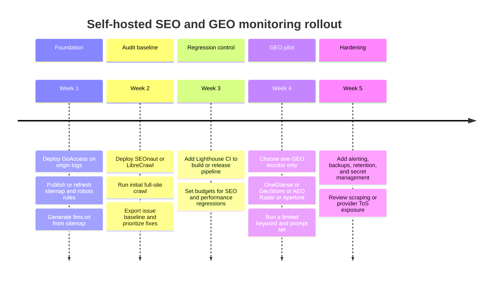

# Self-Hosted GitHub Projects for SEO and GEO Monitoring

## Executive summary

For a **strict no-signup, self-hosted** setup, the strongest stack is not a single project. It is a layered combination of **SEOnaut** or **LibreCrawl** for crawl-based audits, **Lighthouse CI** for recurring technical SEO/performance regression checks, **GoAccess** for first-party log and crawler visibility, and **llmstxt** for machine-readable `llms.txt` generation from your sitemap. That combination stays on your infrastructure, needs no vendor SaaS account to be useful, and covers the parts of GEO that are actually measurable without depending on external model providers: crawlability, AI-bot access, page quality, discoverability files, and change detection. citeturn3search0turn3search5turn33search3turn33search1turn34search0turn34search1

The hard truth is that **true cross-provider GEO monitoring is not realistically available today without some form of account or key**. The most promising open-source GitHub projects in that category—**OneGlanse**, **GeoStorm**, **AEO Radar**, and **Aperture**—all require either browser logins to AI products, provider/API keys, or both. They are useful, increasingly capable, and worth piloting, but they do **not** satisfy a strict interpretation of “no signup.” citeturn19view0turn10view0turn11view0turn31view1turn32view0

If you also want classic **rank tracking**, the best self-hosted GitHub option I could verify is **SerpBear**. It is mature and actively released, but it depends on Google scraping providers or your own proxies, and its richer features rely on Google Ads and Google Search Console integrations. In other words, it is self-hosted, but not dependency-free. citeturn2view0turn3search1turn1search9turn3search2

My recommendation is to treat your stack in two layers. Build a **no-signup core** first for evidence you control, then add a **GEO overlay** only if you decide the extra operational and legal risk is worth it. That gives you a system that is useful on day one and extensible later. citeturn33search3turn33search1turn34search0turn19view0turn30view0

## What no-signup really means in this category

There are three different “self-hosted” patterns in this space, and they matter more than the marketing label.

The first pattern is **fully local or first-party**: crawler audits, Lighthouse runs, sitemap and `llms.txt` generation, and server-log analysis. Projects in this group can be run entirely on your own host and against your own data, with no mandatory vendor accounts. This is where **SEOnaut**, **LibreCrawl**, **site-audit-seo**, **Lighthouse CI**, **GoAccess**, and **llmstxt** fit best. citeturn3search0turn33search3turn33search0turn33search1turn34search0turn34search1

The second pattern is **self-hosted but BYOK**. The software runs on your infrastructure, but the core signal comes from outside APIs or model/router keys. **GeoStorm** explicitly requires an OpenRouter key or direct provider keys; **Aperture** is BYOK by design; **Promptfoo** can run completely locally for evaluation, but most real-world provider comparisons still require keys unless you restrict yourself to local models such as Ollama. citeturn10view0turn11view0turn32view0turn4search2turn4search1

The third pattern is **self-hosted browser automation against AI product UIs**. This is how **OneGlanse** and **AEO Radar** get closer to “what users actually see” rather than just API output. It is powerful because UI answers can differ from API answers, but it comes with account/session handling and provider terms-of-service risk. AEO Radar says this openly and warns that automated use of ChatGPT, Gemini, Perplexity, or Claude web interfaces may violate ToS and can lead to account suspension. OneGlanse likewise depends on your own provider accounts and stores session/auth data locally. citeturn19view0turn31view1

For GEO specifically, the most defensible “no-signup” evidence still comes from **your own logs**. Cloudflare’s bot references and AI traffic docs show that AI-specific crawlers have recognizable user agents and categories, and GoAccess can slice logs in real time or from persisted datasets. That gives you ground truth on **whether AI crawlers are actually reaching your content**, even if it does not tell you whether AI systems later recommend you. citeturn35search4turn35search1turn34search0

## Prioritized inventory and evaluation

### High-confidence projects

| Project | Best use | Strict no-signup fit | Installation and stack | Dependencies and data sources | Metrics and outputs | Key risks | Maturity and activity |
|---|---|---|---|---|---|---|---|
| **SEOnaut** | Self-hosted SEO auditing service for site scans | **Yes** | Go app with MySQL; official Docker Compose example is the recommended path. citeturn3search0 | Crawls websites directly; no mandatory paid APIs surfaced in the retrieved docs. citeturn3search0 | Broken links, redirect issues, missing or duplicate meta tags, heading problems, severity-based reports, dashboarding via ECharts. citeturn3search0 | Standard crawler etiquette and crawl-load considerations; multi-user service means you need normal app hardening and HTTPS. citeturn3search0 | GitHub topic pages showed it **updated Sep. 16, 2025**. The retrieved views did not reliably expose a current star count. citeturn3search5turn3search6 |
| **LibreCrawl** | Screaming Frog-style crawler and audit UI | **Yes**, except optional PageSpeed API use | Docker Compose or Python; local mode is specifically designed for single-user use with no auth friction. citeturn33search3 | Site crawl, rendered pages via Playwright, optional PageSpeed Insights key for higher limits. citeturn33search3 | Titles, descriptions, headings, link maps, JS-rendered content, issue detection, exports, live progress, plugin API. citeturn33search3 | PageSpeed integration adds Google dependency if enabled; aggressive crawling of third-party sites still has normal legal and rate-limit implications. citeturn33search3 | Owner page listed **about 271 stars**; repo view showed **77 commits**. citeturn33search4turn33search3 |
| **site-audit-seo** | Batch crawl + Lighthouse + export-heavy local auditing | **Yes** | Docker, npm CLI, or local scripts; supports browser UI and CLI. citeturn33search0 | Crawler + Lighthouse + readability/Yake analysis; public hosted demo exists but self-host/local is fully workable. citeturn33search0 | Full-site crawl, per-page Lighthouse, mixed content, keyword/readability extraction, JSON/CSV/XLSX output. citeturn33search0 | Mainly crawl-load/Chrome-headless operational overhead. | The retrieved view did not surface trustworthy star/update data; treat it as useful but lower-confidence on maturity than GoAccess or Lighthouse CI. citeturn33search0 |
| **Lighthouse CI** | Continuous technical SEO and performance regression monitoring | **Yes** | Node-based CLI/server, GitHub Actions friendly, can be wired into any CI or run on your own schedule. citeturn33search1turn33search2 | Uses Lighthouse against your site builds or live URLs; no paid API required. citeturn33search1turn33search2 | SEO/performance/accessibility/best-practice scores, performance budgets, repeated runs, diffing across commits. citeturn33search1turn33search2 | Measures technical quality, not live SERP or AI-answer visibility. | GitHub showed **about 6.9k stars** and **58 releases**; latest release was **v0.15.1 on Jun. 26, 2025**. citeturn33search2 |
| **GoAccess** | First-party crawler/log visibility and AI-bot monitoring | **Yes** | Native package install, source build, or Docker; very easy to self-host. citeturn34search0turn4search0 | Web server logs only; optional GeoIP/GeoIP2 libs. citeturn34search0 | Real-time HTML/JSON/CSV dashboards, incremental processing, response times, bot filtering, persistent datasets. citeturn34search0turn4search0 | You need access logs and sane rotation; geography enrichments add extra data files if enabled. | GitHub showed **about 20k stars**, **58 tags**, and **159 contributors** in the retrieved repo views. citeturn4search0 |
| **llmstxt** | Generate `llms.txt` from `sitemap.xml` | **Yes** | Simple `npx` utility. citeturn34search1 | Consumes sitemap only; no DB, no vendor key. citeturn34search1 | Markdown-style `llms.txt` content derived from site URLs and descriptions. citeturn34search1 | Not a monitor by itself; usefulness depends on the still-evolving `llms.txt` ecosystem. | The retrieved views did not surface reliable stars or last-commit metadata. citeturn34search1turn34search2 |
| **SerpBear** | Self-hosted rank tracking | **Mostly no**, but not dependency-free | Node/Next.js app with SQLite; can run via Node or Docker. citeturn1search9turn2view0 | Needs third-party SERP scrapers or your own proxies; optional Google Ads and Search Console accounts for keyword research and real traffic/search-volume data. citeturn2view0 | Keyword positions, history, notifications, API, keyword ideas, GSC stats. citeturn2view0turn3search1 | Google scraping fragility, proxy/provider dependency, possible ToS and reliability issues; issue/discussion history showed concern about Google changes and abandonment. citeturn2view0turn3search3turn3search4 | Repo page showed **about 1.9k stars** and **296 commits**; latest visible release info in retrieved sources was **v3.1.0 on Mar. 27, 2026**. citeturn2view0turn1search8 |
| **Promptfoo** | Prompt testing, benchmark automation, GEO-style scenario testing | **Yes for local evals**, **No** if you need external providers | npm, brew, or pip; CLI-first. citeturn4search2turn4search1 | Can stay local with Ollama; most provider comparisons use API keys. citeturn4search2turn4search1 | Structured evals, red teaming, model comparisons, CI automation. Excellent for “synthetic GEO” test suites. citeturn4search2turn4search1 | Not direct AI-search visibility on its own; evaluates what you ask it to evaluate. | GitHub org page showed **about 20.3k stars** and **updated Apr. 18, 2026** for the main repo. citeturn4search1 |

### GEO-focused projects that require accounts, keys, or both

| Project | Best use | Why it is compelling | What breaks strict no-signup | Risks and caveats | Maturity and activity |
|---|---|---|---|---|---|
| **OneGlanse** | Most promising open-source GEO dashboard for browser-rendered AI answers | Tracks ChatGPT, Gemini, Perplexity, Claude, and Google AI Overview via the **actual product UIs**, captures full responses and citations, then analyzes visibility, rank, sentiment, competitor mentions, and source domains. Uses Postgres and ClickHouse on your own infrastructure. citeturn19view0turn18view0 | Requires your own provider accounts plus an **OpenAI or Anthropic API key** for analysis. citeturn19view0 | Session handling, browser automation, and UI workflows raise ToS and account-management risk even though data stays on your own infra. citeturn19view0 | Topic page showed **about 37 stars** and **updated May 2, 2026**; repo page showed high-30s stars as well. citeturn30view0turn19view0 |
| **GeoStorm** | Cleanest packaged AI-perception monitor | Single-container deployment, SQLite, scheduled polling, recommendation-share and position tracking, alerts, optional MCP endpoint for Claude Code. citeturn10view0turn11view0 | Requires an **OpenRouter key** or direct provider keys. citeturn10view0turn11view0 | Low infra friction, but still key-dependent; recommended more for software/product perception than broad enterprise GEO. | Brand-monitoring topic page showed **about 30 stars** and **updated Mar. 5, 2026**. citeturn30view0turn14view0 |
| **AEO Radar** | Low-SaaS, UI-scraping GEO monitor with screenshots | Daily headless crawl, rank/mention/sentiment/competitor/citation analysis, screenshots, SQLite default, Postgres swappable. citeturn31view1 | Uses **Claude CLI** in its pipeline and automates target AI services in browsers, so it is not truly account-free. citeturn31view1 | The README explicitly warns that automating ChatGPT, Gemini, Perplexity, or Claude may violate ToS and may get accounts suspended. citeturn31view1 | GitHub showed **11 stars** and the topic page showed **updated Apr. 27, 2026**. citeturn31view1turn30view0 |
| **Aperture** | BYOK AI-visibility infrastructure for agencies/teams | Self-hosted visibility monitoring with compare/audit/track workflows; targets ChatGPT and Perplexity now, with Google AI Overviews and Claude marked planned. Supports OpenAI-compatible endpoints including Ollama/vLLM. citeturn32view0 | Explicit BYOK model: OpenAI, Anthropic, Google, Perplexity, or OpenAI-compatible endpoints. citeturn32view0 | Young project, small footprint, no releases yet; good watchlist item but not yet a default recommendation. citeturn32view0 | GitHub showed **9 stars**; topic page showed **updated Mar. 27, 2026**. citeturn32view0turn30view0 |

### Emerging watchlist

These look interesting, but I would treat them as **watchlist repos**, not first-line recommendations, because I did not retrieve enough primary README/runtime detail to evaluate them as deeply as the projects above.

| Project | What the retrieved GitHub topic pages showed |
|---|---|
| **AICW Rankings** | Open-source tool for AI/GEO marketers to track mentions of brands by AI; **22 stars**, **updated Oct. 30, 2025**. citeturn30view0 |
| **aeo-mentions-crawler** | “AI Visibility Monitor” for tracking brand mentions across multiple LLM platforms; **11 stars**, **updated Mar. 18, 2026**. citeturn30view0 |
| **sonde-analytics** | “Understand how your brand shows up in LLM responses”; **7 stars**, **updated Mar. 25, 2026**. citeturn30view0 |

## Recommended integration patterns and deployment stack

The most robust pattern is to separate **ground truth**, **technical readiness**, and **visibility experiments**.

Your **ground-truth layer** should be **GoAccess** on web logs, with dashboards or saved reports segmented by AI user agents. Cloudflare’s bot references show the crawler and assistant identities you should expect to see in logs, such as GPTBot, ChatGPT-User, OAI-SearchBot, ClaudeBot, Claude-SearchBot, PerplexityBot, and Google-CloudVertexBot. This layer answers the first GEO question: *can AI systems and their crawlers actually reach my content?* citeturn35search4turn35search1turn34search0

Your **technical readiness layer** should combine one crawler/audit service and one continuous testing tool. For most teams, that means **SEOnaut** or **LibreCrawl** plus **Lighthouse CI**. SEOnaut is stronger as a persistent service with severity-based site auditing; LibreCrawl is stronger if you want a self-hosted Screaming Frog-style operator workflow, plugin extensibility, and local-mode convenience; Lighthouse CI is the recurring guardrail that catches regressions after deploys. citeturn3search0turn33search3turn33search1turn33search2

Your **machine-readable discovery layer** should include regular regeneration of `sitemap.xml`, schema validation in your own QA process, and **llmstxt** to publish a fresh `llms.txt` derived from your sitemap. This will not prove visibility, but it improves discoverability hygiene with almost no extra operational burden. citeturn34search1

If you decide to add a **GEO experimentation layer**, choose only one of the following, not all of them at once. Use **OneGlanse** if you care most about real browser-rendered provider outputs and source citations. Use **GeoStorm** if you want the lowest operational burden and can accept API/router-based monitoring. Use **AEO Radar** if you want a leaner UI-scraping approach and can tolerate explicit ToS/account risk. Use **Aperture** if you want a bring-your-own-keys base you expect to extend yourself. citeturn19view0turn11view0turn31view1turn32view0

A practical **Docker Compose** deployment should therefore look like this in service terms:

- `reverse-proxy` and your main site/app
- `goaccess` mounted to Nginx or CDN-origin logs
- `seonaut` + `mysql`, **or** `librecrawl`
- `lhci-server` plus a scheduled runner or CI job
- `llmstxt` as a cron-style regeneration job
- optionally, **one** GEO monitor: `oneglanse`, `geostorm`, `aeo-radar`, or `aperture` depending on your tolerance for signups and scraping risk

In **Kubernetes**, map this to:
- persistent datastores as StatefulSets or managed PVC-backed services
- audit UIs and dashboards as Deployments
- recurring scans as CronJobs
- logs shipped or mounted into GoAccess or an adjacent log processor
- GEO runners isolated in their own namespace because they tend to be the noisiest and most failure-prone part of the system

## Minimal stack and optional add-ons

### Strict no-signup minimal stack

For your constraint set, this is the stack I would actually deploy first:

| Component | Recommended project | Why it makes the cut |
|---|---|---|
| Crawl audit | **SEOnaut** or **LibreCrawl** | Best coverage of on-site SEO issues without mandatory vendor dependencies. citeturn3search0turn33search3 |
| Continuous testing | **Lighthouse CI** | Best regression guard for technical SEO and performance over time. citeturn33search1turn33search2 |
| Crawler/log intelligence | **GoAccess** | Best first-party evidence for AI crawler reach and behavior. citeturn34search0turn35search4 |
| AI-discovery file generation | **llmstxt** | Cheap, simple, useful hygiene for AI-readable site indexing. citeturn34search1 |
| Optional batch export tool | **site-audit-seo** | Useful when you want a local or ad hoc export-heavy audit run. citeturn33search0 |

This stack will not tell you “ChatGPT ranks you above Competitor X for Prompt Y,” but it **will** tell you whether your site is crawlable, fast, structurally sound, accessible to AI crawlers, and changing in good or bad ways over time. That is the maximum reliable GEO-adjacent coverage you can get without introducing account dependencies. citeturn3search0turn33search1turn34search0turn35search4

### Optional add-ons that require signups or keys

| Need | Preferred project/service | Explicit dependency | Minimal alternative if you want to avoid signup |
|---|---|---|---|
| Real AI-answer visibility across major providers | **OneGlanse** | Provider accounts + OpenAI/Anthropic analysis key. citeturn19view0 | There is no equivalent fully automated, high-confidence substitute; your fallback is manual prompt sampling plus log-based evidence. |
| Low-friction software perception tracking | **GeoStorm** | OpenRouter or direct provider keys. citeturn10view0turn11view0 | Skip this layer and rely on Promptfoo + local models for synthetic tests, knowing that this is not the same as real AI-search visibility. citeturn4search2 |
| Rank tracking | **SerpBear** | SERP scraping APIs or proxies; optional Google Ads/GSC accounts. citeturn2view0turn3search1 | Use proxies only and skip ads/GSC features; if even that is too much, rely on Search Console and manual SERP spot checks rather than self-hosted rank tracking. |
| AI crawler dashboard and export | **Cloudflare AI Crawl Control** | Cloudflare account/dashboard access, with some richer features plan-dependent. citeturn35search1turn35search9 | Use GoAccess plus user-agent filtering from Cloudflare’s published bot references. citeturn35search4turn34search0 |
| Rich prompt/agent test harness | **Promptfoo** | Often provider keys unless you stay on Ollama. citeturn4search2turn4search1 | Use Ollama-only local evals. It is cheaper and signup-free, but no substitute for real provider visibility. citeturn4search1turn4search2 |
| PageSpeed API enrichment in crawler UIs | **LibreCrawl** | Google API key for higher PSI limits. citeturn33search3 | Rely on local Lighthouse and Lighthouse CI instead. citeturn33search1turn33search2 |

## Deployment timeline

The fastest safe rollout is to put the **evidence-generating layers** in place before you touch AI-answer automation. That sequence minimizes lock-in and lets you decide whether GEO tooling is worth its friction after you already have useful telemetry. citeturn3search0turn33search3turn33search1turn34search0turn19view0

## Open questions and limitations

Some GitHub pages in the retrieved source set did **not** expose a trustworthy current star count or a directly readable last-commit page, so in those cases I used the latest visible GitHub update or release date instead, or I marked the maturity data as incomplete rather than guessing. This affected lower-priority utilities more than the top recommendations. citeturn3search5turn33search0turn34search1

I also did **not** find a mature, broadly adopted, SEO/GEO-specific “skill pack” repo that was better supported than simply using the agent-facing artifacts already present in these projects—such as **CLAUDE.md**, **AGENTS.md**, or **MCP endpoints** in OneGlanse, GeoStorm, AEO Radar, and Aperture. For now, the practical path is to treat those projects themselves as the agent layer rather than looking for a separate skills repository. citeturn19view0turn11view0turn31view1turn32view0

The most important strategic limitation is this: **strict no-signup GEO monitoring is still immature**. If you truly refuse all vendor accounts and all paid APIs, your best stack is excellent for **SEO health and AI crawl readiness**, but only partial for **AI-answer share-of-voice**. To measure the latter in production, today’s open-source tools still depend on either browser accounts, provider keys, or both. citeturn19view0turn11view0turn31view1turn32view0