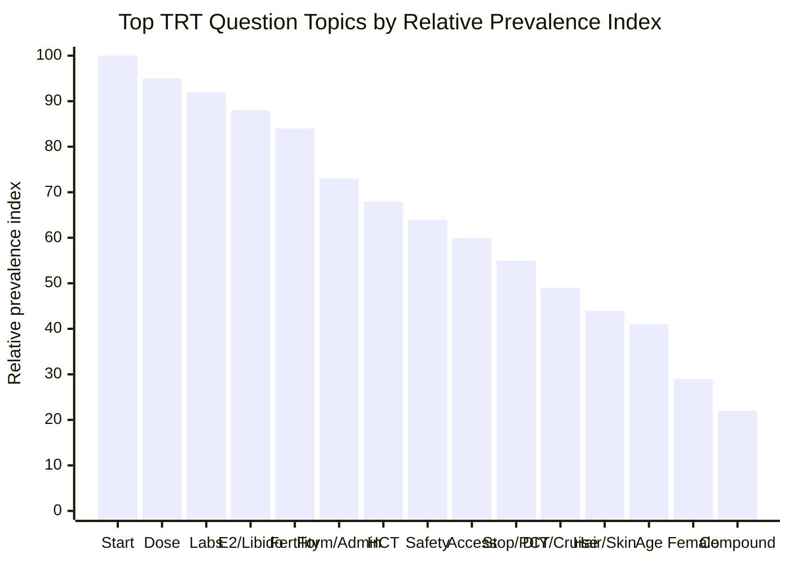
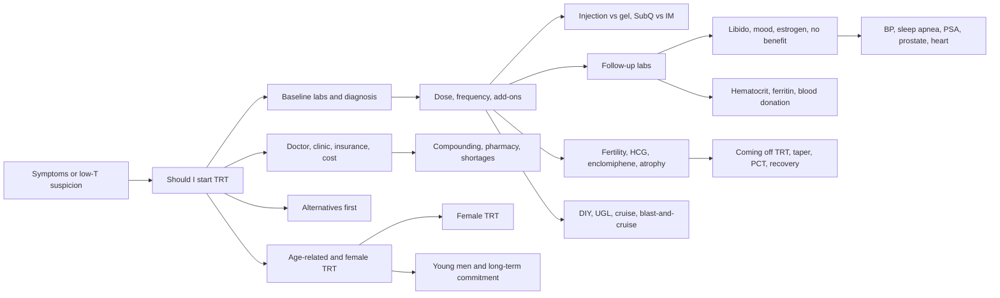

# TRT User Question Landscape Across Reddit, Forums, and Public Social Media

## Executive summary

Across public English-language TRT communities, the densest clusters of user questions are not about advanced endocrinology first. They are about decision points and troubleshooting moments: **Do I qualify and should I start? What dose and schedule make sense? What do my labs mean? Why do I feel worse, different, or “not dialed in”? What happens to fertility, libido, hematocrit, and long-term safety if I continue?** Those themes recur repeatedly in r/Testosterone and r/trt, in long-running forum ecosystems such as ExcelMale and T-Nation, and in public YouTube/Facebook discussion surfaces. citeturn26search1turn4search10turn13search0turn12search1turn23search5turn17search15

The single biggest pattern is that TRT questions follow a lifecycle. The first stage is **qualification and commitment**: borderline numbers, “normal-range but symptomatic” cases, whether to try lifestyle changes or enclomiphene/clomiphene/hCG first, and fear of lifetime dependence. The second stage is **protocol construction**: weekly versus split dosing, injections versus gel/cream, subQ versus IM, whether clinics are overtreating, and whether AI or hCG should be added from the start. The third stage is **monitoring and troubleshooting**: SHBG, estradiol, prolactin, thyroid, hematocrit, ferritin, libido, sleep, mood, hair loss, and persistent symptoms despite “good numbers.” The fourth stage is **family planning and exit options**: fertility preservation, testicular atrophy, conception while on TRT, and PCT/taper/recovery if stopping. citeturn15search1turn4search0turn26search7turn11search0turn13search1turn19search6turn14search0turn10search0

A second important pattern is the rise of **access and optimization questions** driven by online clinics and social media. Users repeatedly ask who should prescribe TRT, whether insurance will cover it, how much clinics charge, whether certain clinics are “red flags,” and whether some providers push high-dose TRT plus AI/hCG too quickly. Public reporting and community threads also show growing interest from men with borderline or even “normal” lab ranges seeking TRT as an aging, body-composition, or lifestyle intervention rather than classic hypogonadism treatment. citeturn23search0turn9search1turn9search4turn23search3turn23search13turn26news15

Two smaller but distinct subgenres stand out. First, **young men and fertility-conscious users** ask whether TRT is a mistake in their 20s or 30s, whether they will regret shutting down natural production, and whether enclomiphene, clomiphene, or hCG are better “off-ramps” or alternatives. Second, **women and bodybuilder-adjacent users** ask different questions: women focus on low-dose precision, virilizing side effects, and the lack of female-specific products; bodybuilding-adjacent users blur TRT with “cruise,” blast-and-cruise, UGL sourcing, and fertility recovery after steroid exposure. citeturn15search1turn15search10turn8search0turn8search9turn18search11turn18search5turn10search2

## Methodology

This report synthesizes **public, English-language, indexed discussions from the last five years**, with older canonical threads included when they still surfaced repeatedly in community search results or forum index pages. The searchable core came from Reddit thread pages in **r/Testosterone** and **r/trt**, forum ecosystems such as **ExcelMale**, **T-Nation**, **TMuscle**, **MESO-Rx / ThinkSteroids**, and related bodybuilding/HRT boards, plus supplementary public discussion surfaces from **YouTube** and **public Facebook TRT groups/pages**. citeturn3search3turn3search0turn15search2turn0search11turn25search12turn18search13turn5search1turn7search0

Search terms combined core TRT language with recurring concern terms, including variants of: **“starting TRT,” “low T,” “dose,” “frequency,” “AI,” “estradiol,” “libido,” “hematocrit,” “ferritin,” “HCG,” “enclomiphene,” “fertility,” “subQ vs IM,” “gel vs injections,” “insurance,” “clinic,” “compounding pharmacy,” “coming off TRT,” “PCT,” “blast and cruise,” “young men,” and “female TRT.”** Verbatim sample questions were drawn mainly from thread titles and directly indexable prompt text.

Deduplication was done by collapsing near-synonyms into shared question stems. For example, “Am I low enough for TRT?”, “Should I finally jump on TRT?”, and “Are people getting prescribed TRT with normal-range testosterone levels?” were coded under **qualification / candidacy**; “Should I start with gel or injections?” and “SubQ vs IM?” were coded under **formulation / administration**. Frequency labels are **qualitative** rather than absolute platform counts:

- **High**: repeatedly observed across Reddit plus multiple forum/social surfaces.
- **Medium**: persistent, but narrower or more stage-specific.
- **Low**: specialized subgroup or logistics niche, still recurring enough to matter.

The chart below uses a **relative prevalence index** derived from this coded sample. It is directional rather than a census of all TRT posts. The strongest repeated signals came from Reddit and forums, while public Facebook/X/Instagram comments were much less indexable and therefore contribute less to prevalence scoring. citeturn3search8turn4search10turn13search0turn19search0turn23search3turn7search0

## Topic map and prevalence visualization

The distribution below reflects how often a topic family reappeared across the sampled public community corpus.

In plain language, the top of the stack is **starting TRT, dosing, lab interpretation, estrogen/libido troubleshooting, and fertility**. Topics such as **formulation choice, hematocrit management, clinic logistics, and stopping TRT** are the next layer. **DIY/cycle crossover, appearance changes, age-specific concerns, female TRT, and compounding/supply issues** are real recurring themes, but they are less universal. citeturn26search1turn26search7turn13search0turn12search1turn14search0turn11search0turn17search15turn23search0turn10search0turn18search11turn8search0turn10search7

The relationships between the topic families are best understood as a flow rather than isolated buckets.

## Deduplicated taxonomy of recurring TRT user questions

| Category | Frequency | Typical contexts | Deduplicated recurring question stems | Source examples |
|---|---|---|---|---|
| Qualification, diagnosis, and whether to start | High | Symptomatic men with low or borderline labs; “normal-range but feel awful” cases; fear of lifetime commitment | “Am I low enough?” “Should I start now or try alternatives first?” “Will I regret it?” | r/Testosterone starting/candidacy threads; ExcelMale pre-TRT threads; young-men regret/candidacy posts citeturn4search0turn4search10turn15search1turn26search2turn23search13 |
| Protocol design, dose, and frequency | High | First prescription; clinic-set high doses; split-dose vs weekly debates; AI/hCG bundled up front | “Is my starting dose too high?” “Once weekly or more often?” “Do I need AI or hCG from day one?” | r/Testosterone dose threads; ExcelMale protocol threads; T-Nation estrogen/protocol debates citeturn26search7turn3search9turn14search4turn0search9 |
| Formulation and administration | Medium-High | Injection anxiety; gel-to-injection switching; subQ vs IM; site rotation; needle size and lumps | “Should I use gel or injections?” “SubQ or IM?” “Why am I getting painful lumps?” | r/trt topical-to-injection post; ExcelMale subQ vs IM; injection-site threads; YouTube TRT injection discussions citeturn11search0turn11search2turn16search0turn16search2turn11search3 |
| Labs, biomarkers, and lab timing | High | Baseline workup; first follow-up labs; interpreting SHBG, free T, E2, prolactin, thyroid, PSA | “What labs matter most?” “Why are my SHBG/E2/prolactin off?” “When should I draw trough labs?” | r/trt bloodwork threads; ExcelMale SHBG, estradiol, thyroid, hematocrit discussions citeturn13search0turn13search1turn13search6turn13search14turn4search14 |
| Estrogen, AI use, libido, erections, and symptom troubleshooting | High | “Not dialed in”; numb libido after honeymoon period; anxiety/insomnia/mood changes; high-E2 fears | “Is estrogen the problem?” “Why is my libido gone?” “Why do I feel worse on TRT?” | r/Testosterone estrogen/libido threads; ExcelMale libido troubleshooting; T-Nation estrogen debates citeturn12search1turn12search5turn19search2turn19search6turn0search2turn0search8 |
| Fertility, HCG, enclomiphene/clomiphene, testicular atrophy | High | Family planning; preserving fertility before conception; reversing atrophy; deciding between hCG and enclomiphene | “Can I stay fertile on TRT?” “Is hCG enough?” “Will enclomiphene/clomid work better?” | Reddit fertility threads; ExcelMale fertility/hCG guides; YouTube fertility explainers citeturn3search6turn14search0turn14search3turn14search9turn5search0 |
| Hematocrit, blood donation, and ferritin | Medium-High | Follow-up CBC abnormalities; therapeutic phlebotomy; low ferritin after repeat donation | “Do I need to donate blood?” “What if ferritin crashes?” “How do I lower hematocrit if I can’t donate?” | Reddit hematocrit/donation posts; ExcelMale ferritin discussions; YouTube donation/hematocrit debates citeturn17search0turn17search11turn17search15turn17search1turn17search2 |
| General long-term safety | Medium | Users with BP, BPH, PSA, sleep, heart-risk concerns; aging users reviewing downside risk | “Is TRT safe long term?” “Can it worsen sleep apnea or prostate symptoms?” “What should I monitor?” | r/trt BPH thread; ExcelMale OSA threads; TRT safety monitoring pages; Harvard overview citeturn22search0turn22search2turn22search14turn22search4turn22search8 |
| Doctor choice, clinics, insurance, and cost | Medium | Telehealth vs urologist/endocrinologist; monthly subscription fatigue; insurance appeals; clinic red flags | “Who should manage TRT?” “Will insurance cover this?” “Which clinics are overprescribing?” | Reddit cost/doctor-choice posts; ExcelMale insurance discussions; YouTube clinic-red-flag content citeturn23search0turn9search0turn9search1turn9search4turn23search3turn23search10 |
| Stopping TRT, tapering, PCT, and recovery | Medium | Financial pressure, side effects, fertility goals, regret, cycling off after years on TRT | “How do I come off?” “Can I recover natural production?” “What PCT makes sense after TRT?” | Reddit taper threads; ExcelMale PCT threads; T-Nation blast-and-cruise exit threads citeturn10search0turn10search3turn10search15turn12search6 |
| DIY, UGL, cruise, and blast-and-cruise crossover | Medium | Users blending TRT with bodybuilding; physician refusal pushing DIY sourcing; cruise-dose questions | “Is this still TRT or a cruise?” “How do I blast on top of TRT?” “Can I maintain fertility while cruising?” | Reddit DIY/blast thread; MESO-Rx/TRT+ threads; T-Nation fertility-after-blast threads; TMuscle TRT forum citeturn18search0turn10search2turn18search11turn18search5turn25search12 |
| Appearance-related side effects | Medium | Hair loss, acne, gynecomastia, body hair changes, “looking puffy” or “aging faster” | “Will TRT make me go bald?” “Can gyno be reversed?” “Why did body hair/skin change?” | Reddit hair-loss threads; ExcelMale hair-loss discussions; YouTube hair/gyno shorts citeturn12search0turn12search2turn12search10turn12search3 |
| Age-related TRT | Medium | Men in their 20s/30s questioning commitment; 40s/50s+ asking if symptoms are just aging | “Am I too young?” “Is this age-related decline or pathology?” “Should men with ‘normal’ labs still consider TRT?” | Reddit young-men posts; ExcelMale young-men discussion; age-comparison YouTube content citeturn15search1turn15search9turn15search10turn15search15 |
| Female TRT | Low-Medium | Perimenopause/menopause; low libido/fatigue; careful dosing; fear of virilization; lack of female products | “Can women safely use testosterone?” “Will I get facial hair or lose my femininity?” “How do women dose this without male products?” | ExcelMale women’s HRT forum; T-Nation women-and-testosterone threads; female TRT explainers citeturn8search1turn8search0turn8search9turn8search10turn8search11 |
| Compounding pharmacies, pharmacy supply, and product availability | Low-Medium | hCG shortages; compounded creams/cypionate; insurance only covering certain esters; stock issues | “Should I use compounded cream?” “Why is hCG out of stock?” “Can I switch esters to what insurance covers?” | ExcelMale compounding/shortage threads; Reddit cypionate vs enanthate; Men’s clinic/shortage coverage citeturn10search7turn10search10turn20search6turn20search0turn20search4 |

A cross-cutting point is that many threads mix categories rather than staying cleanly inside one. A single post often starts as **“Do I qualify?”**, turns into **“What dose?”**, then becomes **“Why is my E2/libido/hematocrit weird?”** This blending is especially strong on Reddit and in the bodybuilding-adjacent TRT boards. citeturn4search10turn12search1turn17search15turn18search7

## Sample verbatim user questions from the top categories

### Starting TRT and deciding whether to begin

**Category frequency: High.** Typical contexts include borderline labs, symptom validation, first-prescription anxiety, fear of lifetime commitment, and uncertainty about which prescriber to trust. citeturn4search0turn15search1turn23search0

| Sample verbatim user question | Typical context | Frequency | Source |
|---|---|---|---|
| “Should I check my estrogen before starting TRT ?” | Pre-start labs; concern about aromatization | High | r/trt citeturn3search8 |
| “New to TRT. Advice on starting dose” | First prescription; uncertain starting point | High | r/Testosterone citeturn4search0 |
| “Starting Dose & Frequency – Pre TRT labs” | Pre-TRT decision with attached labs | High | ExcelMale citeturn4search10 |
| “Does anybody regret taking T?” | Fear of irreversible commitment, especially in younger users | High | r/Testosterone citeturn15search1 |
| “How difficult is it to get prescribed testosterone? (30M)” | Access frustration; wondering if candidacy is enough | High | r/Testosterone citeturn26search2 |
| “Levels dropping- should I finally jump on TRT?” | Progressive decline with symptoms; indecision | High | r/Testosterone citeturn15search9 |
| “Trt clinic wants to prescribe me trt. I’m 45 yr old.” | Suspicion that clinic may be too eager | High | r/Testosterone citeturn23search13 |
| “What were your testosterone level when you started TRT?” | Benchmarking against peers before deciding | High | r/Testosterone citeturn15search0 |
| “Prescribed testogel, is it worth using or shall I go straight on jabs ...” | Deciding whether to start with gel or injections | High | r/Testosterone citeturn11search5 |
| “Who to go through for TRT? Urologist, Endocrinologist, In person clinic ...” | Provider selection before initiation | High | r/Testosterone citeturn23search0 |

### Dose, frequency, and protocol design

**Category frequency: High.** Typical contexts include “dialing in,” clinic-generated protocols, questions about bundled AI/hCG, and optimization of frequency versus symptom relief. citeturn26search7turn3search9turn14search4

| Sample verbatim user question | Typical context | Frequency | Source |
|---|---|---|---|
| “How long did it take to find your optimal dose?” | Early dial-in expectations | High | r/Testosterone citeturn26search7 |
| “How did adjusting dosing frequency affect your SHBG?” | Frequency changes tied to lab interpretation | High | r/Testosterone citeturn13search9 |
| “Dr agreed to switch to injections but wants me to dose 1 time every 21 ...” | Concern that provider schedule is outdated or too infrequent | High | r/Testosterone citeturn11search8 |
| “What were your effects when raising your test dosage?” | Escalation from TRT to higher doses or symptom chasing | High | r/Testosterone citeturn26search9 |
| “Is an AI and hcg necessary for trt?” | Whether add-ons are required or overprescribed | High | MESO-Rx / ThinkSteroids forum surface citeturn3search9 |
| “Hcg with trt or Enclomiphene with trt?” | Choosing a protocol adjunct for testicular function/fertility | High | r/Testosterone citeturn14search4 |
| “Switching from topical to injection? SUBQ vs IM” | Route-switch decision after mediocre topical response | High | r/trt citeturn11search0 |
| “Let’s Settle This: Subcutaneous vs. Intramuscular Testosterone Injections” | Community split on injection route | High | ExcelMale citeturn11search2 |
| “Gel vs injections” | Formulation tradeoff debate | High | ExcelMale citeturn11search6 |
| “People on TRT + HCG with 0 AI use whats your protocol?” | Peer benchmarking for “clean” protocols without AI | High | r/trt citeturn23search16 |

### Labs, biomarkers, and what to monitor

**Category frequency: High.** Typical contexts include first follow-up labs, surprise SHBG/estradiol/prolactin findings, and uncertainty about which markers matter clinically versus cosmetically. citeturn13search0turn13search1turn17search11

| Sample verbatim user question | Typical context | Frequency | Source |
|---|---|---|---|
| “2 months into TRT, first 8-week lab results, and a few questions” | First follow-up bloodwork | High | r/trt citeturn13search0 |
| “FSH 28, SHBG High, Low Free T – Would TRT or hCG Help? Need Advice” | Diagnostic ambiguity before or during TRT | High | r/Testosterone citeturn13search1 |
| “Blood Work results Thyroid questions and slightly elevated estrogen and prolactin also low shbg” | Multi-marker interpretation problem | High | ExcelMale citeturn13search6 |
| “Advice of Lab Results-High Estradiol” | Estradiol-inside-range vs symptom mismatch | High | ExcelMale citeturn13search14 |
| “Got some extensive blood work done. What do we think?” | Community reading of a broad panel | High | r/Testosterone citeturn13search13 |
| “Could 1 blood donation have crashed my ferritin?” | CBC management side effect of TRT monitoring | High | ExcelMale citeturn17search1 |
| “Need some advice on how to lower my hematocrit” | Elevated hematocrit after established TRT | High | r/Testosterone citeturn17search11 |
| “How do you reduce your hematocrit if you can’t donate blood in Canada?” | Access barrier to routine hematocrit management | High | r/Testosterone citeturn17search15 |
| “TRT Lab Test Results: What to Look For.” | Broad recurring lab-interpretation FAQ | High | ExcelMale citeturn4search14 |
| “I seem to be a candidate for TRT, doc is concerned w/ hematocrit.” | Starting TRT when CBC is already borderline | High | ExcelMale citeturn13search10 |

### Estrogen, libido, side effects, and “why do I feel off”

**Category frequency: High.** Typical contexts include the “honeymoon then crash” experience, erection/libido loss despite improved testosterone levels, emotional flattening, high-E2 fear, insomnia, and appearance side effects such as hair loss. citeturn12search1turn12search5turn19search6

| Sample verbatim user question | Typical context | Frequency | Source |
|---|---|---|---|
| “On TRT and now high estrogen” | Emotional or motivational changes blamed on E2 | High | r/Testosterone citeturn12search1 |
| “Libido is gone and experiencing ED” | Sexual side effects after starting or modifying protocol | High | r/Testosterone citeturn12search5 |
| “How long did it take to get your libido back?” | Recovery expectations after starting TRT | High | r/trt citeturn19search0 |
| “Been on trt for 2 years and still no libido ..# libido” | Long-term failure of symptom resolution | High | ExcelMale citeturn19search2 |
| “Low Libido while on TRT” | Ongoing sexual dysfunction despite treatment | High | ExcelMale citeturn19search10 |
| “Help..? I feel worse than pre-TRT” | Fatigue and discouragement despite being on treatment | High | ExcelMale citeturn19search6 |
| “What do you guys do to avoid Hair Loss While on TRT?” | DHT/hairline anxiety | High | r/trt citeturn12search0 |
| “TRT with HCG & Hair Loss” | Appearance changes after adding hCG | High | ExcelMale citeturn12search2 |
| “Age 58 on TRT for years but now dealing with prostate enlargement issues” | BPH/prostate symptoms in older users | High | r/trt citeturn22search0 |
| “Can’t sleep. Sometimes I am up till 3-5am” | Insomnia after TRT initiation or dose issues | High | r/Testosterone citeturn22search17 |

### Fertility, HCG, coming off TRT, and recovery

**Category frequency: High.** Typical contexts include trying to conceive, late discovery that TRT can suppress sperm, preserving fertility while staying on therapy, testicular shrinkage, and stopping TRT for either family planning or regret/financial reasons. citeturn23search5turn14search0turn10search0

| Sample verbatim user question | Typical context | Frequency | Source |
|---|---|---|---|
| “What are the chances of TRT causing permanent/ Temporary infertility?” | Pre-start fertility fear | High | r/Testosterone citeturn3search6 |
| “Long time TRT User with hCG included in my protocol. Need advice about my hCG dosage and fertility.” | Fertility planning after years on TRT | High | r/trt citeturn23search12 |
| “Is Clomid or HCG better for restoring Fertility?” | Restoration protocol choice | High | r/Testosterone citeturn14search0 |
| “Trying to conceive with partner on TRT” | Couple-level fertility crisis after TRT start | High | r/Testosterone citeturn23search5 |
| “Do I start clomid or no? I need advice to help have children” | Fertility-specific decision under time pressure | High | r/Testosterone citeturn14search12 |
| “How long until HCG starts working?” | Expectations after beginning fertility-support drug | High | r/Testosterone citeturn20search8 |
| “How to come off TRT gradually” | Financial or side-effect reasons for stopping | High | r/Testosterone citeturn10search0 |
| “PCT regiment coming off 2 years TRT” | Exit planning after medium-term TRT | High | ExcelMale citeturn10search3 |
| “Coming Off Blast & Cruise PCT Plan?” | Recovery after TRT/steroid crossover | High | T-Nation citeturn10search15 |
| “Regaining Fertility on TRT, or coming off.” | Whether to stay on TRT while recovering sperm production | High | Steroid Source Talk citeturn3search10 |

## Cross-cutting patterns and limitations

The question set is strikingly consistent across communities, but the **tone** differs by platform. Reddit and general TRT forums emphasize **personal uncertainty, symptom validation, and “dialing in.”** Bodybuilding-adjacent boards are more likely to blur TRT with **cruise doses, blasts, ancillary drugs, and fertility after AAS exposure.** Women’s TRT communities focus much more on **virilization risk, micro-dosing precision, and the absence of female-labeled products.** citeturn13search0turn19search6turn18search11turn10search2turn8search0turn8search9

A notable meta-pattern is that people often use community spaces to compensate for what they feel they did **not** get from clinics: clear expectations, informed consent on fertility, practical monitoring advice, and interpretation of subjective symptoms when total testosterone looks “fine” on paper. That pattern appears in candidacy threads, insurance/clinic discussions, and fertility/conception posts. citeturn23search5turn9search1turn23search3turn23search14

Open questions and limitations remain. This is a **search-based qualitative synthesis**, not a full API scrape of Reddit or a platform-wide crawl. Public Facebook, Instagram, and X contributed fewer directly indexable question texts than Reddit/forums/YouTube, so those environments are **supplementary** rather than equal-weight frequency sources in this report. Bodybuilding.com’s historical forum footprint was also less searchable than newer or better-indexed TRT communities during this pass. Frequency labels and the bar-chart index should therefore be read as **directional prevalence**, not exact global post counts. citeturn25search0turn7search0turn5search1