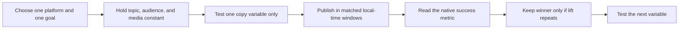

# Writing for Major Social Platforms

## Executive summary

The most reliable way to write well on X, LinkedIn, Instagram, YouTube, Facebook, and Reddit is not to start with word count. It is to start with **the job the audience hired that platform to do**. X is still strongest for live public conversation and news; LinkedIn for professional credibility and B2B trust; Instagram for visual identity, creativity, and social connection; YouTube for searchable, high-intent video; Facebook for networked distribution, Groups, and broad-age reach; and Reddit for community problem-solving and credibility earned by contribution rather than brand volume. When teams write “one message, six ways,” performance usually drops because the hook, body, CTA, and media are no longer aligned to platform intent. citeturn21search1turn41search1turn27search12turn10view0turn2search8turn22search7turn36search13

Across all six platforms, the strongest common pattern is this: **front-load value before truncation, keep copy natively scannable, and pair it with media designed for the feed surface people actually use**. On LinkedIn and X, that means the first line or two must carry the post. On Instagram and Facebook, the creative often does the first job and the caption does the second. On YouTube, title and thumbnail perform the click, while the opening seconds and retention curve determine whether distribution expands. On Reddit, title clarity and comment quality matter more than branded polish. citeturn34view2turn34view0turn35view0turn33view0turn2search0turn29search4turn16view1turn17view1

“Optimal length” is best treated as a **starting prior, not a law**. Hootsuite’s current synthesis still points marketers toward concise Facebook posts, sub-100-character X posts, short LinkedIn updates, selective Instagram captions, and tightly written YouTube titles and descriptions, but several of those recommendations are based on older underlying studies. The rigorous takeaway is not “always write short”; it is “write only as long as needed to win the next action.” On platforms where dwell time and completion matter—especially LinkedIn video, Instagram video, and YouTube—longer can outperform if the opening and structure keep people moving. citeturn33view0turn34view0turn34view2turn35view0turn29search4turn37search1

The most defensible testing method across platforms is a **single-variable, platform-native A/B process**. Hold audience, topic, media, and timing as constant as possible; test one copy variable at a time; decide results using the metric the platform actually optimizes for. On YouTube that is usually watch time and retention; on Instagram, shares, saves, and watch time; on Reddit, upvote rate and comment quality; on LinkedIn, meaningful comments and clicks; on Facebook, shares and conversation quality; on X, replies, reposts, and CTR by post type. citeturn37search4turn37search1turn23search16turn40search6turn5search2turn7search2turn29search0

This report assumes **English-language organic social content**, with no specified industry and no specified paid media mix. Where B2B and B2C diverge meaningfully, that is called out. Time recommendations should be read in **audience local time**, not the writer’s time zone. Sprout’s 2026 timing studies explicitly normalize to local time across markets. citeturn30search0turn30search1turn30search2turn30search3

### Open questions and limitations

Some platform help documentation—especially for X, LinkedIn, and certain Meta surfaces—is fragmented, moved, or inconsistently exposed in public search. For that reason, the report prioritizes official or primary sources where accessible, and supplements them with recent benchmark analyses where official guidance is incomplete. The examples section therefore leans toward **stable public case-study references, official educational examples, and publicly documented executions**, rather than relying only on live post permalinks whose metadata may not render reliably in search. citeturn10view0turn21search1turn30search0turn36search3

## Cross-platform comparison

The table below is the fastest way to orient a multi-platform editorial plan. It summarizes each platform’s audience skew, writing job, best starting length, most effective native media tendency, timing baseline, and the metric most worth optimizing first.

| Platform | Primary audience skew | Platform job | Best starting copy length | Best native media tendency | Timing and cadence baseline | First metric to optimize | Source basis |
|---|---|---|---|---|---|---|---|
| X | US use skews younger than Facebook, with especially strong 18–34 use; globally, the largest ad-audience slice is men 25–34. News use is unusually high relative to many networks. | Real-time conversation, commentary, reaction, and news distribution. | Start around **71–100 characters** for standard posts; standard cap is **280**. | Short text, one strong image, or short native video; vertical is increasingly useful, but 1:1 and 16:9 remain common. | Timeliness matters more than fixed volume; use multiple touches only when you have something genuinely new, and anchor tests in audience-local midday to late afternoon windows. | Replies, reposts, link CTR, follows from post. | citeturn13view0turn39view0turn21search1turn41search1turn34view0turn3search5turn30search0 |
| LinkedIn | Professional network with the heaviest global representation in ages 25–34; registered audience skews toward business decision-makers and educated professionals. | Professional credibility, expertise signaling, recruiting, and B2B trust-building. | For feed posts, a short-update baseline is still useful; Hootsuite’s starting rule is **~25 words** or at least make the point before truncation. Hard cap is **3,000 characters**. | Documents/carousels, one-image thought-leadership posts, and short native video. | Consistent weekly rhythm beats forced daily volume; best engagement clusters Tue–Thu, late morning to afternoon. | Impressions, clicks, comments, reposts, follower quality, leads. | citeturn39view4turn34view2turn34view3turn30search1turn5search2 |
| Instagram | Strongest among younger adults; globally, 18–34 dominates. | Visual storytelling, identity, entertainment, and social connection. | Caption starting point **138–150 characters** if you want a short, feed-native caption; hard cap **2,200**. | Reels at **1080×1920 9:16**, carousels, and 4:5 feed visuals. | Consistent creation matters; midweek afternoons are strongest in broad benchmarks, and Instagram’s own best-practices tooling emphasizes posting frequency, attention capture, and Reel length. | Shares, saves, watch time, profile actions, content interactions. | citeturn13view0turn39view2turn35view0turn28search4turn10view0turn30search2turn23search16 |
| YouTube | Broadest age spread of the six; globally the average user age sits around 35–44, with major 25–44 weight. | Searchable video library, education, entertainment, fandom, and intent-rich discovery. | For long-form, optimize the **title** and the **first 100–150 description characters** more than total text length; title hard cap **100**, description **5,000**. | Custom thumbnail, subtitles/captions, long-form video plus Shorts; Shorts are vertical. | Reliable schedule is more important than frequency for its own sake; publish before viewers come online and test long-form vs Shorts separately. | Impressions, CTR, average view duration, retention, watch time, subscribers. | citeturn13view0turn39view3turn35view0turn2search0turn2search3turn29search1turn37search4turn31search12 |
| Facebook | Broad, cross-generational reach; in the US it remains heavily used across 30–64 and older groups. | Distribution through the social graph, Groups, local/community discovery, and broad awareness. | Start concise: **1–80 characters** is still the strongest short-post heuristic. | Native video and Reels, square or portrait feed graphics, Group/community posts. | Use a steady rhythm, not clutter; Tuesdays and Wednesdays from midday into evening are the strongest broad windows. | Reach, shares, reactions, comments, clicks, video views. | citeturn13view0turn39view1turn33view0turn22search3turn22search7turn30search3turn7search2 |
| Reddit | Younger and millennial-heavy, but topic-specific rather than broad-demographic; communities span everything from finance to parenting to gaming. | Community problem-solving, opinion formation, and trust earned through value. | Use a concrete, factual title well below the **300-character** cap; body length should follow the subreddit’s norms, not marketing convention. | Text, screenshots, proof images, AMA threads, native discussions. | Comment first, post second. Match the rhythm of the subreddit; broad weekday ET windows are a useful starting point, but subreddit norms dominate. | Upvote rate, comments, click quality, community sentiment. | citeturn13view0turn36search8turn16view1turn36search2turn31search5turn40search6turn40news47 |

A disciplined cross-platform testing workflow looks like this:

For example, YouTube already supports title-and-thumbnail testing around watch time; Instagram’s Trial Reels lets creators test with non-followers first; Reddit Pro emphasizes upvote rate and growth signals; Sprout and Hootsuite both stress using audience-local timing rather than universal posting myths. citeturn37search4turn23search16turn40search6turn30search0turn31search2

## X

### What works

X remains the most **real-time** of the six platforms in this report. In the US, it is smaller than YouTube, Facebook, and Instagram, but it punches above its weight in public conversation and news behavior. Pew’s 2025 fact sheet shows especially strong US use among adults 18–29 relative to older groups, while DataReportal’s 2025 global ad-audience analysis puts the platform’s center of gravity around ages 25–34, especially men 25–34. Purpose matters here: people use X for short public statements, reaction, conversational participation, news following, and live event commentary. citeturn13view0turn39view0turn21search1turn41search1

The writing implication is simple: **lead with the point, not the setup**. X still rewards quick comprehension. Hootsuite’s current synthesis recommends starting in the 71–100 character range, citing older but still directionally useful evidence that sub-100-character posts tend to outperform longer ones. That should not be read as a ban on threads or longer Premium posts; it should be read as a reminder that the first post in the sequence must earn the rest. citeturn34view0turn34view1

### Quick-reference cheat sheet

| Dimension | Recommendation | Evidence |
|---|---|---|
| Primary audience | Start with audiences who care about immediacy: media, operators, founders, analysts, fans, and communities that track events in real time. Global audience center is 25–34; US use is strongest among younger adults. | citeturn13view0turn39view0 |
| Content norms | Newsy, reactive, direct, public-by-default. Context is thin, so ambiguity underperforms. | citeturn21search1turn41search1 |
| Ideal post length | Start tests at **71–100 characters**; standard post cap is **280**. If you need more, use a thread, but make each post semantically complete. | citeturn34view0turn34view1turn21search1 |
| Tone and voice | Crisp, opinionated when appropriate, but specific. Sound human, not corporate. If your niche expects authority, use source-first wording rather than hype. | citeturn21search1turn41search1 |
| Headline and lead | Use one of four leads: **news**, **number**, **strong opinion**, or **question tied to a live topic**. Put the most informative noun and verb first. | citeturn41search1turn34view0 |
| Formatting | Use line breaks sparingly. Mentions work when they add relevance. Keep hashtags selective rather than stuffing them; cleaner copy is increasingly favored. | citeturn34view1turn18news13 |
| Media | Strong single visual or short native video often outperforms link-only posting. Recent X ad/spec references prefer vertical video for mobile, while still supporting 1:1 and 16:9. | citeturn3search5 |
| Links | Use links when the click is the goal, but expect that link-heavy posting may compete with an in-feed consumption bias. When possible, summarize the value in-post before the link. | citeturn19news35turn2search8 |
| Cadence and timing | Do not post for volume alone. Multiple daily posts can work on X because the shelf life is short, but only if each adds new value. Use audience-local midday or late-afternoon windows as a baseline and test around event moments. | citeturn18search9turn30search0 |
| Engagement and A/B testing | Ask for one action only: reply, repost, or click. Test just one variable at a time—hook, angle, CTA, or link placement—and judge by replies, reposts, CTR, and follows-per-post. | citeturn29search0turn30search0 |

### Goal templates and public examples

| Goal | Copy template | Public example and why it works |
|---|---|---|
| Brand awareness | **“[Clear opinion/news peg]: [one-sentence point]. [One proof point].”** Example: “AI search is not replacing category pages. It’s replacing lazy category pages. Here’s what changed…” | Warby Parker’s “long day, long Twitter thread” is a good documented example of serial, witty attention capture. It turned one premise into many short beats, which is closer to how X is consumed than a single overloaded post. citeturn34view0 |
| Conversion | **“Trying to [outcome]? We tested [thing]. Result: [number]. Full teardown: [link].”** Keep the body lean; let the link carry detail. | X’s own ecosystem has drifted toward cleaner paid copy; Elon Musk’s 2025 move to ban hashtags in ads on X is a useful signal that clarity and visual cleanliness matter more than hashtag stuffing in paid environments. citeturn18news13 |
| Community | **“Quick question for [community]: what changed for you about [topic] in the last [time frame]? I’ll summarize the best replies.”** | X’s continued role as a news and commentary surface means question-led posts tied to live issues still work when they ask for experience or interpretation rather than generic engagement bait. Pew and Reuters both show the platform’s outsized role in news behaviors. citeturn41search0turn41search1 |

## LinkedIn

### What works

LinkedIn is the least ambiguous platform in this set about its core function: it is a **professional network** used to build credibility, relationships, and commercial trust. DataReportal’s 2025 global analysis puts its center of gravity firmly in the 25–34 range, and the platform’s own ad audience is unusually concentrated in professional segments compared with mainstream social apps. In practical terms, that means posts should answer one of three audience questions: **What can I learn? Why should I trust you? What can I do next?** citeturn39view4turn27search12

LinkedIn writing is often misunderstood as “longer is better.” The real pattern is narrower: **early clarity is mandatory, and useful depth can outperform when it is earned**. Hootsuite still recommends a short-update baseline and explicitly notes that feed posts get truncated; the safest practice is to make the value obvious in roughly the first 140–150 characters and then decide whether the rest truly increases relevance. For native video, LinkedIn Business guidance cited by Hootsuite recommends very short creative for awareness and under-30-second brand videos. citeturn34view2turn34view3

### Quick-reference cheat sheet

| Dimension | Recommendation | Evidence |
|---|---|---|
| Primary audience | Professionals, job seekers, operators, executives, and B2B buyers. The dominant age band globally is 25–34. | citeturn39view4 |
| Content norms | Expertise, proof, reflection, and credibility. The strongest posts usually combine insight with a personal or operational angle. | citeturn27search12turn24news48 |
| Ideal post length | Start with a concise opening and make the value clear before truncation. Hard cap is **3,000 characters**; Hootsuite’s short-update rule remains a useful baseline for feed posts. | citeturn34view2turn34view3 |
| Tone and voice | Professional but not sterile. Specific beats abstract. Replace slogans with observations, outcomes, and examples. Humor can work if it is work-native rather than random. | citeturn24news48 |
| Headline and lead | Use a hook that creates **relevance tension**: “Most teams think X; in practice Y,” “What we changed,” “Three mistakes,” or “I was wrong about…” | citeturn24search7turn34view2 |
| Formatting | Short paragraphs, generous white space, one idea per line cluster. Emojis are optional and should stay minimal. Hashtags are fine but should be sparse and relevance-led. | citeturn34view2 |
| Media | Documents/carousels for educational swipes, one-image posts for thought leadership, and short native video. Recent spec guides commonly use **1080×1080** or **1200×627** for images and allow video up to **10 minutes / 5GB**. | citeturn5search0turn34view3 |
| Cadence and timing | A consistent weekly rhythm is better than overposting. Broad engagement peaks are Tue–Thu, especially late morning through afternoon in audience local time. | citeturn30search1 |
| Engagement and A/B testing | Ask for a professional response, not a vanity response. Track impressions, clicks, comments, reposts, CTR, and follower demographics. Test one variable at a time—hook, claim order, or CTA—and compare matched posts. | citeturn5search2turn30search1 |

### Goal templates and public examples

| Goal | Copy template | Public example and why it works |
|---|---|---|
| Brand awareness | **“Most people think [conventional wisdom]. In our experience, [contrarian truth]. Here’s the evidence…”** | The Financial Times’ report on LinkedIn humor highlights creators like Rob Mayhew and brands such as Monzo and Semrush using humor that is still rooted in shared work realities. The lesson is not “be funny”; it is “be recognizable.” citeturn24news48 |
| Conversion | **“We changed [process/tool/strategy]. Outcome after [time period]: [metric]. If you want the framework, comment [keyword] or see the link in comments.”** | Hootsuite’s Shopify sponsored-post example is a useful warning: if the opening gets cut before the payoff, the post underperforms. Write so the first visible lines carry the business case. citeturn34view2 |
| Community | **“Curious how other [role] teams handle [shared challenge]. Here’s what we do. What is working for you?”** | Recent reporting that verified LinkedIn members and organizations see measurable engagement lifts reinforces a core LinkedIn truth: trust cues and credible identity increase the odds that people will engage in the first place. citeturn25news46 |

## Instagram

### What works

Instagram’s current direction is best summarized by Meta’s own wording: **creativity and connection**. Meta’s 2024 launch of the in-app Best Practices hub for creators says the platform’s guidance now explicitly spans creation, engagement, reach, monetization, and policies, including advice on how often to post, how to capture attention, and how long Reels should be. Meta’s 2025 product messaging also keeps emphasizing friend connection and creator interaction. In other words, Instagram is no longer “post pretty photos and hope.” It is a **shareable, keyword-aware, original-content system** built around visual storytelling and recommendation. citeturn10view0turn23search2turn41search7

The practical writing rule is that captions should **amplify the creative instead of repeating it**. Hootsuite’s current starting range of roughly 138–150 characters is useful for most feed-native captions, and the same source points to 3–5 hashtags—not 30—as the better strategic range. Long captions can still work for education, storytelling, or conversion, but they need a strong lead, clear formatting, and a reason to keep reading. citeturn35view0

### Quick-reference cheat sheet

| Dimension | Recommendation | Evidence |
|---|---|---|
| Primary audience | Strongest among 18–34 globally and in the US; especially valuable when identity, aspiration, lifestyle, creativity, or creator affinity matter. | citeturn13view0turn39view2 |
| Content norms | Original, visual, shareable, and increasingly video-led. Instagram’s own creator hub emphasizes attention capture, frequency, Reel length, engagement, and reach. | citeturn10view0turn23search2 |
| Ideal caption length | Short captions remain the safest default: **138–150 characters** is a practical starting point, but longer captions work when they add real narrative or utility. Hard cap is **2,200**. | citeturn35view0 |
| Tone and voice | Human, visually literate, emotionally legible. Avoid sounding like ad copy unless the post is clearly promotional. | citeturn10view0turn23search2 |
| Headline and lead | Use the first line for one of three things: the payoff, the setup for the story, or the context for the swipe/save/share. Do not bury the point. | citeturn35view0turn10view0 |
| Formatting | Use selective emojis, line breaks, and highly relevant keywords. Hashtag stuffing is weak strategy; a short, relevant set is better. | citeturn35view0 |
| Media | Prioritize **Reels at 1080×1920 9:16**, carousels for educational swipes, and feed visuals in a mobile-friendly portrait ratio. | citeturn28search4turn28search0 |
| Cadence and timing | Consistency matters more than bursts. Broad benchmark peaks are Tue–Wed afternoons/evenings; use Instagram Best Practices and Trial Reels to refine. | citeturn30search2turn23search16turn10view0 |
| Engagement and A/B testing | Optimize for **shares, saves, watch time, comments, and profile actions**. Trial Reels gives a platform-native way to test creative/copy fit with non-followers before wider distribution. | citeturn23search16turn23search15 |

### Goal templates and public examples

| Goal | Copy template | Public example and why it works |
|---|---|---|
| Brand awareness | **“[Unexpected payoff] in [short phrase]. Save this for later.”** Pair with a strong first frame or carousel cover. | Hootsuite’s reference to guidance from **@creators** on using fewer, more relevant hashtags is a useful official-signal example: Instagram wants relevance and readability, not volume-hacking. citeturn35view0 |
| Conversion | **“If you’re trying to [outcome], here are the 3 steps. Full guide in bio/link sticker.”** Use carousel or Reel captions that make the value obvious before the CTA. | Meta’s **Trial Reels** rollout is a strong real-world example of Instagram encouraging creators to test what performs with non-followers before going all-in. In practice, that favors hook-first copy and clear promise statements. citeturn23search16 |
| Community | **“Prompt: show/tell me your version of [theme]. We’ll feature favorites / reply in stories.”** | Meta’s 2024 update to broadcast channels—adding **Replies, Prompts, and Insights**—is a direct example of Instagram rewarding community-led interaction instead of one-way broadcasting. citeturn23search15 |

## YouTube

### What works

YouTube is the platform in this set where **writing is inseparable from search and watch behavior**. Google’s own Help documentation says YouTube is one of the largest search engines in the world and explicitly recommends descriptions written with keywords so viewers can find videos more easily through search. But metadata alone is not enough: YouTube Help also stresses thumbnail/title fit, and YouTube Analytics centers impressions, CTR, watch time, audience retention, and audience composition. In practice, that means YouTube writing has three jobs: **earn the click, keep the watch, and cue the next watch**. citeturn2search8turn2search0turn29search0turn29search4turn37search1turn37search2

Hootsuite’s general “7–15 minute” recommendation for many YouTube videos is still directionally useful for long-form business and education video, but YouTube itself is far firmer about the elements that matter across lengths: custom thumbnails, clear titles, meaningful descriptions, and captions. The short-form side also matters: YouTube Shorts is explicitly framed by Google as a way to connect with new audiences, and Shorts now supports longer durations than before. citeturn35view0turn2search0turn29search1turn37news46

### Quick-reference cheat sheet

| Dimension | Recommendation | Evidence |
|---|---|---|
| Primary audience | Broadest audience of the six, with particularly heavy 25–44 global weight and strong US reach across almost all adult age bands. | citeturn13view0turn39view3 |
| Content norms | Searchable, episodic, educational, entertaining, and community-building. Title and thumbnail do first-stage writing work. | citeturn2search8turn2search0turn41search2 |
| Ideal title and description length | Keep the title tightly written even though the hard cap is **100 characters**; the first **100–150 description characters** do the heavy lifting. Hard description cap is **5,000**. | citeturn35view0turn2search8 |
| Tone and voice | Promise a result, curiosity, or transformation without overselling. Searchable titles work when intent is clear; intriguing titles work when the audience already knows you. | citeturn2search0turn37search3 |
| Headline and lead | Build the title on **topic + payoff**. In the video itself, state the value fast—your first seconds shape retention. | citeturn2search0turn37search1 |
| Formatting | Front-load keywords and the core promise; add timestamps, resources, and links after the opening description block; always caption when possible. | citeturn2search8turn2search3 |
| Media | Use custom thumbnails; YouTube states that **90% of the best-performing videos have custom thumbnails**. Shorts should be vertical; add subtitles/captions. | citeturn2search0turn29search1turn2search3 |
| Cadence and timing | Reliable schedule beats erratic bursts. Publish before your audience peak; recent large-sample analyses point to Mon–Tue midday and evening windows as useful baselines, then refine with “When your viewers are on YouTube.” | citeturn31search12turn37search2 |
| Engagement and A/B testing | Optimize **impressions, CTR, average view duration, watch time, key moments/retention, and subscribers**. YouTube now supports native **A/B testing for titles and thumbnails**, selecting winners by watch time. | citeturn29search0turn29search4turn37search1turn37search4 |

### Goal templates and public examples

| Goal | Copy template | Public example and why it works |
|---|---|---|
| Brand awareness | **Title:** “[Big promise] in [time frame]” or “[Topic] explained in [plain language].” **Description:** one-sentence payoff first. | YouTube’s own **Thumbnail & title tips** page is the clearest official example base: thumbnails and titles are the first viewer decision point, and top-performing videos overwhelmingly use custom thumbnails. citeturn2search0turn37search3 |
| Conversion | **Title:** “How we got [result] with [method].” **Description:** “Watch if you need [outcome]. Resources below.” | YouTube’s native **A/B test titles & thumbnails** feature is the strongest real-world example of how the platform expects creators to optimize copy: test competing title/thumbnail combinations and keep the one that wins on watch time. citeturn37search4 |
| Community | **Post/Community prompt:** “Which should we test next?” or “What did you struggle with in this tutorial?” | YouTube’s expansion of **Communities/Posts** is a useful live example of how the platform wants creators to foster discussion between uploads, not just after video release. citeturn29news50 |

## Facebook

### What works

Facebook remains more resilient than the usual cultural narrative suggests. Pew’s 2025 fact sheet still shows very high US adult use overall, and unlike Instagram or Reddit it remains broadly distributed across age groups. At the same time, Meta’s product direction has moved Facebook toward **more interest and creator discovery**, not just friend-feed posting. Meta has added Explore/Local surfaces, upgraded the video player, and—crucially—announced that all videos on Facebook will be shared as Reels, while also increasing its emphasis on original content in Feed and Reels. citeturn13view0turn22search6turn22search7turn22search3turn22search10

The writing takeaway is that Facebook now requires a split mindset. Short feed posts still work for broad engagement, but video posts need to be written and produced for **mobile-first, recommendation-aware consumption**. That means shorter copy in-feed, stronger first-frame or first-line context, and more deliberate prompting for comments and shares. Facebook is also one of the clearest cases where **responsiveness** is part of strategy, not only customer service. citeturn33view0turn7search2

### Quick-reference cheat sheet

| Dimension | Recommendation | Evidence |
|---|---|---|
| Primary audience | Broad, cross-generational, especially strong in 30–64 and still meaningful among older adults. | citeturn13view0turn39view1 |
| Content norms | Native sharing, Groups, community discussion, creator video, and increasingly interest/discovery surfaces. | citeturn22search6turn22search7 |
| Ideal post length | Short is still the safest default: **1–80 characters** is the practical starting point for feed copy. | citeturn33view0 |
| Tone and voice | Accessible, friendly, clear. Facebook tolerates a warmer and more community-forward voice than LinkedIn, but “brand voice” still needs a point. | citeturn7search2turn22search7 |
| Headline and lead | Lead with the takeaway or the ask. Do not make people click “See more” to discover why the post matters. | citeturn33view0 |
| Formatting | Emojis and line breaks can help scannability, but clutter hurts. Mentions and links should support the point, not replace it. | citeturn33view0turn7search2 |
| Media | For feed images, recent Meta-spec summaries commonly recommend **1:1 or 4:5 at at least 1080×1080**. For Reels, **1080×1920 9:16** is the production-safe default. | citeturn28search10turn28search5 |
| Video | Meta says all Facebook videos are moving into the Reels publishing flow, and Reels on Facebook will have no length or format restrictions after rollout. Original content is explicitly prioritized. | citeturn22search3turn22search10 |
| Cadence and timing | Prioritize consistency and response speed. Broad timing peaks fall Tue–Wed from midday into evening, with weaker weekends. | citeturn30search3turn7search2 |
| Engagement and A/B testing | Optimize **reach, shares, reactions, comments, clicks, and video views**. Test one copy variable at a time, and keep response time high because conversation quality affects visibility and business outcomes. | citeturn7search2 |

### Goal templates and public examples

| Goal | Copy template | Public example and why it works |
|---|---|---|
| Brand awareness | **“[One-sentence takeaway]. Watch this.”** Keep the post copy short and let the visual do the first job. | Meta’s 2025 “all videos become Reels” announcement is the clearest strategic example: Facebook expects creators and brands to think vertically/mobile-first and to package video for discovery, not only followers. citeturn22search3 |
| Conversion | **“If you’re looking for [outcome], here’s the easiest next step: [CTA].”** Use native video or proof image and put the click reason in the opening line. | Meta’s product updates around search, Explore, and Local are a reminder that Facebook increasingly surfaces content by relevance, meaning conversion posts must state utility fast rather than lean on page loyalty. citeturn22search7 |
| Community | **“We hear this question a lot: [question]. Here’s our answer. What would you add?”** | Meta’s March 2026 update says its push to prioritize original content doubled views and time spent watching original Reels in the second half of 2025 versus the same period in 2024. Community and originality are linked. citeturn22search10 |

## Reddit

### What works

Reddit is the platform where “optimal writing” depends most on **local community rules**. Reddit’s own rules define the product as a vast network of communities where people post, comment, vote, debate, support, and connect around shared interests. Reddit Help and Reddiquette both repeatedly tell users to read community rules, keep titles factual, remember the human, and contribute to conversation rather than treat communities as distribution pipes. Reddit’s own organic playbook for businesses goes even further: first **lurk**, then comment, then post; and when you comment, add value, keep it casual and personable, be explicit about who you are, and do not sell unless the community clearly allows it. citeturn36search13turn16view1turn16view2turn17view0turn17view1

That produces a very different writing model from mainstream social. On Reddit, the title is not ad copy; it is a **contract**. Overstate and you get punished. Under-explain and you get ignored. The body should solve, explain, or invite real participation. For brands, Reddit’s own guidance is unusually explicit: commenting is your first step, and businesses should provide real value in two-way dialogue rather than push product. citeturn36search8turn16view2turn17view1

### Quick-reference cheat sheet

| Dimension | Recommendation | Evidence |
|---|---|---|
| Primary audience | Interest-defined rather than broad-demographic, but younger and millennial-heavy overall. Reddit’s public positioning centers authentic conversation across thousands of communities. | citeturn40search2turn16view3turn40news47 |
| Content norms | Factual titles, community rules first, credibility through value, comments matter as much as posts. | citeturn16view1turn36search8turn36search13 |
| Ideal post length | Title hard cap is **300 characters**. Use as few as necessary to be concrete and specific. Body length should match subreddit expectation, not a generic brand template. | citeturn36search2turn36search8 |
| Tone and voice | Casual, informed, transparent. “Write it like you’re talking to close colleagues in chat” is Reddit’s own business guidance. | citeturn17view1 |
| Headline and lead | Keep titles factual and opinion-light; put your commentary in the body or comments. Promise utility, not hype. | citeturn16view1 |
| Formatting | Use paragraph breaks, bullets only when genuinely useful, and receipts when making claims. Titles should rarely be cute if usefulness is the goal. | citeturn16view1turn36search8 |
| Media | Many communities still privilege text and discussion, but screenshots, proof images, and native posts work well when they support the claim. Reddit Ads officially supports image, carousel, video, and free-form ads; image-ad headlines allow **300 characters max**. | citeturn36search0turn36search2 |
| Cadence and timing | Do not force a publishing cadence. Learn the subreddit rhythm first. Broad weekday ET windows are a reasonable starting prior, but community norms dominate. | citeturn31search5turn17view0 |
| Engagement and A/B testing | Track **upvote rate, comments, click quality, and sentiment**. Reddit Pro says best-in-class business upvote rate is **75%+**. Test one title/body framing change at a time in matched communities or matched weekly windows. | citeturn40search6 |

### Goal templates and public examples

| Goal | Copy template | Public example and why it works |
|---|---|---|
| Brand awareness | **Title:** “[Specific problem]? Here’s what we learned after [real experience].” **Body:** transparent, useful, low-promo. | Reddit’s own organic playbook is full of the right model: brand visibility begins with value-first participation, not polished promotion. The “lurk phase” is treated as mandatory, not optional. citeturn16view2turn17view0 |
| Conversion | **Title:** keep it informational, not salesy. **Body:** “We built/tested/fixed [thing]. Happy to share the process if useful.” Put the product second. | Wayfair’s documented example in Reddit’s playbook is instructive because it gives room-measurement advice for sofa fit without pushing product. Helpful specificity beats overt selling. citeturn16view2turn17view1 |
| Community | **AMA:** “We’re [who we are], and we’ve spent [time] on [topic]. Ask us anything about [specific domain].” | Reddit’s own organic-brand curriculum explicitly teaches AMA strategy as a way to build trust and interaction. That is a strong signal that community-led, expertise-led threads are Reddit-native. citeturn40search13 |

