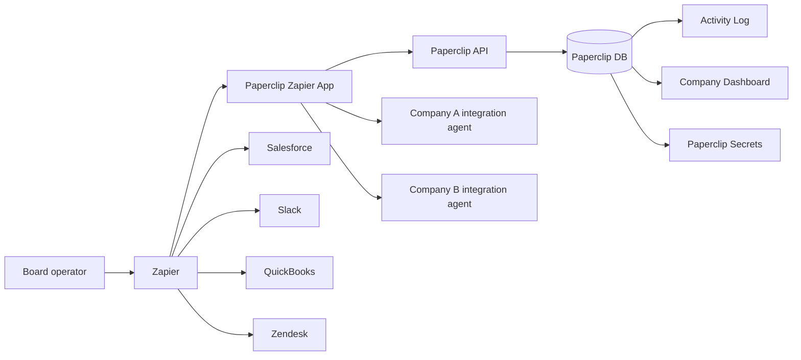
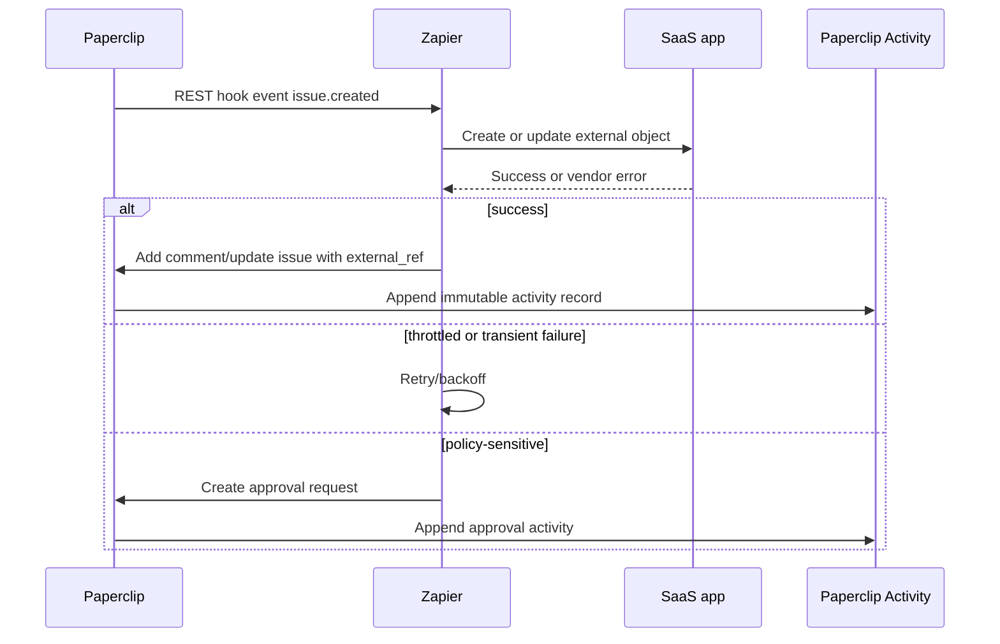
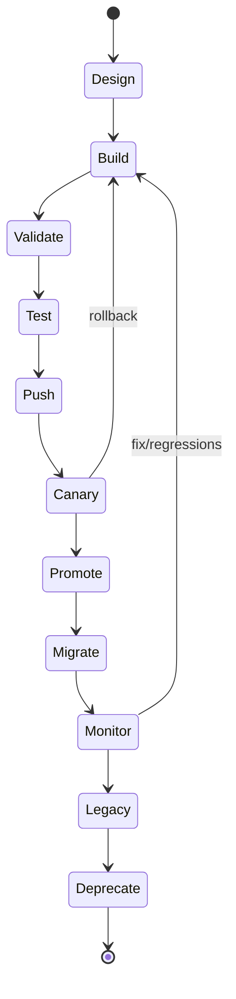

# Zapier Integration Plan for a Multi-Company Paperclip System

## Executive summary

Paperclip is already structured around a strong tenant primitive: the **company** is the top-level unit, one Paperclip instance can run multiple companies, and the API enforces company boundaries so agents can only access their own company while cross-company access is denied with `403`. Paperclip also already has encrypted secrets, an append-only activity log, and company-level dashboard endpoints. That means the right Zapier strategy is **not** “one Zapier app per company,” but **one shared Paperclip Zapier integration surface with strict per-company connections, credentials, and audit trails**. citeturn4view4turn7view2turn7view1turn7view3turn7view5turn7view4

For production, Paperclip should be built on the **Zapier Platform CLI with TypeScript**, not primarily in the Platform UI. The decisive reasons are: TypeScript is now a first-class path in the CLI, Zapier’s CLI runtime targets Node.js 22, the CLI gives you proper source control and CI/CD ergonomics, robust local and remote invocation, canary tools, environment management, advanced error handling, buffering, dehydration, and callback-based long-running actions through `z.generateCallbackUrl()` and `performResume`, which the Platform UI does **not** support. Platform UI remains useful for rapid prototypes and simple forms, but Zapier itself recommends keeping code there simple; npm modules are not supported in the UI, and complex implementations are better suited to the CLI. citeturn16view0turn16view2turn17view0turn4view2turn15search1turn13view0

Paperclip should expose a **small, stable Zapier object model** centered on the entities that already matter in Paperclip: issues, comments, approvals, agent health, cost/budget alerts, and company health. For **event triggers**, prefer **REST hooks** wherever possible. Polling is acceptable for low-frequency or derived states, but it is a poor default for Paperclip because Zapier polling steps have a 30-second runtime budget, plan-dependent polling intervals between roughly 1 and 15 minutes, and a default cap of 100 new items recognized per poll after deduplication. Paperclip’s activity-heavy workflows would exceed those constraints much sooner than webhook-driven delivery. citeturn12view8turn12view6turn4view1turn12view19turn18search8

The biggest architectural recommendation is to standardize on a **per-company integration agent** inside Paperclip. Each company gets its own agent record and long-lived API key for Zapier-triggered actions, rather than using a cross-company board-operator session. This aligns with Paperclip’s company-scoped authorization model, keeps the activity log attributable to a concrete actor, and avoids the security problem that board operators can access multiple companies they belong to. For sensitive domains like HR, identity, or payment operations, Zapier should often create an approval in Paperclip rather than executing the highest-risk mutation immediately. citeturn7view2turn7view3turn6search5turn6search16

For external systems, the optimized default is: **use existing Zapier apps for commodity SaaS connectors; build custom Zapier SDK apps only when the target system is internal, missing critical capabilities, or requires custom mediation/policy that the standard Zapier app cannot guarantee.** That means Salesforce, HubSpot, QuickBooks Online, Xero, Shopify, Zendesk, Google Drive, Google Calendar, Stripe, Slack, Airtable, Notion, Mailchimp, BambooHR, Okta, and GA4 should usually be consumed through their existing Zapier apps first, while Paperclip’s own Zapier app provides the Paperclip-side triggers/actions/searches. citeturn21search0turn21search1turn21search2turn21search3turn22search0turn22search1turn22search2turn22search3turn23search0turn23search1turn23search2turn23search3turn24search0turn24search1turn24search2turn24search3

My recommended rollout is straightforward. Start with a **private Paperclip Zapier app** and a **Wave One connector pack**: Salesforce, HubSpot, Slack, Shopify, Stripe, Zendesk, Google Calendar, and QuickBooks Online. Build only the Paperclip-side app and curated Zap templates first. Add direct/custom SDK work only for internal tools and specific gaps after real usage shows where the standard app ecosystem is insufficient. That yields the lowest maintenance burden and the fastest path to value. citeturn12view11turn12view12turn12view13turn13view0turn12view17

## What Zapier can and cannot do for Paperclip

Zapier supports the five authentication families most relevant to Paperclip and connector work: **API Key, Basic, Digest, Session auth, and OAuth v2**. OAuth v2 and Session auth can also persist extra values as computed/auth fields for later steps; API Key auth cannot. Platform UI supports OAuth 2.0 **authorization code** flows, but not other OAuth 2 grant types, and if you need OAuth 1 or a non-supported grant shape, Zapier directs you to the Platform CLI instead. Zapier also explicitly notes that Basic auth is the least appropriate option for a third-party service like Zapier because users type credentials directly into Zapier. citeturn12view1turn12view2turn12view3turn12view4turn12view5turn4view0turn15search14

For Paperclip itself, that creates a clean decision tree. In non-local environments, do **not** use Paperclip’s local trusted mode. Use a company-scoped integration credential. Because Paperclip’s short-lived JWTs are recommended for agents **during heartbeats**, while Zapier runs are independent server-to-server executions, the practical fit today is a long-lived **agent API key** per company-specific “integration agent,” stored in the Zapier connection. That key is hashed at rest in Paperclip and only shown in full at creation time. citeturn7view2turn7view0

Zapier’s object model is straightforward but powerful. A Zapier integration can expose **triggers**, **actions**, and **searches**. Polling triggers return arrays of items and rely on Zapier deduplication; REST hook triggers let your app subscribe/unsubscribe and then push events to a unique `bundle.targetUrl` for each active Zap; actions create or update items; searches find records and can optionally be paired with creates as “find or create.” Zapier’s own guidance for app design emphasizes shipping the foundational trigger/action/search surface for each category rather than over-optimizing edge objects first. citeturn12view6turn12view7turn12view8turn12view9turn12view10turn9search6turn20search0

For Paperclip, the correct first-party Zapier surface is therefore:

| Paperclip object | Recommended Zapier trigger | Recommended Zapier action | Recommended Zapier search | Why |
|---|---|---|---|---|
| Issue | New Issue; Issue Status Changed | Create Issue; Update Issue Status | Find Issue | Issues are Paperclip’s fundamental unit of work, with titles, descriptions, status, priority, assignee, and parent relationships. citeturn4view4turn7view0 |
| Comment / Mention | New Mention in Issue Comment | Add Comment to Issue | Find Issue by title or external key | Comments are the primary communication channel between agents. citeturn6search8 |
| Approval | New Approval Requested | Resolve Approval | Find Approval | Approvals are already first-class and ideal for gating risky automations. citeturn6search5turn6search16 |
| Agent health | Agent Entered Error or Paused State | Pause Agent; Resume Agent | Find Agent | Agent lifecycle is explicit in Paperclip and is operationally important. citeturn5search15turn6search19 |
| Company health / cost | Budget Threshold Reached; Cost Event Reported | None initially, or acknowledge/escalate | Get Company Dashboard | Dashboard and cost APIs already summarize company health and spend. citeturn7view5turn6search14turn6search17 |

Zapier’s biggest hard constraints matter a lot for Paperclip design. The runtime is stateless. Zapier documents a **30-second** budget for editor tests, polling triggers, REST hook ingestion, and create/search actions. It also documents payload and size limits, including a **10 MB webhook payload** ceiling, **20 MB HTTP response payload** ceiling, and input payload limits that historically were 6 MB but increased to 35 MB on newer platform versions. Deduplication tables are also finite. This is why Paperclip triggers should send **thin events** and hydrate details lazily when later steps need them. citeturn4view1turn11search8turn11search5turn17view0

The CLI gives Paperclip several advanced features the UI alone does not. The ones most worth exploiting are: `z.dehydrate()` and `z.dehydrateFile()` to keep trigger payloads small; `z.errors` to signal expired auth, throttling, or halted execution; `z.generateCallbackUrl()` plus `performResume` for long-running work; and `performBuffer` to group writes where a downstream API supports batch semantics. Those are highly relevant if Paperclip later wants actions like “Run an agent job and wait for completion” or a batch-oriented internal-tool connector. citeturn17view0

Versioning and deployment are mature enough for serious rollout control. Zapier uses semantic versioning and lifecycle states such as **private, promoted, available, legacy, deprecating, and deprecated**. In the CLI, `push` builds/uploads a version, `promote` makes it the default for new users, and `migrate` moves active users between versions. Zapier recommends migrating a small subset first, then monitoring logs before moving everyone. The canary tools are explicitly designed for this, although Zapier notes canary traffic is not isolated in monitoring, so you still need strong correlation and observability on your side. citeturn12view11turn12view12turn12view13turn12view14turn13view7turn13view8turn13view9turn13view0

Testing and monitoring should be treated as a first-class engineering concern. The Platform UI supports auth and step testing, and the Monitoring page shows the requests Zapier made to your API. The CLI supports local and **remote** invocation, including auth tests and running triggers/actions against production-like infrastructure. Zapier now treats TypeScript as a first-class path, recommends Jest for general projects and Vitest for modern TS/ESM workflows, and exposes `zapier-platform validate` for schema checks in CI. One subtle but important testing caveat: test auth tokens in the Platform UI are not saved in Zapier’s database, so real auth refresh behavior should also be validated in an actual Zap in your account. citeturn12view15turn12view17turn16view1turn16view2turn13view6turn11search7

The security best-practice set for Paperclip is clear. Use environment variables for client IDs, secrets, and environment-specific settings instead of committing them; validate user-supplied domains/subdomains during auth flows; prefer OAuth or scoped tokens over Basic auth; minimize requested scopes; and keep code that handles secrets out of module-level interpolation paths because Zapier warns that `${process.env.VAR}` at module scope can get baked into `definition.json` during build time. For a self-hosted product like Paperclip, the domain-validation guidance is especially important: a public Zapier app that accepts arbitrary instance URLs is materially riskier than a cloud-only app or a private app with an allow-list. citeturn12view18turn10search2turn15search14turn16view4turn4view3

## Connector catalog and recommendations

The base rule is simple: **use the existing Zapier app when it already covers the connector’s standard triggers/actions/searches and auth model; build a custom SDK app only for internal tools, missing objects, missing webhook support, or when you need Paperclip-specific policy mediation that the standard app cannot enforce.** Zapier already publishes official app pages for the major connector targets listed below, which confirms the default ecosystem path exists. citeturn21search0turn21search1turn21search2turn21search3turn22search0turn22search1turn22search2turn22search3turn23search0turn23search1turn23search2turn23search3turn24search0turn24search1turn24search2turn24search3

**CRM**

| Connector | Recommendation | Primary auth at vendor/API layer | High-value Zap surface | Paperclip mapping | Error, rate-limit, and tenant notes |
|---|---|---|---|---|---|
| Salesforce | Use the existing Zapier app for standard lead/contact/account/opportunity/case workflows; build custom only if you need unsupported objects or strict mediation. citeturn21search0turn20search0turn26search0 | OAuth on the Salesforce side is the standard modern model. Monitor org/API limits via Salesforce’s limits resources. citeturn26search12turn26search0turn26search4 | New/updated records, contacts, leads, opportunities; create/update records; add notes/tasks. Zapier’s CRM guidance strongly favors those primitives. citeturn20search0 | Use one Salesforce org connection per Paperclip company. Typical mappings are Issue → Task/Case/Opportunity task, Comment → Note/Activity, Approval → stage-gated follow-up. This is an architectural recommendation based on Paperclip’s issue/comment/approval model. citeturn4view4turn6search5 | Poll only on modified timestamps if webhooks are unavailable; otherwise prefer event-driven delivery. Use remaining-limit visibility from Salesforce; never reuse one Salesforce credential across multiple Paperclip companies. citeturn26search0turn12view8 |
| HubSpot | Use the existing Zapier app by default. The HubSpot APIs already expose contacts, deals, and search cleanly. citeturn21search1turn38search18turn38search14turn38search2 | OAuth 2.0 for distributed integrations. HubSpot’s OAuth flows return access and refresh tokens. citeturn26search17 | Contacts, companies, deals, pipeline stage changes, CRM searches, create/update contact and deal. citeturn38search18turn38search14turn38search2 | Map company-level customer/account work into one Paperclip company connection; map deal stage changes to issue status or approval escalation. | HubSpot documents OAuth app rate behavior at **100 requests / 10 seconds** and returns rate-limit headers on OAuth calls. Favor search endpoints instead of broad list scans. One HubSpot portal per Paperclip company. citeturn26search1turn26search5turn26search9 |

**Accounting**

| Connector | Recommendation | Primary auth at vendor/API layer | High-value Zap surface | Paperclip mapping | Error, rate-limit, and tenant notes |
|---|---|---|---|---|---|
| QuickBooks Online | Use the existing Zapier app for invoices, customers, payments, sales receipts, and basic bookkeeping workflows. citeturn21search2turn20search0 | OAuth 2.0 against Intuit, tied to a QuickBooks company (`realmID`). citeturn26search6turn26search10 | New invoice/payment/customer; create invoice/customer/payment; search invoice/customer. citeturn21search2turn20search0 | Map a Paperclip company to one QuickBooks company. Typical flows are “create finance issue when payment fails,” “create invoice when order closes,” and “comment back reconciliation status.” | Intuit documents **500 requests/minute per realm**, **10 concurrent requests per second per realm/app**, and batch limits. Use serial writes for the same accounting object and batch where supported. citeturn26search14 |
| Xero | Use the existing Zapier app for standard finance workflows. Consider custom mediation only if you need stricter tenant or approval logic. citeturn24search0turn20search0 | OAuth 2.0; Xero notes code/PKCE apps can connect to multiple tenants, which is precisely why Paperclip should still force one tenant connection per company. citeturn26search15 | New invoices/payments/contacts; create invoices/payments/contacts; search contacts/invoices. citeturn20search0 | Typical mapping is finance exceptions or invoice/payment objects to Paperclip issues and approvals. | Xero publishes clear limits: **5 concurrent**, **60/minute**, and daily tenant caps, with `Retry-After` guidance. Use queueing, pagination, and batch-like multi-object requests where available. citeturn26search3turn26search7turn26search11 |

**HR**

| Connector | Recommendation | Primary auth at vendor/API layer | High-value Zap surface | Paperclip mapping | Error, rate-limit, and tenant notes |
|---|---|---|---|---|---|
| BambooHR | Start with the existing Zapier app if it covers onboarding/offboarding and employee-change use cases. Build a custom helper only if you need newer OAuth 2.0 behavior, deeper field mapping, or webhook/event mediation not exposed by the app. citeturn24search1turn25search2 | BambooHR now supports **OAuth 2.0** as the primary method, while legacy API-key/OIDC paths still exist in their documentation. citeturn25search8turn25search0turn25search11 | Employee created/updated, last-change information, changed employee IDs, create/update employee, field-based or event-based webhooks. citeturn25search1turn25search18turn25search12turn25search10turn25search14 | Map HR events to Paperclip approvals and issues, not directly to autonomous agent behavior, because HR actions are sensitive and often policy-bound. | BambooHR’s docs in this source set discuss request budgets and rate-limit usage but do not expose a single universal numeric cap. Treat it as a low-concurrency integration, back off conservatively, and use metadata/discovery endpoints because account fields vary heavily by tenant. citeturn25search3turn25search15 |

**Marketing**

| Connector | Recommendation | Primary auth at vendor/API layer | High-value Zap surface | Paperclip mapping | Error, rate-limit, and tenant notes |
|---|---|---|---|---|---|
| Mailchimp | Use the existing Zapier app for audience, subscriber, and campaign workflows. Only build a helper if you need batch-heavy backfills or custom consent logic. citeturn23search2turn37search3 | OAuth 2.0 is the right model for third-party integrations; Mailchimp explicitly frames OAuth 2 as the way to access user data on behalf of other Mailchimp users. citeturn31search8turn31search20 | New campaign, new subscriber/contact, add/update subscriber, add to audience/tag, campaign management, merge fields. citeturn37search1turn37search12turn31search5 | Map subscriber and campaign events to growth issues, experiment tasks, or reporting comments in Paperclip. | Mailchimp documents a **10 concurrent connection** limit per API key and recommends the batch endpoint for long-running work. Use merge fields carefully for custom data, and surface API errors cleanly when consent or field schemas mismatch. citeturn37search11turn37search13 |

**E-commerce**

| Connector | Recommendation | Primary auth at vendor/API layer | High-value Zap surface | Paperclip mapping | Error, rate-limit, and tenant notes |
|---|---|---|---|---|---|
| Shopify | Use the existing Zapier app for orders, customers, paid orders, abandoned carts, and basic catalog workflows. Avoid custom Shopify work unless you need policy mediation or unsupported objects. citeturn21search3turn20search0 | Use the Zapier-managed Shopify account connection in the first version. If you later build a direct helper, re-verify Shopify’s current auth flow during implementation. Shopify’s docs in this source set confirm Admin APIs and webhook/event surfaces, but I did not separately re-open the auth guide here. citeturn27search18turn27search3 | New order, paid order, customer events, product workflows. citeturn21search3turn20search0 | Map order/payment/customer exceptions to issues; route fulfillment or customer-service escalations to Slack/Zendesk via Paperclip. | Shopify’s current platform docs emphasize API limits and backoff; the REST Admin API is legacy for new public apps and GraphQL Admin is the strategic direction. Respect usage metadata and back off for at least ~1 second when limited. Keep one shop per Paperclip company. citeturn27search6turn27search0turn27search3turn27search12 |

**Support**

| Connector | Recommendation | Primary auth at vendor/API layer | High-value Zap surface | Paperclip mapping | Error, rate-limit, and tenant notes |
|---|---|---|---|---|---|
| Zendesk | Use the existing Zapier app for ticketing and customer-support workflows. Zendesk’s APIs are well shaped for ticket, user, and search use cases. citeturn22search0turn27search7turn27search16 | Prefer OAuth-based account connections where possible. Zendesk exposes OAuth token management and cursor-paginated token resources. citeturn27search13 | New ticket, updated ticket in view, update ticket, create ticket/request/conversation, search users/tickets. citeturn22search0turn20search0turn27search16 | Tickets become Paperclip issues; public ticket notes can map to comments; escalation decisions can map to approvals. | Zendesk publishes account-wide and endpoint-specific rate headers and recommends using them before handling 429s. Use cursor pagination and avoid broad searches on every poll. One Zendesk subdomain/account per Paperclip company. citeturn27search1turn27search4 |

**Analytics**

| Connector | Recommendation | Primary auth at vendor/API layer | High-value Zap surface | Paperclip mapping | Error, rate-limit, and tenant notes |
|---|---|---|---|---|---|
| Google Analytics 4 | Use the existing Zapier app for ordinary event/report automation. Build a custom helper only if you need strict Measurement Protocol validation or custom event mediation. citeturn24search2turn28search14 | For direct server-side eventing, GA4’s Measurement Protocol is the relevant vendor surface; validate the exact credential model during implementation. The important point for Paperclip is that GA4 supports server-to-server and offline events. citeturn28search0turn28search6 | Send conversion/measurement events and annotate analytics-relevant business milestones. | Map Paperclip events such as approval granted, issue completed, or budget threshold reached into measurement events rather than trying to mirror entire records. | GA4 Measurement Protocol limits payload shape and timing; requests can carry up to **25 events**, and stricter validation rejects data older than **72 hours** in certain validation modes. Hash sensitive user-provided data where required. citeturn28search4turn28search2turn28search18 |

**Cloud storage and calendar**

| Connector | Recommendation | Primary auth at vendor/API layer | High-value Zap surface | Paperclip mapping | Error, rate-limit, and tenant notes |
|---|---|---|---|---|---|
| Google Drive | Use the existing Zapier app for new file, new folder, upload, move, and lookup workflows. citeturn22search1turn20search0 | Google Drive uses OAuth scopes and encourages choosing the minimum scopes required. citeturn30search2 | New file in folder, upload file, create folder/file, find file/folder. citeturn20search0turn22search1 | Map issues or approvals to document generation, artifact storage, or evidence archiving. | Google Drive documents quotas/usage limits and notes that notification-channel deliveries don’t count against quota. Prefer push notifications/change feeds over brute-force polling for active tenants. citeturn30search0turn30search6 |
| Google Calendar | Use the existing Zapier app for event-driven scheduling workflows. citeturn22search2turn20search0 | Google Calendar is an OAuth-based Google Workspace API. citeturn30search14turn30search7 | New event, event started, updated event, create event, add attendee, find event. citeturn20search0turn30search3turn30search11 | Map Paperclip approvals, launches, or deadlines into calendar events; use “event started” to trigger work. | Google Calendar quotas are enforced per project and per user, and Google recommends exponential backoff, randomized traffic, and push notifications. That makes per-company connection throttling important. citeturn30search1turn30search13 |

**Payments and identity**

| Connector | Recommendation | Primary auth at vendor/API layer | High-value Zap surface | Paperclip mapping | Error, rate-limit, and tenant notes |
|---|---|---|---|---|---|
| Stripe | Use the existing Zapier app for common payment and subscription workflows. Build a custom helper only if you need advanced Connect mediation or a Paperclip-owned payments control plane. citeturn22search3turn38search19turn38search15 | For direct integrations, Stripe supports API-key authentication and Connect OAuth/connected-account patterns; for Standard accounts, Stripe now recommends Connect Onboarding over OAuth for new Connect platforms. citeturn27search5turn27search2turn27search11turn27search20 | Payment success/failure, subscription lifecycle, refunds/disputes, customer updates, webhook events. citeturn38search7turn38search3turn38search11 | Map failures, disputes, subscription state changes, and payout exceptions into issues and approvals; do not automate destructive finance operations without approval. | Stripe documents API rate limits and lock-contention behavior and strongly recommends retries with exponential backoff plus idempotency keys. For anything that creates or updates Stripe objects, preserve idempotency through your connector ledger. citeturn27search8turn28search1turn28search3 |
| Okta | Use the existing Zapier app for standard user/group/app-assignment flows, but classify it as **high security sensitivity**. Build custom only if you need stricter approval, scope, or audit mediation. citeturn23search1turn38search12 | OAuth 2.0 / OIDC with scoped Okta admin APIs. Okta’s scope model is granular and explicit. citeturn31search19turn31search16 | User/group lifecycle, app assignment, System Log, event-type driven sync. citeturn38search4turn38search16turn38search8 | Identity actions should almost always become approvals first in Paperclip unless the action is low risk and easily reversible. | Okta rate limits are bucketed and client-based. OAuth apps and tokens default to a configurable fraction of org capacity, which is useful for protecting one Paperclip company’s automations from another. One Okta org connection per company is mandatory. citeturn31search4turn31search1turn31search13turn31search7 |

**Internal tools**

| Connector | Recommendation | Primary auth at vendor/API layer | High-value Zap surface | Paperclip mapping | Error, rate-limit, and tenant notes |
|---|---|---|---|---|---|
| Slack | Use the existing Zapier app for message, channel, and lightweight workflow handoffs. Build a custom helper only if you need unusual admin or workflow features. citeturn23search0turn23search4 | Slack uses app-install OAuth 2.0 and scope-based access. Posting/messaging scopes are explicit. citeturn36search1turn31search18turn31search0 | New public message, post message, DM, channel lookup, basic workflow notifications. citeturn23search4 | Map comments, mentions, issue assignments, and approvals to Slack notifications; use Slack as a human-interrupt surface, not as a source of truth. | Slack’s method-specific limits can change; history-heavy methods have seen tighter limits for some app classes. Prefer event-driven or lightweight posting patterns over deep polling/backfill. One workspace or Enterprise Grid install per intended tenant boundary. citeturn31search3turn36search2 |
| Airtable | Use the existing Zapier app for ordinary records-and-tables automation. Build a custom helper if you need webhook-driven high-scale sync or custom schema handling. citeturn23search3turn34search9 | Airtable supports personal access tokens for first-party/internal use, and also OAuth for broader integrations. PATs should be kept secret. citeturn34search8turn34search4 | New/updated record patterns, record CRUD, base schema, webhooks. citeturn20search0turn34search2turn34search3 | Map internal trackers or lightweight operational tables into Paperclip issues, comments, or dashboards. | Airtable publishes unusually clear rate limits: **5 req/s per base**, **50 req/s for all traffic using PATs from a user/service account**, and a **30-second** cool-down after 429s. Webhooks are limited per base and expire unless refreshed. citeturn34search1turn34search12turn34search10 |
| Notion | Use the existing Zapier app for page/database automation. Build a custom helper if you need newer webhook features, lower-latency sync, or stricter capability control. citeturn24search3turn32search6 | Notion has two main auth modes: internal connections with a static API token and public connections with OAuth 2.0. Request only the capabilities you need. citeturn32search2turn32search11turn32search7 | Page/database creation and updates, query data sources, webhook-driven change detection. citeturn32search4turn32search5turn32search0 | Use Notion when companies want a human-readable operating log or planning surface; keep Paperclip as system-of-record for work state. | Notion’s API averages **3 req/s per integration**, supports bursts, and uses `Retry-After`. Search is not exhaustive or immediate, so data-source queries and webhooks are better for deterministic sync. citeturn32search1turn32search3turn32search4 |
| Custom internal REST/GraphQL tools | Build a **private CLI app** when the company’s internal tools are not already covered by Zapier or when the company needs fields, auth, and policy that generic webhook steps cannot give you. | Prefer OAuth 2.0 service accounts or scoped API keys; avoid Basic auth unless there is genuinely no modern alternative. citeturn15search14turn12view1turn12view3 | Expose only the thin set of events and mutations that companies actually automate. | Canonical Paperclip mappings should flow through a connector ledger and per-company integration agent. | Use REST hooks if the internal tool can push; otherwise implement polling with modified-since cursors and strong deduplication. Leverage Zapier CLI features like dehydration, `z.errors`, and buffering. citeturn12view8turn17view0 |

## Multi-company architecture for Paperclip

The architecture that best fits both Zapier and Paperclip is a **hub-and-spoke** pattern:

1. **One Paperclip Zapier app** as the shared product surface.
2. **One Paperclip integration agent per company** as the executing identity for that company.
3. **One or more Zapier connections per company**, each tied to one external tenant, workspace, org, or shop.
4. **One integration ledger** in Paperclip (or a small sidecar service) to track external IDs, source event IDs, retries, correlation IDs, and idempotency.  
This is an architectural recommendation grounded in Paperclip’s company-scoped model, agent API keys, immutable activity log, and dashboard/secret primitives. citeturn4view4turn7view2turn7view1turn7view3turn7view5turn7view4

The most important isolation rule is: **never share a write credential across companies unless the business intentionally wants a single shared external tenant**, and even then, mediate it through policy. Paperclip’s API model is already company-scoped, and agents are limited to their own company. Lean into that. If two companies use the same Slack workspace or the same finance stack, keep them as separate Zapier connections with separate integration-agent identities and separate routing rules inside Paperclip. That preserves attribution and makes approval policies possible. citeturn7view2turn7view3

For provisioning, the cleanest operational flow is:

| Provisioning step | Recommendation | Why it fits the source systems |
|---|---|---|
| Create company | Create the Paperclip company normally. | Company is the top-level unit and the natural Zapier tenant boundary. citeturn4view4 |
| Create integration agent | Add a dedicated agent such as `zapier_ops` under that company. Generate its long-lived API key once and store it in the Zapier connection. | Paperclip already supports agent API keys, hashed at rest, and they remain company-scoped. citeturn7view2turn5search15 |
| Register external connection | Connect Salesforce/HubSpot/etc. in Zapier, not inside Paperclip, unless agents themselves need the secret for independent work. | Zapier is the integration plane; Paperclip only needs secrets when its own agents must call the external API. citeturn7view1turn12view18 |
| Subscribe real-time events | For Paperclip-origin events, subscribe REST hooks from the Zapier app to Paperclip’s event publisher. | Zapier REST hooks are the best fit for Paperclip’s high-churn event sources. citeturn12view8turn12view19 |
| Record approvals/policies | For high-risk actions, configure the Zap to create or resolve a Paperclip approval rather than making the final mutation directly. | Paperclip already has an approvals system, and identity/HR/finance actions are the right place to require a human gate. citeturn6search5turn6search16 |

Secrets management should follow a **single-source-of-truth rule**. App-level secrets that belong to the Zapier integration itself — client IDs, client secrets, shared webhook tokens, feature flags — belong in **Zapier environment variables**. Company/vendor secrets that are only required for a Zapier connection should stay in the **Zapier connection**, not be copied into Paperclip. Only when a Paperclip agent independently needs the credential should you create a Paperclip secret and reference it through `secret_ref` so the value is injected at runtime. This avoids needless secret duplication and aligns with both platforms’ intended secret models. citeturn12view18turn13view10turn7view1turn6search3

Paperclip’s current default secret provider is local encrypted storage with a master key on disk. That is acceptable for development and perhaps small internal deployments, but for a production multi-company integration plane you should treat it as the minimum bar, not the long-term optimum, especially if regulated companies or high-value finance/identity connectors are involved. That is an inference from Paperclip’s documented local-encrypted default and the absence, in the source set used here, of a fully documented external KMS-backed operating pattern. citeturn6search3turn7view1

Retries, backoff, and idempotency need to be designed deliberately. Zapier’s CLI gives you `RefreshAuthError`, `ExpiredAuthError`, `ThrottledError`, and `HaltedError`; vendor APIs like Xero, Notion, Airtable, Zendesk, Stripe, Google Calendar, and others document rate limits or retry headers; and Zapier itself recommends retry/backoff when webhook delivery is throttled. For Paperclip, the consequence is simple: every actionable event should carry a stable **connector event ID**, and every mutating write into Paperclip or out to a vendor should carry a deterministic **idempotency key** when the target supports it. If Paperclip does not yet have a public idempotency header for its own API, add one before large-scale rollout. citeturn17view0turn12view19turn26search7turn32search1turn34search1turn27search4turn27search8turn30search1

For data transformation, use a **canonical connector DTO layer** inside the Paperclip Zapier app or a small shared package. Do not let every Zap template choose its own shape ad hoc. A practical minimum canonical model is:

- `external_ref`: vendor + tenant + object type + object id
- `title`
- `body`
- `status`
- `priority`
- `owner`
- `due_at`
- `labels`
- `money`
- `links`
- `source_event_id`
- `metadata`

That schema is a recommendation, but it is directly motivated by Paperclip’s issue-centered work model and Zapier’s emphasis on stable output fields, dynamic fields, and sample data. citeturn4view4turn15search13turn16view5turn11search15

Schema versioning should follow the same discipline as your Zapier app versioning. Keep old output fields stable, add new fields rather than renaming old ones, and move unstable or vendor-specific details under `metadata`. When you introduce a breaking mapping change, create a new Zapier integration version, canary it, then migrate users incrementally. Use Paperclip’s immutable activity log and dashboard metrics to verify behavior before wider migration. citeturn12view11turn12view12turn13view0turn7view3turn7view5

There is one especially important Paperclip-specific security inference: because Paperclip is **self-hosted and open source**, a public Zapier app that allows arbitrary customer base URLs is riskier than a cloud-only app pinned to a fixed origin. Zapier’s docs explicitly warn to validate domain and subdomain input during auth when sensitive values are involved. My recommendation is to split the product surface into either:
- a **public/cloud-only** Paperclip Zapier app for your managed domain, and
- a **private/invite-only** or partner-scoped self-hosted app for customer-controlled domains.  
That separation materially reduces auth-surface risk. citeturn4view3turn10search2turn8search8turn12view18

## Prioritization matrix

The matrix below is my recommended order for the first twelve connectors, using a 100-point priority score that weights business value highest, then implementation complexity, maintenance cost, and security risk. The scores are analytical judgments, not vendor-published values.

| Connector | Business value | Complexity | Maintenance cost | Security risk | Priority score | Rationale |
|---|---:|---:|---:|---:|---:|---|
| HubSpot | 5 | 3 | 2 | 3 | 93 | Strong CRM primitives, strong search endpoints, OAuth-friendly, and common across growth-led companies. citeturn21search1turn38search18turn38search14turn38search2turn26search17turn26search1 |
| Salesforce | 5 | 4 | 3 | 3 | 91 | The highest enterprise CRM value, but slightly heavier implementation and tenant complexity than HubSpot. citeturn21search0turn26search0turn26search4turn20search0 |
| Slack | 5 | 2 | 2 | 2 | 90 | Fastest human-in-the-loop value; low implementation risk; ideal for notifications, escalations, and approvals. citeturn23search0turn23search4turn31search18 |
| Shopify | 5 | 3 | 3 | 3 | 88 | High value for e-commerce companies; orders and paid-order events drive real workflows; some API/platform churn to watch. citeturn21search3turn27search6turn27search3 |
| Stripe | 5 | 3 | 3 | 4 | 87 | Payment and subscription events are high-value, but they are operationally and financially sensitive. citeturn22search3turn38search15turn27search8turn28search1 |
| Zendesk | 4 | 3 | 2 | 2 | 84 | Support automations map cleanly into issues, comments, and escalation workflows. citeturn22search0turn27search7turn27search16turn27search1 |
| Google Calendar | 4 | 2 | 2 | 2 | 82 | Excellent for deadline, launch, and meeting-driven workflows; strong event semantics. citeturn22search2turn30search3turn30search1 |
| QuickBooks Online | 4 | 3 | 3 | 4 | 80 | Finance operations have high business value, but accounting flows must be conservative and auditable. citeturn21search2turn26search14turn26search6 |
| Google Drive | 4 | 2 | 2 | 2 | 79 | Useful for artifact routing and records management; low conceptual complexity. citeturn22search1turn30search0turn30search2 |
| Airtable | 4 | 2 | 2 | 2 | 77 | Extremely common as an internal operations tool; strong webhook + rate-limit story. citeturn23search3turn34search1turn34search2turn34search12 |
| Xero | 3 | 3 | 3 | 4 | 73 | Important in many markets, but lower total addressability than QuickBooks in a general-first rollout. citeturn24search0turn26search3turn26search15 |
| Notion | 3 | 2 | 2 | 2 | 72 | Valuable for internal operating systems and documentation, especially for AI-first teams. citeturn24search3turn32search0turn32search1turn32search2 |
| Okta | 4 | 4 | 3 | 5 | 71 | High business importance, but identity changes are high-risk and should be approval-gated. citeturn23search1turn31search1turn31search13turn38search4 |
| Mailchimp | 3 | 2 | 2 | 3 | 68 | Useful for growth teams, but often secondary to CRM and commerce workflows. citeturn23search2turn31search8turn37search11 |
| BambooHR | 3 | 3 | 3 | 5 | 66 | HR data is sensitive, schemas vary heavily by tenant, and action safety matters. citeturn24search1turn25search15turn25search8 |
| Google Analytics 4 | 3 | 3 | 2 | 3 | 62 | Valuable for telemetry and attribution, but less central than CRM, comms, payments, or support in the first rollout. citeturn24search2turn28search0turn28search4 |

A practical rollout by wave would be:

| Wave | Recommended connectors | Why |
|---|---|---|
| Wave One | HubSpot, Salesforce, Slack, Shopify, Stripe, Zendesk, Google Calendar, QuickBooks Online | Highest immediate company value and best balance of maturity vs effort. |
| Wave Two | Google Drive, Airtable, Xero, Notion, Mailchimp | Strong demand, but slightly less central or more variable by company. |
| Wave Three | Okta, BambooHR, GA4, custom internal SDK apps | Security-sensitive or highest-variance connectors; best added after the integration plane is proven. |

## Implementation, testing, and operations plan

The codebase should live as a dedicated package or repository, for example `paperclip-zapier-app`, with a small shared client package for the Paperclip API and shared schemas. Because Paperclip’s current local development stack targets Node.js 20+ while Zapier’s CLI runtime targets Node.js 22, you should keep shared code runtime-light and test it in both environments. Generated API clients, plain schema packages, and pure TypeScript utilities are safer to share than deep server-side imports from the Paperclip monorepo. citeturn5search18turn7view4turn16view0

A good CI/CD pipeline for this integration should look like this:

| Stage | Recommendation | Why |
|---|---|---|
| Lint and typecheck | Run TypeScript checks and linting on every PR. | Zapier CLI is TypeScript-friendly now, and keeping schemas tight prevents downstream Zap breakage. citeturn16view2 |
| Unit tests | Use Jest or Vitest with `createAppTester()` and fixture bundles. | Zapier officially recommends Jest generally and Vitest for TS/ESM. citeturn16view1turn16view2 |
| Validation | Run `zapier-platform validate` in CI. | Zapier’s schema validation is the same routine used during build/push/test. citeturn13view6 |
| Smoke invocation | Run local `invoke` and remote `invoke -r` against a test connection. | Remote invoke is the closest pre-prod check to actual Zapier runtime behavior. citeturn16view1turn4view2 |
| Package/upload | Use `zapier-platform push` on tagged releases or controlled deployment branches. | `push` builds/uploads the version. citeturn13view7 |
| Controlled exposure | `promote` only after smoke, then `migrate` gradually, optionally with canary tests first. | Zapier’s version lifecycle is built exactly for this sequence. citeturn13view8turn13view9turn13view0 |

The implementation checklist I recommend is:

| Workstream | Concrete step | Effort |
|---|---|---|
| App strategy | Build a **private** Paperclip Zapier app first; delay public listing until the connector surface and domain strategy are stable. | Low |
| Auth model | Add or standardize a per-company `integration_agent` pattern in Paperclip and use its API key as the Zapier connection credential. | Medium |
| Event plane | Add a server-side event publisher for issue, comment, approval, agent-health, and cost-threshold events. Prefer thin webhook payloads and lazy hydration. | Medium |
| Connector ledger | Add a table or service for `company_id`, `connector`, `external_tenant_id`, `external_object_id`, `source_event_id`, `idempotency_key`, `last_sync_at`, `retry_count`, and `correlation_id`. | Medium |
| API hardening | Add idempotency support for Paperclip mutating endpoints and explicit correlation-ID propagation. | Medium |
| Zapier surface | Implement the initial triggers/actions/searches listed earlier. | Medium |
| Templates | Publish curated Zap templates for Wave One connectors rather than exposing every possible object pairing at launch. | Low |
| Monitoring | Correlate Zapier request logs with Paperclip activity log and dashboard metrics. | Medium |
| Rollout | Canary one version, then promote/migrate in small cohorts. | Low |

Testing should be multi-layered. In addition to normal unit tests, create a matrix of **real connected tenants** for at least one sandbox account in each Wave One connector. For auth, test initial connect, stale token refresh, revoked credentials, wrong scopes, and a tenant switch. For triggers, test sample loading, dedupe population, out-of-order webhook delivery, duplicate webhook delivery, large payload hydration, and plan-limited polling fallback. For actions, test retries, vendor-side idempotency, validation errors, and partial-failure visibility. Zapier’s own docs are explicit that auth testing in the UI is not enough for refresh-token validation. citeturn12view15turn12view17turn16view1turn11search7

Observability should use both platforms. On the Zapier side, rely on the Platform UI Monitoring page, remote invocation, and canary monitoring. On the Paperclip side, rely on the company dashboard for health summaries and the append-only activity log for immutable mutation history. I would add one extra explicit correlation convention: every Zap-triggered write into Paperclip should include a connector metadata payload with `zap_id`, `zap_run_id`, `step_key`, `external_tenant`, and `source_event_id`, so that a board operator can traverse one event across Zapier Monitoring and Paperclip Activity without guesswork. This last part is a recommendation built on top of the systems the docs already expose. citeturn12view17turn13view0turn7view3turn7view5

For maintenance, set a recurring cadence:
- weekly: error review and 429 review,
- monthly: connector-schema drift review and auth-scope review,
- each release: `validate` + smoke invoke + canary,
- each quarter: dependency upgrade and Node 22 compatibility check for shared packages.  
That release discipline matches Zapier’s versioning and Paperclip’s auditable multi-company control-plane role. citeturn16view0turn12view11turn13view0

Estimated effort, given unspecified scale/compliance requirements:

| Milestone | Outcome | Effort range |
|---|---|---|
| Discovery and design | Tenant model, auth model, event model, connector wave selection | Low to Medium |
| MVP build | Private Paperclip app, Wave One templates, integration agent flow, initial monitoring | Medium |
| Production hardening | Idempotency, event queueing, webhook retry/replay, canaries, migration playbooks | Medium to High |
| Security and compliance hardening | Domain strategy split, secret-provider upgrade path, approval policies, audit packaging | Medium to High |
| Ongoing maintenance | Connector drift, auth rotations, version migrations, template upkeep | Low to Medium |

The immediate next steps I would take are:

| Next step | Why now | Effort |
|---|---|---|
| Freeze the first-party Paperclip Zapier surface | Prevents connector sprawl and version churn later. | Low |
| Add the integration-agent pattern to Paperclip onboarding/provisioning | It is the keystone of safe multi-company auth. | Medium |
| Build the private CLI app in TypeScript | Best long-term engineering fit. | Medium |
| Implement REST-hook triggers for issue, approval, and agent-error events | This avoids the biggest Zapier polling bottlenecks early. | Medium |
| Ship 6–8 Wave One templates | Fastest path to business adoption across companies. | Low |
| Add a connector ledger and idempotency plan before scale-out | This is much harder to retrofit after production usage begins. | Medium |

## Diagrams and source pack

The first diagram shows the architecture I recommend for a multi-company deployment. It explicitly separates the shared Zapier app from per-company identities and connections, which matches Paperclip’s company-scoped auth model and Zapier’s per-connection execution model. citeturn7view2turn7view1turn12view8turn17view0

The second diagram shows the event/data flow for the most important Paperclip pattern: a first-party Paperclip event triggers a Zap, a commodity SaaS app handles the downstream action, and the result is written back to Paperclip with correlation and attribution. citeturn12view8turn7view3turn7view5

The third diagram shows the connector lifecycle I recommend using the CLI and Zapier’s native versioning tools. citeturn12view11turn13view7turn13view8turn13view9turn13view0

The recommended source pack for implementation is:

| Source type | Why it should be in your working docs |
|---|---|
| Zapier Platform docs for auth, triggers, actions, testing, operating constraints, versioning, and security | These are the primary source of truth for what the integration can do and where it will fail. citeturn12view1turn12view6turn12view8turn12view15turn4view1turn12view11turn10search2 |
| Zapier Platform GitHub repository and CLI command reference | Best reference for build, validate, invoke, push, promote, migrate, and environment management in CI/CD. citeturn12view20turn4view2turn13view6turn13view7turn13view8turn13view9turn13view10 |
| Paperclip docs for core concepts, architecture, auth, secrets, dashboard, activity, and approvals | These define the tenant and control-plane assumptions your Zapier design must preserve. citeturn4view4turn7view4turn7view2turn7view1turn7view3turn7view5turn6search5turn6search16 |
| Official vendor API docs for each Wave One connector | Necessary for auth, rate limits, scopes, and object semantics. citeturn26search0turn26search1turn26search14turn27search1turn27search8turn30search0turn30search1 |
| Zapier app pages for validation of ecosystem coverage | Useful for deciding where **not** to build. citeturn21search0turn21search1turn21search2turn21search3turn22search0turn22search3turn23search0turn24search0 |

## Open questions and limitations

A few decisions remain genuinely sensitive to facts that were unspecified in the request.

If Paperclip will remain primarily **self-hosted**, I strongly favor a split between a cloud-pinned public app and a private/self-hosted app because Zapier’s domain-validation guidance makes the arbitrary-domain threat model materially harder. If Paperclip will instead offer a single managed cloud domain, the public-app path becomes much cleaner. citeturn4view3turn10search2turn12view18

If you expect **very high event volume** from some companies, webhook-first delivery is not optional; it is mandatory. Polling constraints are simply too tight for high-churn activity streams. Conversely, if event volume is low and freshness requirements are loose, a simpler polling fallback can cover more use cases with less engineering. citeturn12view19turn18search8turn4view1

If you need **board-operator-only** actions from Zapier that current agent-scoped keys cannot safely perform, Paperclip likely needs an explicit service-account auth mode beyond cookie-based board sessions. That is a product gap to evaluate before deeper admin workflows go live. The current source set confirms agent keys and board-operator cookie sessions, but not a separate non-cookie service-user mode. citeturn7view2

Finally, for a few connectors — especially where ecosystem auth patterns are evolving — I deliberately prioritized high-confidence integration guidance over exhaustively re-verifying every vendor-specific auth nuance. The plan above is therefore strongest as an architectural and delivery blueprint and should be paired with a short per-connector implementation checklist before each connector wave ships.